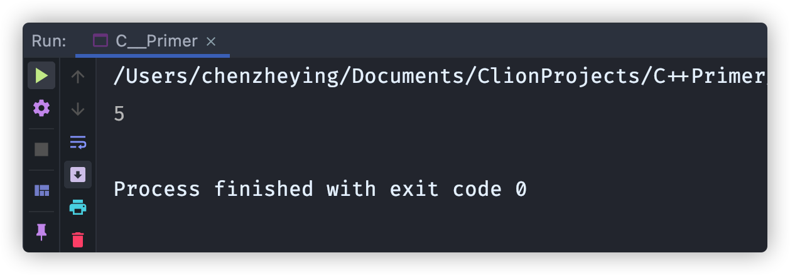
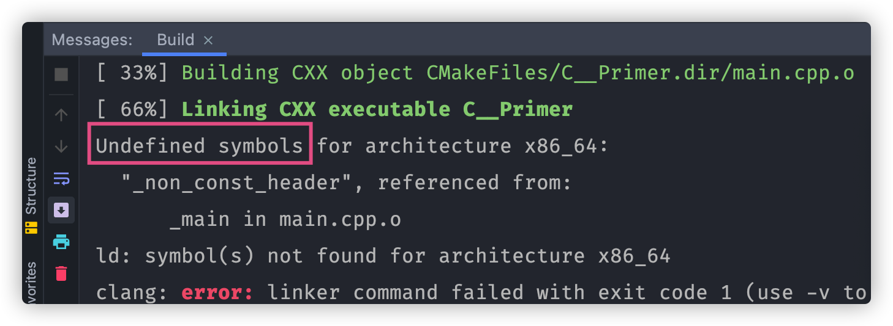
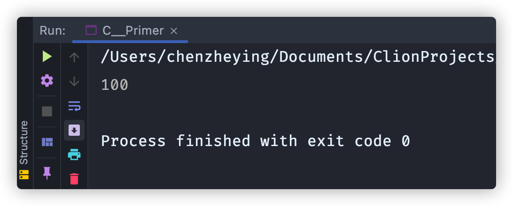

## 基本数据类型
### 算数类型选择建议
- 当明确知晓数值不可能为负时：选用无符号类型
- 整数运算：int
- 数值超过int范围：long long
- 不大的整数：signed char / unsigned char
- 浮点数运算：double

### 不同“前缀”所代表的不同进制

下面⬇️表格中的例子都表示十进制的20

|前缀|进制|举例|
|-----|--------|---|
|无|十进制|20|
|0|八进制|024|
|0x / 0X|十六进制|0x14|

### 转义符
|符号|含义|
|---|----|
|`\n`|换行符|
|`\t`|制表符|
|`\a`|报警符|
|`\v`|纵向制表符|
|`\b`|退格符|
|`\r`|回车符|
|`\"`|双引号|
|`\'`|单引号|
|`\\`|反斜线|
|`\?`|问好|
|`\f`|进纸符|

### 字符/字符串字面值的前缀

|前缀|适用类型|含义|
|---|----|---|
|`u`|`char16_t`|Unicode|
|`U`|`char32_t`|Unicode|
|`L`|`wchar_t`|宽字符|
|`u8`|`char[]` / `string`|UTF-8|

`char16_t`、`char32_t`、`wchar_t`、`char`的区别主要在于所占存储空间与编码格式，可参考 https://blog.csdn.net/nanmudage/article/details/106597032


## 变量
### 变量初始化
1. 初始化与赋值都使用`=`，但**初始化不是赋值**
   - 初始化：创建变量时赋予其一个初始值
   - 赋值：把对象的当前值擦除，而以一个新值来替代。
2. 初始化方式之--列表初始化
    ```cpp
        int a = 0;
        int b = {0};
        int c(0);
        int d{0};
    ```

   - 以上四种初始化方式全部合法，其使用花括号`{}`进行的初始化方式（b和d）称为列表初始化。
   - 列表初始化不允许初始化时丢失信息，即下面a、c的初始化合法，初始化为3；b、d的初始化不合法，报错`Type 'long double' cannot be narrowed to 'int' in initializer list`

    ```cpp
        long double ld =3.14159;
        int a = ld;
        int b = {ld};
        int c(ld);
        int d{ld};
    ```

### 变量的声明和定义
为了支持分离式编译，C++语言将声明和定义区分开来。
- 变量声明：规定变量的类型和名字，使得名字为程序所知。
    ```cpp
    extern int i; //声明而不定义i
    ```
- 变量定义：为变量申请存储空间，可能对变量初始化，即创建与名字关联的实体。
    ```cpp
    int j;//声明并定义i
    extern double pi = 3.14 //赋初值时就无所谓有没有用extern，会自动定义pi
    ```
- 🗒️ Note: 变量能且只能被定义一次，但是可以被多次声明。⚠️⚠️⚠️  

- `extern`使用实例
`extern`关键字使得变量可以在一个文件中定义，（无需进行`#include`）在另一个文件中声明后进行调用使用。
  - 普通变量使用`extern`  
    1. 在`a.cpp`中进行`non_const`变量的定义  
          ```cpp
          // a.cpp
          int non_const = 10;
          ```
    2. 在`main.cpp`中声明并使用变量`non_const`
          ```cpp
          //main.cpp
          #include <iostream>
          int main() {
              extern int non_const;
              std::cout << non_const << std::endl;
              return 0;
          }
          ```

          在`main.cpp`中可以正常使用定义在`a.cpp`中的`non_const`变量。
          
      - 🗒️ Note: 如果变量是定义在一个`.h`文件中的，则无法通过在`main.cpp`声明后使用这个变量。
         1. 在`a.h`中进行`non_const_header`变量的定义
         ```cpp
         //a.h
         int non_const_header = 99;
         ```
         2. 在`main.cpp`中声明并使用变量`non_const_header`
              ```cpp
              #include <iostream>
              int main() {
                  extern int non_const_header;
                  std::cout << non_const_header << std::endl;
                  return 0;
              }
              ```

              报错显示变量`non_const_header`没有被定义
              

              疑惑🤔：可以在cpp中定义，另一cpp中声明并使用；在a.h中定义，另一b.h中声明后，在b.h中 <kbd>⌘</kbd> + <kbd>🖱️</kbd> 变量名可以看到使用extern成功，但是`main.cpp`中#include `b.h` 后使用变量还是会报错，这是咋回事？

  - 常量变量使用`extern`
    1. 常量变量使用`extern`在定义变量时就必须带上`extern`
        ```cpp
        //a.cpp
        extern const int bufsize = 100;
        ```
    2. 在`main.cpp`中声明并使用变量`bufsize`
        ```cpp
        #include <iostream>
        int main() {
            extern const int bufsize;
            std::cout << bufsize << std::endl;
            return 0;
        }
        ```

        正常使用变量
        
### 变量名（标识符）
- 用户自定义的标识符中不能连续出现两个下画线
- 不能以下画线紧连大写字母开头
- 定义在函数体外的标识符不能以下画线开头