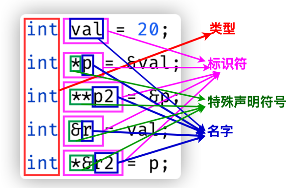

复合类型是区别于基本类型的其他类型，引用和指针都属于复合类型。

C++中声明一个“变量”（引用不是变量）的语句由类型+标识符组成，引用和指针的声明，就是在标识符的开头部分加上了特殊声明符号`&`或`*`。


## 引用
- 声明引用的特殊符号是`&`，即
    ```cpp
    int ival = 1024;
    int &refVal = ival;
    ```
- 引用即别名，引用其实就是给它绑定的变量起一个别名，所以：
  1. **引用不是变量**，所以不能定义引用的引用，不能定义指向引用的指针。
  2. 把引用的值赋值给另一个变量，就是把它绑定的值赋值给另一个变量。
  3. 对引用的值进行更改，也就是对它绑定的值进行更改
- 引用的作用是将一个引用和另一个对象绑定在一起，因此：
  1. 必须对引用进行初始化，要不然不知道它和谁绑定一起。
  2. 引用初始化之后，不能再给它赋值别的变量了，因为“绑定”的意思就是绑在一起锁定住。

## 指针
- 声明指针的特殊符号是`*`，即
    ```cpp
    int *p;
    ```
- 指针存放的是对象的地址，使用取地址符`&`取得变量的地址，然后赋值给指针对象。
    ```cpp
    int ival =42;
    int *p = &ival;
    ```
- 使用`nullptr`或`0`进行不指向任何对象的空指针的定义
    ```cpp
    int *p1 = nullptr;
    int *p2 = 0;
    ```
    需要注意，使用`0`进行空指针初始化时，只能使用字面量0，不能用值为0的int变量。
- 可以使用指针作为条件值，指针非0得到`true`，否则得到`false`
- `void*`指针: 一种特殊的指针类型。
  - 可以存放任意对象的地址。
  - 不能操作`void*`指针所指的对象。

## 取地址符`&`和解引用符`*`

可以将「声明引用的特殊符号`&`，声明指针的特殊符号`*`，取地址符`&`,解引用符`*`」看作完全不同的四个符号，只不过其中有两对长得一模一样。

### 取地址符`&`

如其名字所示，取地址符用于获得某个变量的地址，即一个指向变量的指针。

```c++
int main() {
    int num = 10;
    cout<<&num<<endl;
}
```

输出变量`num`的地址


由于指针对象存储的是一个对象的地址，所以取地址符多用于指针对象的赋值：

```c++
int main() {
    int num = 10;
    int *ptr = &num;
    cout<<*ptr<<endl;
  	//输出10
}
```

### 解引用符`*`

- 顾名思义，解引用`*`将指针的地址进行解析，得到一个引用类型

## 🗒️ Note
- 面对一条比较复杂的指针或引用的声明语句时，**从右向左阅读**有助于弄清楚它的真实含义。
```cpp
int i = 42;
int *p;
int *&r = p;
```
从右向左读`r`的定义语句，`&r`：说明r是一个引用；`*&r`：说明`r`是一个指针的引用；`int *&r`：说明`r`是一个int型指针的引用