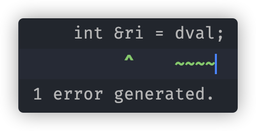
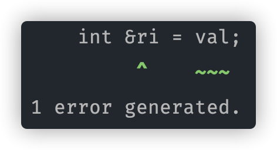

# const基础知识
- const限定符用于定义**值不能改变**的变量——常量。
- const对象创建之后值就不能改变，所以必须初始化。
- 根据所赋初值方式的不同，const对象有两种初始化：编译时初始化和运行时初始化
  - 编译时初始化：`const int j = 42;`  
    *编译器会在**编译过程中**将程序中所有的变量`j`替换成42*
  - 运行时初始化：`const int i = get_size()`
- 为了实现const对象的编译初始化，const对象被设定为尽在文件内有效，想要跨文件使用时，可以[利用`extern`关键字]()。

# const与复合类型
const可以与复合类型（引用和指针）结合。  
由于const使用来创建一个值不能改变的变量对象，而引用并非一个对象，所以const与引用的结合只有一种 —— 对常量的引用。  
而指针是一个对象，所以指针和const的结合有两种：常量指针（顶层const）和指向常量的指针（底层const）。
## const与引用
绑定到const对象上的引用，简称常量引用。由于const对象不可以改变的特性，常量引用也不能用来改变const对象的值。  

常量引用的声明方式：   
  ```cpp
  const int i = 42;
  const int &r1 = i;
  ```

一个常量引用可以进行绑定的情况有4种：
1. 常量引用绑定到同类型的常量上：  
    ```cpp
    const int i = 42;
    const int &ri = i;
    ```
2. 常量引用绑定到与其类型不同，但可以进行类型转换的常量上（`double` 绑 `int` / `int` 绑 `double`）：  
   
    原则上来讲，引用必须绑定在一个与其类型一致的对象上，但是，如果常量是可以转换为与引用一致的类型，编译器会自动帮忙利用中间变量进行*类型转换后的绑定*，即：  
    ```cpp
    const double dval = 3.14;
    const int &ri = dval;
    ```
    会被编译器处理为：
    ```cpp
    const double dval = 3.14;
    const int temp = dval;
    const int &ri = temp;
    ```
    那么，常量引用`ri`实际上是被绑定到了一个与常量`dval`进行类型转换之后的值一样的临时常量对象上。  

    <big>但是!!!</big>对变量以及变量引用进行同样的操作是非法的！
    ```cpp
    double dval = 3.14;
    int &ri = dval;     
    //error: non-const lvalue reference to type 'int' cannot bind to a value of unrelated type 'double' 
    ```
      

    常量这样操作合法而变量这样操作非法的原因是：
    - 不论其绑定的是变量还是常量，常量引用并不能用于改变绑定对象的值，所以将其绑定到一个与欲绑定常/变量值相同的临时常量对象上并不会造成其他后果。
    - 而变量引用可以且多用于改变绑定对象的值，而绑定到类型转换后的中间变量上会造成无法使用引用对欲绑定的变量进行值改变的操作。

3. 常量引用绑定到符合情况1或2的**变量**上
    ```cpp
    double dval = 3.14;
    const int &ri = dval;
    ```

    同样的，由于变量引用可以用于改变其绑定对象的值，所以不可以将变量引用绑定到常量上
    ```cpp
    const int val = 3;
    int &ri = val;
    //error: binding reference of type 'int' to value of type 'const int' drops 'const' qualifier
    ```
       

4. 常量引用绑定到运算结果符合1或2或3的一般表达式上
    ```cpp
    int i = 3;
    const int &ri = i*3;
    ```

## const与指针
const与指针的结合有两种：常量指针（顶层const）和指向常量的指针（底层const）。
### 指向常量的指针
即**底层const**，只要求不**能通过该指针改变对象的值**，所谓的“指向常量”，是指针的一厢情愿，它自己认为自己指向的是常量，所以不去改变其值，其实也可以指向变量。
```cpp
//指向常量
const double cdval = 3.14;
const double *ptr = &cdval;

//指向变量
double dval = 3.14;
ptr = &dval;
```
从右到左原则：

- `double *ptr`：           ptr是一个XXXXXXX的double型的指针

- `const double *ptr`： ptr是一个指向常量的double型的指针

### 常量指针

const指针，也叫做**顶层const**。**指针本身是常量**，初始化之后不可以再指向其他地址,但是可以用此指针改变指向对象的值。
```cpp
int num = 0;
int *const constPtr = &num;
int num2 = 1;
constPtr = &num2;
//error: cannot assign to variable 'constPtr' with const-qualified type 'int *const'
```

从右到左原则：

- `const constPtr`：         constPtr是一个XXXXXXXXXXXXXXX常量

- `int *const constPtr`：constPtr是一个指向int型变量的指针常量


# 常量表达式
值不会改变并且在**编译过程**就能得到计算结果的表达式。如：字面值、用常量表达式初始化的const对象。
- 值在编译过程中可以计算得到是很重要的一点，如：
    ```cpp
    const int sz = get_size();
    ```
    `sz`并不是常量表达式，因为它的值运行时才可以获取到。
- 可以将变量声明为`constexpr`类型以便由编译器来验证变量的值是否是一个常量表达式
    ```cpp
    constexpr int sz = get_size();
    ```


## constexpr与复合类型
指针和引用都能定义成constexpr，但必须使用一个**固定的值**对其进行初始化


### constexpr指针
constexpr指针可以用nullptr或0初始化
```cpp
constexpr int *ptr = 0;
constexpr int *ptr = nullptr;
```

指针内存放的是其指向对象的地址，由于函数体内定义的变量并非存放在固定地址上，所以用变量对constexpr指针进行初始化时必须是位于与函数体之外的对象。
- 使用位于函数体内的对象初始化报错：
    ```cpp
    int main() {
        int num = 0;
        constexpr int *ptr = &num;
    }
    // error: constexpr variable 'ptr' must be initialized by a constant expression
    ```
    

- 使用位于函数体外的对象初始化成功：
    ```cpp
    int num = 0;
    int main() {
        constexpr int *ptr = &num;
    }
    ```


### constexpr引用
引用要和对象绑定，所以constexpr引用只可以使用函数体之外的对象初始化。
```cpp
int num = 0;
int main() {
    constexpr int &ptr = num;
}
```

