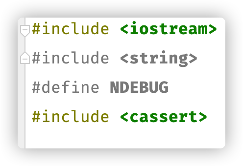
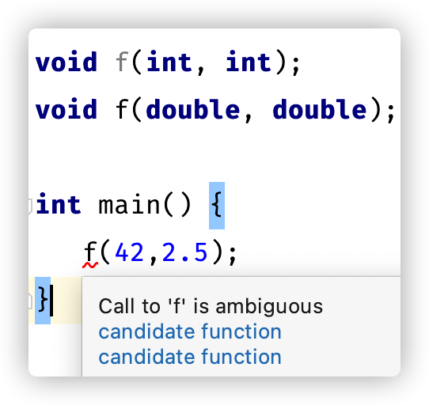
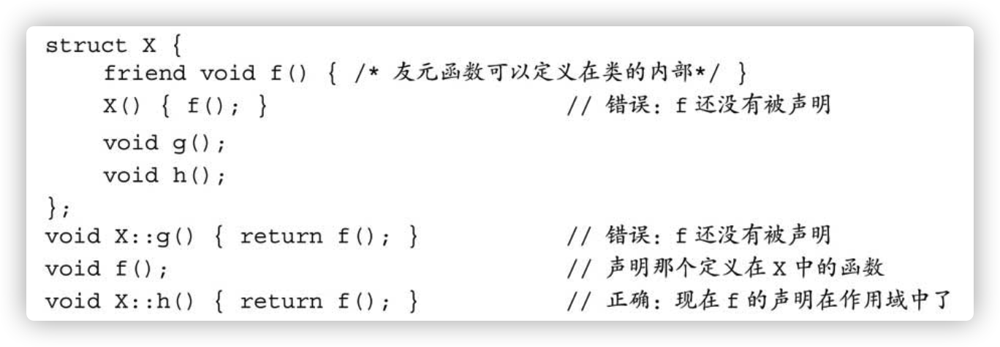

# 运算符

- 关于int型的val的布尔判断
  1. `if(val)`：val为0 -> 假；val不为0 -> 真
  2. `if(val == true)`: true被转化成1，val为1 -> 真，val不为1 -> 假

- 赋值运算符的右结合律: 

  ```cpp
  int ival, jval;
  ival = jval = 0;
  ```

- 移位运算符的左结合律

  ```cpp
  cout<<"Hello"<<"World";
  ```

  

- `if(i=j)`并不总被判断为true，仅当j不等于0时被判断为true

- 为什么`++i`比`i++`效率高？
  - 因为`i++`需要做额外工作：将i加1之前的值存储起来，用于表达式计算。
  - 也就是说`i++`等同于`i的表达式; i+=1;`两条语句，对于可以加一的变量i来说（因为有的迭代器不能+=1，只能自增），`i++`唯一的作用是语句的缩写。
  - 而`++i`不仅仅是语句的缩写，还有性能上的优化
  
- 三元运算符：`cond?expr1:expr2`

- 左值和右值：
  - 左值：那些求值结果为对象或函数的表达式。一个表示对象的非常量左值可以作为赋值运算符的左侧运算对象。
  - 右值：一种表达式，其结果是值而非值所在的位置。
  
- `->`和`.`运算符的区别

  - `.`：调用成员函数、数据成员等
  - `->`: 相当于先解引用，再使用`.`运算符

## 强制转换类型

### 旧式强制类型转换

```cpp
type (expr);
(type) expr;
```

不要再用这种形式的强转了。

### c++11强制类型转换

```cpp
cast-name<type>(expression)
```

cast-name可以是`static_cast`、`dynamic_cast`、`const_cast`、`reinterpret_cast`

# 语句

- break不作用于if，所以我们可以`if(condition) break;`
- break语句的作用范围仅限于最近的循环或者switch。

##  异常处理

- `throw`：

  ```cpp
  if(condition)
  {
    throw runtime_error("error information");
  }
  ```

- `try`语句块：

  ```cpp
  try{
    statements;
  } catch (runtime_error err) {
    haldler statements;
  }
  ```

  

- 异常类：
  1. exceprtion
  2. stdexcept
  3. new
  4. type_info

# 函数

- 定义在函数之内的对象出了函数就会被销毁，除非用局部静态对象。
- 局部静态对象：在程序的执行路径第一次经过对象定义语句时初始化，并且直到程序终止才被销毁，在此期间即使对象所在的函数结束执行也不会对它有影响。(声明时最前面加上`static`)
- 变量和函数都应在头文件中声明，在源文件中定义。

## 参数传递

### 引用形参

- 为了改变传入函数的实参的值，可以使用指针形参或引用形参，c++推荐使用引用形参。
- 使用引用形参，不仅能用来改变入参的值，还能用来**避免对参数的拷贝**，以提高效率（甚至有时候入参都不能拷贝）。
- 可以利用引用形参一次返回多个值。
- 尽量把引用形参定义为常量引用类型。

### 数组形参

#### 两个重要特点

1. 不允许拷贝数组
2. 使用数组时（通常）会将其转换成指针

#### 补充

- 由于数组会被转换成指针，所以以下三种形式是等价的，编译器看到的形参都是`const int*`

```cpp
void print(const int*);
void print(const int[]);
void print(const int[10]);
```


- 想真的给函数中传入数组时:

  1. 使用数组的引用作为形参

     ```cpp
     f(int (&arr)[10])
     ```

     - 此函数只接受大小为10的int数组作为入参

  2. 使用*首元素是欲作为入参的数组*的**“二维数组”**作为入参

     - 二维数组的元素是一维数组，所以将二维数组的首元素指针传入，即将一个以为数组传入

       ```cpp
       void print(int (*matrix)[10], int rowSize) {}
       ```

       

### `main`函数的参数

```cpp
int main(int argc, char *argv[]) {}
```

- 第二个形参argv是一个数组，它的元素是指向C风格字符串的指针
- 第一个形参argc表示数组中字符串的数量

### 可变形参

- 使用场景：不确定传入参数的个数
- 使用方法：
  1. 所有参数类型相同：initializer_list
  2. 参数类型不同：可变参数模版

## 返回值

### 返回数组指针

1. `Type (*function (parameter_list)) [dimension]`

   ```cpp
   int (*func(int i)) [10];
   ```

   阅读顺序由内向外

2. 尾置返回类型

   ```cpp
   auto func(int i) -> int(*) [10]
   ```

   用`auto`代替返回值类型，在尾部用`->`引出真正的返回值类型（形式主语和真主语）

3. 别名

   ```cpp
   Typedef int arrT[10];
   using arrT = int[10]; //这两条语句等价
   arrT* func(int i);
   ```

### 返回一个引用

一个类的成员函数可以以本类型的引用作为返回值，返回的是调用对象的引用。

## 重载

- 不能用顶层const重载

  ```cpp
  Record lookup(Phone);
  Record lookup(const Phone);  //重复声明
  ```

- 可以用底层const重载

  ```cpp
  Record lookup(Account&);
  Record lookup(const Account&);
  ```

  

## 特殊用途语言特性

### 默认实参

- 一旦某个形参被赋予了默认值，它后面的所有形参都必须有默认值。

- 只能省略尾部的实参，即使前面的形参有默认实参。（以下语句非法）

  ```cpp
  string screen(size_type ht = 24, size_type wid = 80, char backgrnd = ' ');
  string window = screen(,,'?'); //错误：不能前面用默认，后面不用默认
  ```

- 当设计含有默认实参的函数时，其中一项任务是合理设置形参的顺序，尽量让不怎么使用默认值的形参出现在前面，而让那些经常使用默认值的形参出现在后面。

### 内联函数和constexpr函数

#### 内联函数

- 普通函数比表达式的开销大（调用前要先保存寄存器，并在返回时恢复；可能需要拷贝实参；程序转向一个新的位置继续执行）

- 内联函数可避免函数调用的开销

  ```cpp
  cout<< shorterString(s1, s2) <<endl;
  cout<< (s1.size()<s2.size()?s1:s2) <<endl;//两条语句效果和开销都是等价的
  ```

  内联函数在每个调用点上“内联地”展开

- 内联说明只是向编译器发出的一个请求，编译器可以选择忽略这个请求。

#### constexpr函数

- 定义：能用于常量表达式的函数
- 要求：
  1. 函数的返回类型及所有形参的类型都得是**字面值类型**。
  2. 函数体中必须有且只有一条return语句。
  3. constexpr函数体内也可以包含其他语句，只要这些语句在运行时不执行任何操作就行。
  4. 必须给consrexpr函数传入常量表达式作为实参时。

#### 调试帮助

1. `assert`预处理宏

   ```cpp
   assert(expr);
   ```

   - 首先对expr求值，如果表达式为假（即0），assert输出信息并终止程序的执行。如果表达式为真（即非0），assert什么也不做。

   - `NDEBUG`预处理变量：如果定义了NDEBUG，则assert什么也不做。

     ```cpp
     #define NDEBUG
     ```

     - ⚠️：这条语句写在任一条`#include`之前才会生效

       ​							

2. 一些局部静态变量

   编译器定义了一些局部静态变量

   | 变量       | 含义                           | 注                                                   |
   | ---------- | ------------------------------ | ---------------------------------------------------- |
   | `__func__` | 存放函数名                     |                                                      |
   | `__FILE__` | 存放文件名的字符串字面值       |                                                      |
   | `__LINE__` | 存放当前行号的整型字面值       | 完全等于在编辑器中显示的行数，不论函数是否是`inline` |
   | `__TIME__` | 存放文件编译时间的字符串字面值 |                                                      |
   | `__DATE__` | 存放文件编译日期的字符串字面值 |                                                      |

   

## 函数匹配

- 对于多个重载函数，编译器会为传入的实参匹配一个最佳函数

- 无法判断哪个重载函数最佳时，编译器会因具有二义性而拒绝请求。

  ```cpp
  void f(int, int);
  void f(double, double);
  f(42, 2.56);
  ```

  - 对于第一个参数，第一个函数更好，对于第二个参数，第二个函数更好

  - 没有最佳函数，报错 (ambiguous: 模棱两可)

    

## 函数指针

- 函数指针指向的是函数而非对象。

- 指针指向特定类型（由返回类型和形参类型决定）。

  ```cpp
  //函数
  bool lengthCompare(const string &, const string &);
  //函数指针
  bool (*pf) (const string &, const string &) = 0;
  // bool (*pf) (const string &, const string &) = nullptr;
  ```

  

- 可以把函数名当作值赋给变量

  ```cpp
  pf = lengthCompare;
  pf = &lengthCompare; //有没有&都可以，两句等价
  ```

- 使用指针调用函数：

  ```cpp
  bool b1 = lengthCompare("hello","goodbye");
  bool b2 = pf("hello","goodbye");
  bool b3 = (*pf)("hello","goodbye"); // 三句都是等价的
  ```

- 虽然函数不能作为另一个函数的形参，但是可以把指向函数的指针作为另一个函数的形参。（类似：虽然数组不能作为另一个函数的形参，但是可以把指向数组的指针作为另一个函数的形参。）

  ```cpp
  useBigger(s1, s2, lengthCompare); //函数类型的参数会被自动转化为对应的指针。
  useBigger(s1, s2, *lengthCompare);
  ```

- 虽然不能把函数作为返回值，但是可以把指向函数的指针作为返回值。

  ```cpp
  decltype(lengthCompare) *f1(int);
  //函数类型的返回值类型不会被自动转化为对应指针，所以 * 是必须的
  bool (*f2(int)) (const string &, const string &);
  auto f3(int) -> bool(*)(const string &, const string &);
  //三种方式是一样的
  ```

  

- 函数的别名

  ```cpp
  //函数的别名
  typedef bool Func(const string&, const string&);
  typedef decltype(lengthCompare) Func; //两句等价
  //函数指针的别名
  typedef bool(*FuncP) (const string&, const string&);
  typedef decltype(lengthCompare) *FuncP; //两句等价
  ```

  

# 类

- 类的成员函数有一个隐式的参数`*this`

- 想把这个隐形的`this`声明为常量指针的话，应该在函数的参数列表后加一个`const`

  ```cpp
  string isbn() const {return bookNo;}
  ```

- 函数必须声明在类内部，可以定义在类外部。

  - 定义在类内部，函数默认是内联的
  - 定义在类 外部，函数默认不是内联的
  
- `class`：默认访问权限是private

- `struct`：默认访问权限是public

- 可以在类内部用`inline`关键字修饰函数的声明，但推荐在类外部定义的时候再用`inline`。

- 为类的数据成员加上`mutable`，使其成为可变数据成员，即使是`const`的可变数据成员，也是可变的。

## 友元

- 想要实现允许其他类或函数访问某一类的非`public`成员，可使用友元

- 友元声明只影响访问权限，并非普通意义上的声明，所以调用友元函数之前光友元声明过还不够，必须“真正声明”过才行：

  

### 普通的友元函数

- 友元函数**声明**在类内任意区域

```cpp
class Sales_data
{
  friend Sales_data add();
  public:
  	......
  private:
  	......
} 
Sales_data add()
{
  //函数内部使用了Sales_data类的私有数据成员
};
```

- 如果我们希望类的用户能够调用某个友元函数，那么我们就必须在友元声明之外再专门对函数进行一次声明。

### 类之间的友元关系

当一个类想要访问另一个类的私有成员时，可在后者的内部，把前者设置成友元类(`friend class`)

```cpp
class Screen {
  friend class Window_mgr;
  private:
  	......
}
class Window_mgr {
  public:
  	void clear(){
      //使用Screen的私有成员
    } 
}

```

- `Window_mgr`想用`Screen`的私有成员，所以在`Screen`内部把`Window_mgr`声明成友元类。
- 当Screen将Window_mgr指定为其友元之后，Screen的所有成员对于Window_mgr就都变成可见的了。

### 某类的成员函数作为另一类的友元函数

与友元类相比，缩小“权利共享”范围，仅允许另一类的某一成员函数访问本类的私有成员

```cpp
class Screen {
  friend void Window_mgr::clear(); //声明
}
```

- 这种情况下尤其要注意顺序：
  1. 先定义要访问别人的私有成员的类，且在其中声明但不定义访问他类私有成员的函数
  2. 定义私有成员被访问的类，且在其中进行友元声明
  3. 定义访问他类私有成员的函数，在其中使用他类的私有成员

## 为了让成员函数能序列化调用作出的努力

### 成员函数会改变数据成员

当想用成员函数改变类的数据成员时，可以把函数返回值设置成引用，以方便连续调用。如下：

- 函数`move`和`set`的返回值是自定义类型`Screen`

  ```cpp
  Screen temp = myScreen.move(4,0);
  temp.set('#');
  ```

  - 如果在move后面直接调用set，set不会再作用到temp上，因为move返回的是`*this`的副本

- 函数`move`和`set`的返回值是自定义类型`Screen`的引用`Screen &`

  ```cpp
  myScreen.move(4,0).set('#');
  ```

### 成员函数不改变数据成员

想要返回一个引用类型，而函数内部又不改变数据成员的值，所以想到把函数的返回值定义为常量引用，但是这样会导致无法在此常量引用函数后继续进行序列化调用，因为这个函数返回的是一个常量引用，而常量对象是无法调用非常量函数的。

- 原则：
  1. 常量对象只能调用常量函数
  2. 尽量让非常量对象调用非常量函数
  3. 内部不改变数据成员的函数，尽量声明为常量函数（把不会改变形参声明为`const`）
- 方案：
  1. 一个成员函数重载两个版本：常量版本和非常量版本
  2. 两个版本的函数都不执行实际的操作，而是去调用一个实际执行操作的私有常量函数

```cpp
class Screen{
  public:
  	Screen &display(std::ostream &os)
    {
      do_display(os);
      return *this;
    }
  	const Screen &display(std::ostream &os) const 
    {
      do_display(os);
      return *this;
    }
  private:
  	void do_display(std::ostream &os) const     //根据原则这里保持为const
    {
      os<<contents;
    }
}
```

## 构造函数

- 构造函数初始值列表

  ```cpp
  Sales_data(const string &s): bookNo(s) { }
  ```

- 不初始化，而是赋值（*不推荐这种做法*）

  ```cpp
  Sales_data(const string &s){
    bookNo = s;
  }
  ```

  1. 常量、引用必须初始化，而不是赋值
  2. 赋值之前会进行默认初始化，效率降低

- 默认构造函数：

  ```cpp
  Sales_data() = default;
  ```

- 委托构造函数

  ```cpp
  Sales_data(std::string s): Sales_data(s, 0, 0) {}
  ```

- 聚合类：
  1. 所有成员都是public的。
  2. 没有定义任何构造函数。
  3. 没有类内初始值。
  4. 没有基类，也没有virtual函数。

## 类的静态成员

与类本身直接相关，而不和类的对象关联的成员。

### 声明

可以是public的也可以是private的.

```cpp
static double rate() {return interestRate};
static double interestRate;
```

### 使用

1. 使用类型名和作用域运算符

```cpp
double r;
r = Account::rate();
```

2. 使用对象调用

```cpp
Account ac1;
r = ac1.rate();
```

# IO库

| 头文件     | 类型                              | 作用             |
| ---------- | --------------------------------- | ---------------- |
| `iostream` | `istream`, `wistream`             | 从流读取数据     |
|            | `ostream`, `wostream`             | 向流写入数据     |
|            | `iostream`, `wiostream`           | 读写流           |
| `fstream`  | `ifstream`, `wifstream`           | 从文件读取数据   |
|            | `ofstream`, `wofstream`           | 向文件写入数据   |
|            | `fstream`， `wfstream`            | 读写文件         |
| `sstream`  | `istringstream`, `wistringstream` | 从string读取数据 |
|            | `ostringstream`, `wostringstream` | 向string写入数据 |
|            | `stringstream`, `wstringstream`   | 读写string       |

- io对象不能拷贝或赋值

## 文件流

文件流`fstream`继承自`iostream`，所以`iostream`的操作`fstream`都可以用， 还有一些特有操作

### `fstream`特有操作

| 代码                      | 含义                                         |
| ------------------------- | -------------------------------------------- |
| `fstream fstrm;`          | 创建未绑定的文件流                           |
| `fstream fstrm(s);`       | s可以是string，也可以是指向c风格字符串的指针 |
| `fstream fstrm(s, mode)`; | 指定文件打开模式                             |
| `fstrm.open(s);`          | 为已定义的fstream对象绑定文件                |
| `fstrm.close()`           | 关闭文件绑定，返回void                       |
| `fstrm.is_open()`         | 返回bool，检查是否成功打开关联的文件         |

### 文件模式

| 代码     | 含义                                 |
| -------- | ------------------------------------ |
| `in`     | 读                                   |
| `out`    | 写                                   |
| `app`    | append，追加写，写操作之前定位到末尾 |
| `ate`    | 打开文件后定位到末尾                 |
| `trunc`  | 截断模式，打开后清空文件             |
| `binary` | 以二进制方式进行IO                   |

##  string流

### stringstream特有操作

| 代码               | 含义                                                         |
| ------------------ | ------------------------------------------------------------ |
| `sstream strm;`    |                                                              |
| `sstream strm(s);` | 一个explicit构造函数（不生成由string转换成sstream对象的隐式转换） |
| `strm.str()`       | 返回strem保存的string的拷贝                                  |
| `strm.str(s)`      | 将s拷贝到strm中，返回void                                    |

