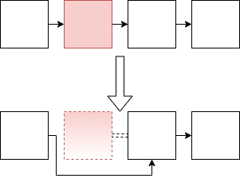

# 顺序容器

- 顺序容器包括：`vector`, `deuqe`, `list`, `forward_list`, `array`, `string`

- 选择容器的基本原则：
  1. 没有特殊原因，请使用`vector`
  2. 有很多小元素，不要用`list`和`forward_list`
  3. 需要随机访问元素：`vector`或`deque`
  4. 需要在中间插入或删除：`list`或`forward_list`
  5. 头尾插入删除，中间不插入删除：`deque`

## 拷贝元素

- 首迭代器`begin`/`first`，尾迭代器`end`/`last`，元素范围`[begin, end)`
- 将容器c1的内容拷贝到容器c2中时，有两种做法
  1. 直接拷贝，`vector<string> c2(c1)` / `vector<string> c2 = c1`: c1和c2的容器类型和元素类型都必须相同
  2. 通过范围拷贝，`forward_list<string> c2(c1.begin(), c1.end())`：c1可以不是forward_list，且元素也可以不是string，只要能转换过去就可以

- 内置数组不能进行两个数组之间的赋值拷贝，但`array`可以(需要保证两个array的大小和类型都相同)

## 添加元素

- `push_back()`, `emplace_back()`, `push_front()`, `emplace_front()`, `insert(ite, elem)`, `emplace(ite, args)`
- `insert()`还可以在指定迭代器前插入n个t，或在指定迭代器前插入其他两个迭代器表示的范围，或在指定迭代器前插入一个花括号包围的元素值列表
- 在调用`emplace_back`时，会在容器管理的内存空间中直接创建对象。而调用`push_back`则会创建一个局部临时对象，并将其压入容器中。

## 访问元素

- `c.back()`, `c.front()`, `c[n]`, `c.at(n)`
- `c.front()` = `*c.begin()`; `c.back()` = `*(--c.end())`
- `forward_list`没有`back()`，`end()`不能`--`

## 删除元素

- `pop_back()`, `pop_front()`, `erase(ite)`, `erase(beginIte, endIte)`, `clear()`
- `deque`删除 除了首位元素外的元素，会导致所有迭代器、引用、指针失效
- `vector`和`string`删除元素，导致被删元素之后的迭代器、引用、指针失效
  - 如想保存迭代器、引用、指针，可以用`list`

## forward_list

- 由于删除一个元素，需要把这个元素之前的元素的后继元素改成要删除元素的后继元素，所以需要向前访问一个元素，而单向链表`forward_list`没有向前访问的功能

- 因此`forward_list`的方法都是对传入方法的迭代器之后的那个元素进行操作：
  - `insert_after`, `emplace_after`, `erase_after`
  - `before_begin()`, `cbefore_begin()`

## resize()

- array不支持
- 可以放大，可以缩小，放大时可以指定初始值

## 容器迭代器失效

### 添加元素

- 如果容器是`vector`或`string`，且存储空间被重新分配，则指向容器的迭代器、指针和引用都会失效。如果存储空间未重新分配，指向插入位置之前的元素的迭代器、指针和引用仍有效，但指向插入位置之后元素的迭代器、指针和引用将会失效。

- 对于deque，插入到除首尾位置之外的任何位置都会导致迭代器、指针和引用失效。如果在首尾位置添加元素，迭代器会失效，但指向存在的元素的引用和指针不会失效。

- 对于list和forward_list，指向容器的迭代器（包括尾后迭代器和首前迭代器）、指针和引用仍有效。

### 删除元素

- 对于list和forward_list，指向容器其他位置的迭代器（包括尾后迭代器和首前迭代器）、引用和指针仍有效。
- 对于deque，如果在首尾之外的任何位置删除元素，那么指向被删除元素外其他元素的迭代器、引用或指针也会失效。如果是删除deque的尾元素，则尾后迭代器也会失效，但其他迭代器、引用和指针不受影响；如果是删除首元素，这些也不会受影响。
- 对于vector和string，指向被删元素之前元素的迭代器、引用和指针仍有效。注意：当我们删除元素时，尾后迭代器总是会失效。 

## 容量

- `capacity`, `size`
- `reserve`, `shrink_to_fit`

## 额外的string操作

- `substr`, `insert`, `erase`, `assign`
- `append`, `replace`

- `find`：搜索成功返回`string::size_type`, 搜索失败返回`string::npos`
- `rfind`

- `name.find_first_of(numbers)`：在字符串`name`中找出现在字符串`numbers`中的任一个字符
- `find_first_not_of`, `find_last_of`, `find_last_not_of`

- `compare`：相等0，大于正数，小于负数
- `s = to_string(a_int);` int转string
- `double d = stod(s);` string转double

- `stoi`, `stol`, `stoul`, `stoll`, `stoull`, `stof`, `stod`, `stold`

## 容器适配器

- 三个顺序容器适配器：`stack`, `queue`, `priority_queue`

- 本质上，一个适配器是一种机制，能使某种事物的行为看起来像另外一种事物一样
- 一个容器适配器接受一种已有的容器类型，使其行为看起来像一种不同的类型
- 选择一个能支持适配器的操作的容器来生成适配器
- 默认情况下，`stack`和`queue`是基于`deque`实现的，`priority_queue`是在`vector`之上实现的，但是实际上只要是能支持适配器的所有操作的容器就可以。
