# Level0 认识C++标准库

- STL = 六大部件 = 80%C++标准库
- 参考网站：
  1. cplusplus.com
  2. cppreference.com
  3. Gcc.gnu.org

- STL六大部件（Components）：

  - 容器（Containers）

  - 分配器（Allocators）

  - 算法（Algorithms）

  - 迭代器（Iterators）：泛化的指针

  - 适配器（Adapters）

  - 仿函数（Functors）

    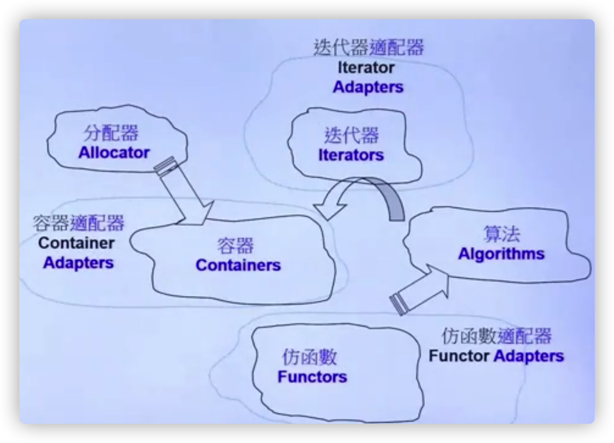


```c++
int main() {
  int ia[6] = {27, 210, 12, 47, 109, 83};
  vector<int, allocator<int>> vi(ia, ia+6);
  cout<< count_if(vi.begin(), vi.end(),
                 not1(bind2nd(less<int>(), 40)));
  return 0;
}
```

- `bind2nd`, `not1`都是适配器，将原来的less函数扩展成我们想要的样子
- `allocator<int>`是分配器，默认不写

## 容器

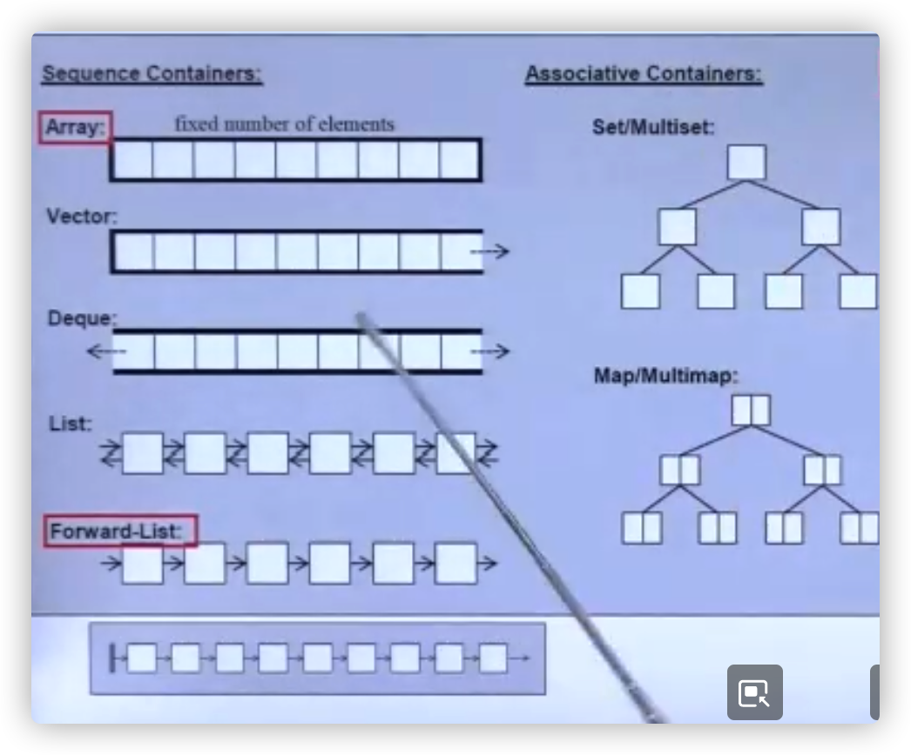

### 结构与分类

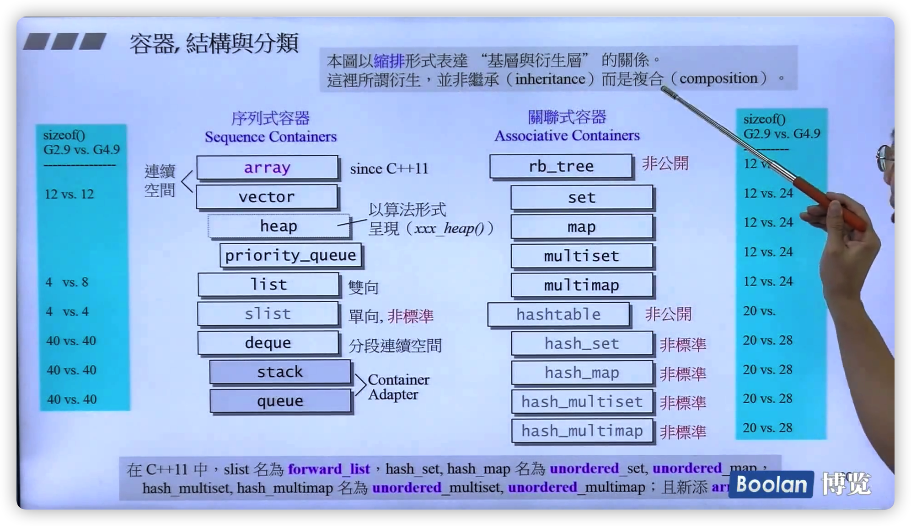

### 顺序容器

`Array`, `Vector`, `Deque`（双向队列）, `List`（链表）, `Forward-List`（前向链表、单向链表）

#### Array

`array<int, 10> myArray;` 

- 如果size被指定为0，会自动初始化为大小为1的数组

#### Vector

- 向vector中放元素时，空间不够的话会在另一片新的空间把将其扩展为原来的两倍大小。

#### List

- List有方法`sort`，比`sort(c.begin(), c.end())`要好
- 每次扩充，加一个节点

#### forward_list

- 有方法`push_front`，没有`push_back`

#### deque

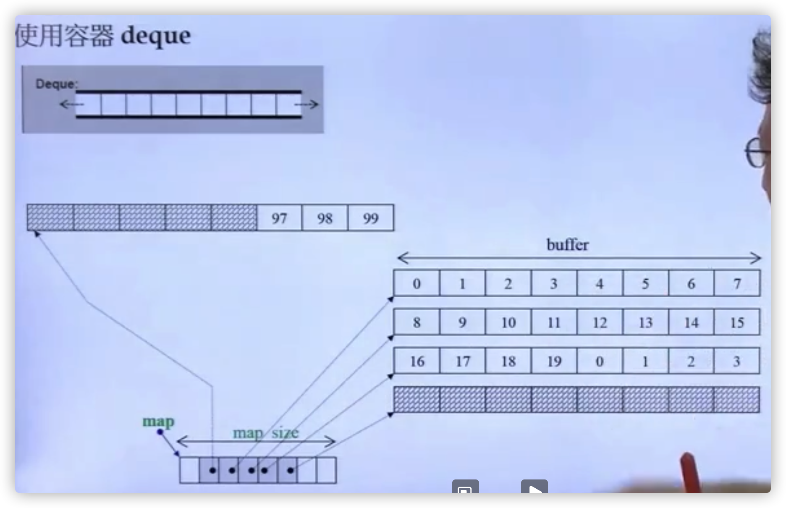

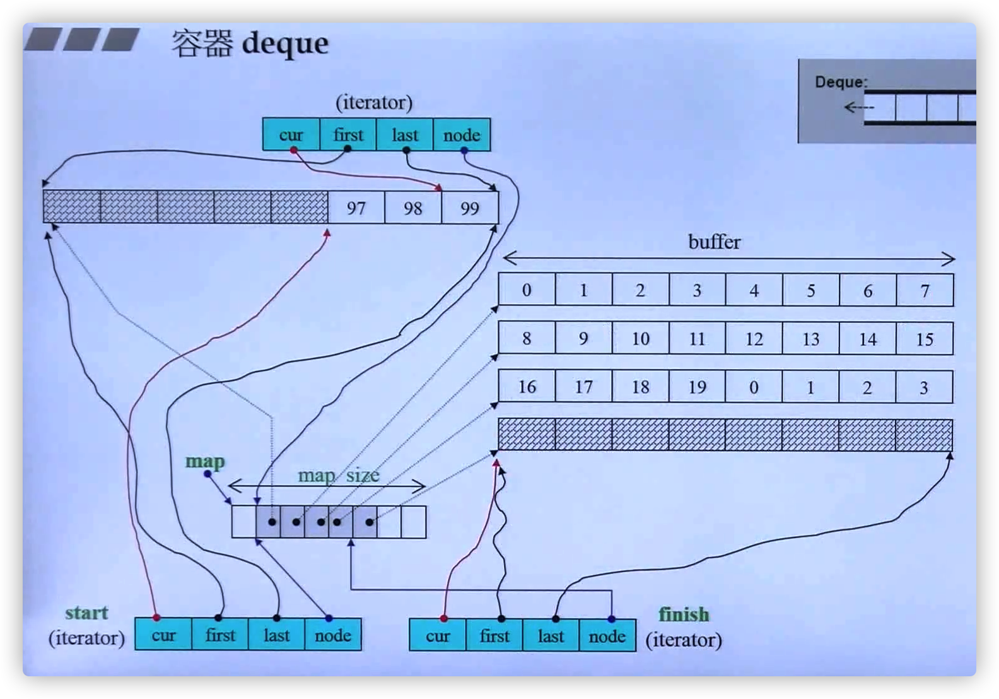

- 两边都可以扩充，`push_front`和`push_back`
- 扩充时对应地方的`buffer`满的话，会新开辟一个空间作为新的`buffer`，指针指过去
- **在使用者看来，deque在内存上是连续的**
- `stack`和`queue`都默认用`deque`实现，都不允许遍历，都不提供`iterator`
- `stack`可以选择`list`或`vector`作为底层结构
- `queue`可以选择`list`作为底层结构

### 关联式容器（Associative Containers）

Set/Multiset, Map/Multimap, Unordered Set, Unodered Map

- 查找非常快

#### multiset

- 使用`insert`插入数据
- 不能用`[ ]`进行插入
- `multiset`有方法`find`，比`find(c.begin(), c.end())`要快

#### multimap

- 用红黑树实现
- key-value
- 不能用`[ ]`进行插入
- key可以重复

#### set

- key=value，不能重复
- set底层由红黑树实现
- set将自己的所有工作都交给红黑树去做
- set通过一个只想红黑树的const指针实现（不能用迭代器更改set的值）的操作

#### map

- key + data = value

- 不能重复（指的是`<key, data>`不一样）
- 可以使用`[ ]`进行插入，括号内是key，等号右边是data
- 底层由红黑树实现
- key不能改，data可以改（可以用迭代器改）

#### rb_tree

- 红黑树是平衡二叉树 
- 红黑树的元素是按照中序遍历的顺序排序的
- 有两种插入操作：`insert_unique()`, `insert_equal()`

#### hashtable 

- 篮子的个数要比元素的个数大，否则需要扩充容器（即增大篮子个数）

 #### unodered容器

- `c.bucket_size(i)`：第i个位置的篮子里有多少个元素

## 分配器

- 环境：gnuc
- 为容器分配内存，没有必要直接操作分配器
- `array_allocator`, `mt_allocator`, `debug_allocator`, `pool_allocator`, `bitmap_allocator`, `malloc_allocator`, `new_allocator`
- `operator new()` 会调用 `malloc()`
- VC6的`allocator`的`allocate`本质上就是直接调用`operator new()`，`deallocate`本质上就是调用`operator delete()`

## OOP vs. GP

- sort操作
  - OOP：将数据和方法关联在一起

    List有sort函数，`c.sort()`

  - GP：将数据和方法分开

    vector和deque都没有sort函数，`sort(c.begin(), c.end)`

- 使用GP（Generic Programing）：
  1. Containers和Algorithms团队可以各自开发
  2. Algorithms通过Iterators确定操作范围 ，并通过Iterators去用Container元素

## 操作符重载

## 模版

### 类模版

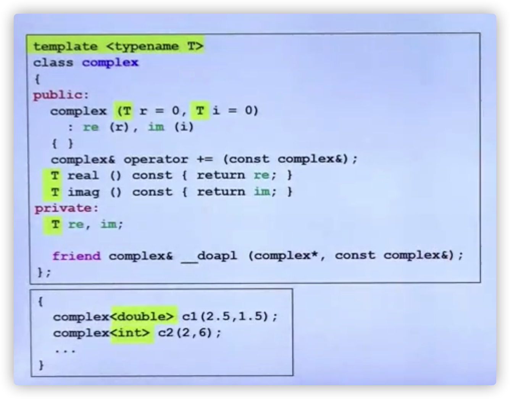

- 设计时使用`template <typename T>`声明，同时使用`T`代替类型名
- 使用时在尖括号内指明类型

#### 特化

在使用泛化类模版的基础上，对一些特定的类型进行特化。

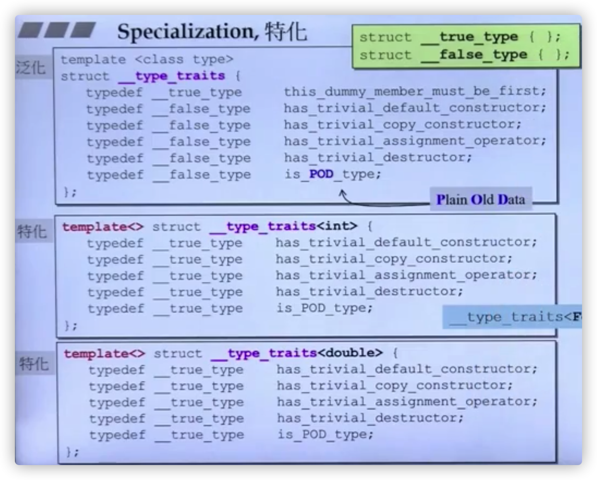

- 使用语句：`template<> struct`

#### 偏特化

- 当类模版有多个参数时，可以对其中部分参数进行指定类型的偏特化

  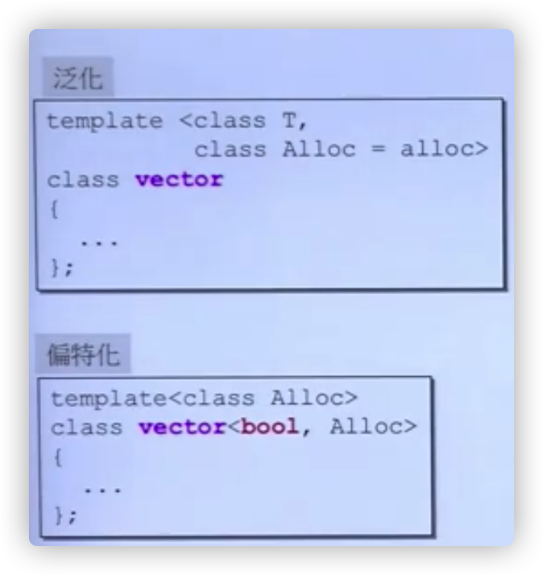

- 将任意类型的泛化（即被模版化的类型），偏特化（缩小）为任意类型的指针

  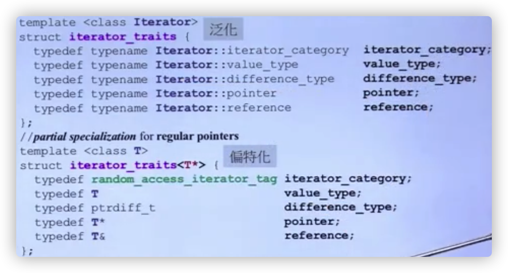


### 函数模版

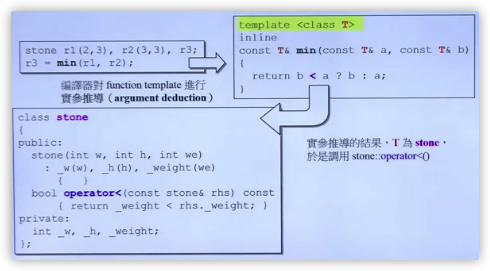

- 声明使用模版：`template <class T>`（class和typename 都可以），用`T`代替类型

- 使用时，不用显式指明T的类型，编译器会根据传参的类型进行推导

### 成员模版


## 迭代器Iterator

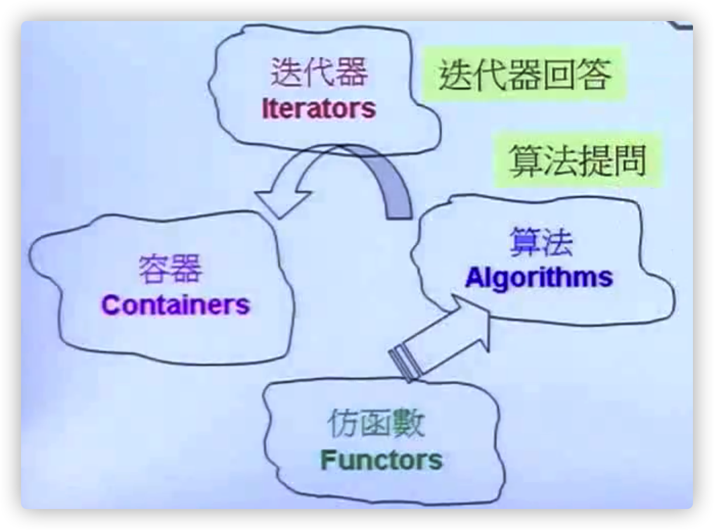 

- 一个算法欲操作容器中的数据时，需要知道这个容器的迭代器的五个信息（五个`associate types`）：`iterator_category`, `value_type`, `pointer`, `reference`, `difference_type`。

- 当容器中的`iterator`是一个类或结构体时，这五个信息直接在类或结构体内部使用`typedef`进行定义。

  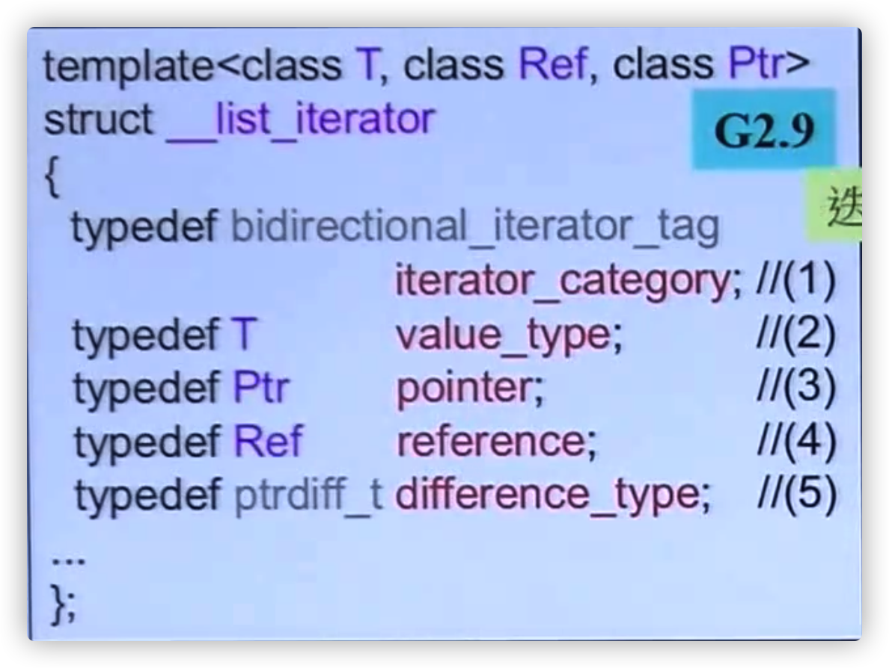

- 当容器中的`iterator`不是类或结构体时（如原生指针），

根据情况返回信息，如：`iterator`的类型时`T*`，那么它的`value_type`是`T`，`pointer`是`T*`

- 使用一个中间介质——`iterator_traits`，将上两种情况进行整合，依据不同的情况 使用不同的方法 返回不同的结果

  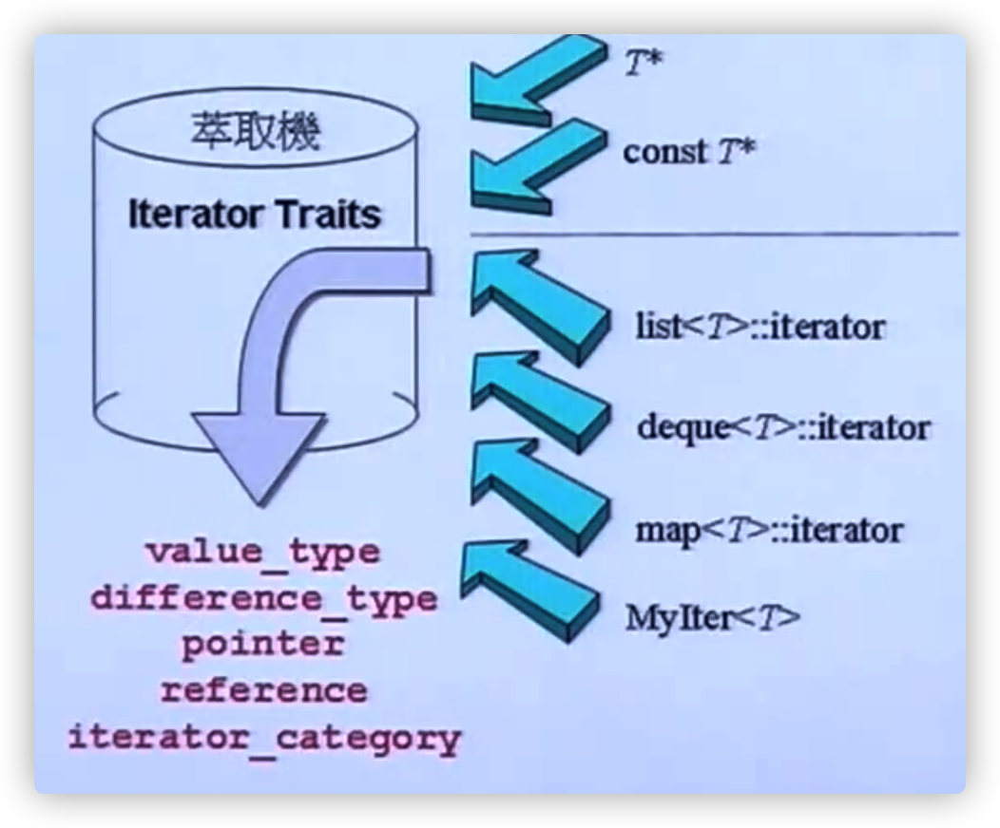

  - 这里将泛化的模版类`T`范围缩小为任意类型的指针`T*`，以对这个缩小后的范围进行特殊的处理的方法，叫做[偏特化](#偏特化)。
  -  内存空间连续的容器，都可以用指针来做迭代器

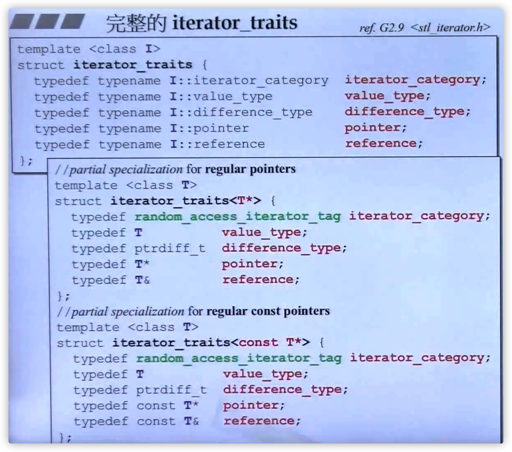

- c++中有各式各样的`traits`，用于特性的提取

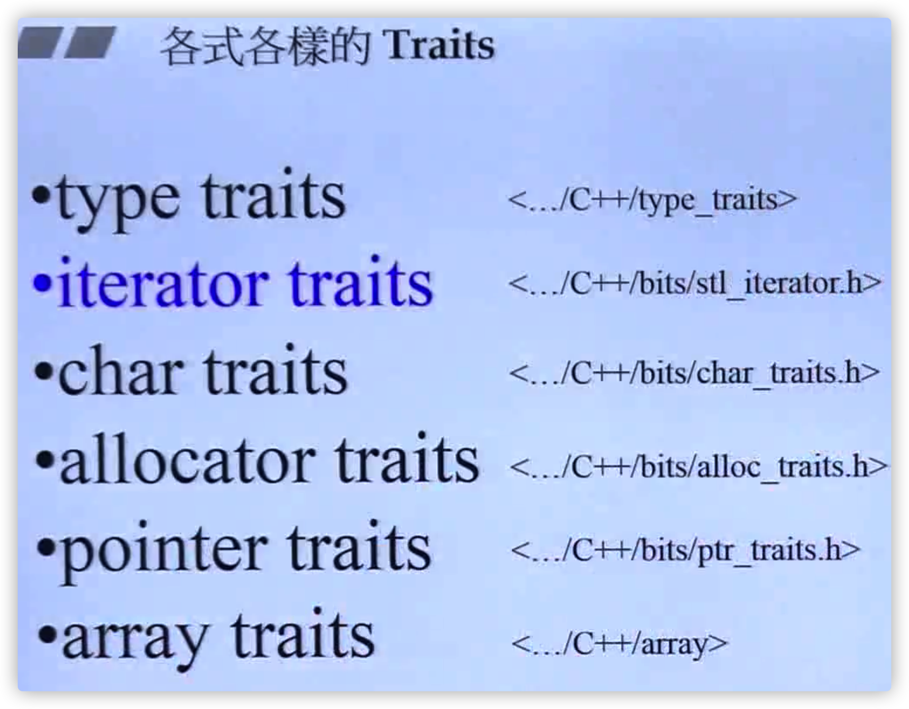

