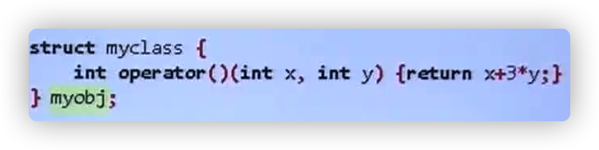
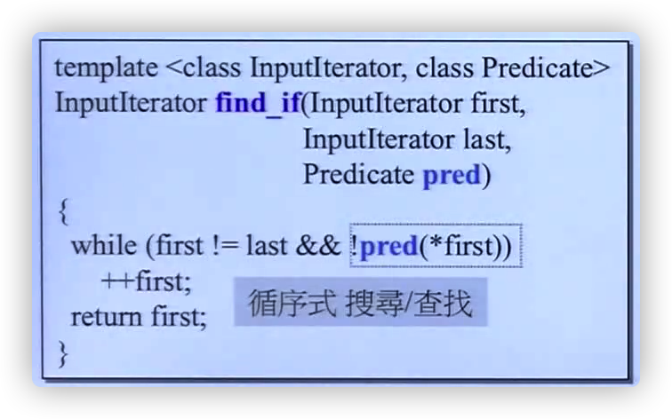
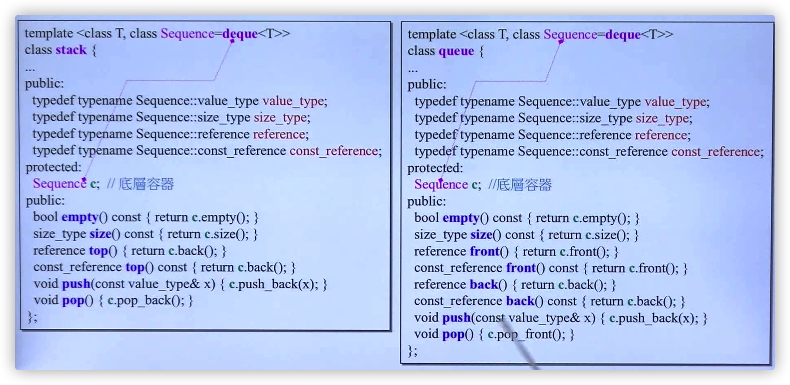
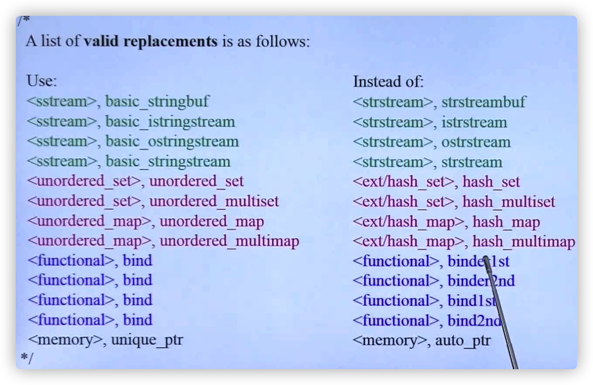

# STL——算法

- 算法是函数模版(function template)

```c++
template<typename Iterator>
Algorithm(Iterator itr1, Iterator itr2) {
  ...
}


//这里的cmp是一个准则（Criterion）
template<typename Iterator, typename Cmp>
Algorithm(Iterator itr1, Iterator itr2, Cmp comp) {
  ...
}
```

- 迭代器有五种：`input_iterator_tag`, `output_iterator_tag`, `forward_iterator_tag`, `bidirectional_iterator_tag`, `random_access_iterator_tag`

  

  

- `typeid`函数可以获得一个变量的类型: `typeid(itr).name()`

- 算法的效率和能否正确识别迭代器的分类有非常大的关系。

- 算法（函数模版）将迭代器类型作为一个参数，进行重载，以对拥有不同类型迭代器的容器进行不同的操作。

  

  

- 算法是函数模版，可以接收任何类型的入参，语法

- 不能对iterator_category进行限制，只能“暗示”

  

  - 如`sort`算法，通过将类型名写作`RandomAccesIterator`来暗示需要输入的参数应有可以跳跃访问的迭代器。

## 算法`accumulate`

accumulate算法有两个版本：

1. 一个版本直接做累加

   

2. 第二个版本可以指定累积的方式

   

   - `BinaryOperation`要求一个二元操作

     - 可以是STL库的仿函数

       ​	

     - 也可以是自定义的一个函数

       ​	

       

     - 也可以是自定义的、重载了小括号`()`操作符的类或结构体

       ​		

       ​	

## 算法`for_each`


- for_each算法是对迭代器范围内的所有元素，都进行`f`操作
- 和`accumulate`算法一样，f可以是一个自定义函数，也可以是一个重载了小括号操作符的类或结构体

## 算法`replace`,  `replace_if`, `replace_copy`

- `replace`将迭代器范围内的`old_value`改为`new_value`

  ​	

- `replace_if`将迭代器范围内的复合`pred`的值都替换为`new_value`

  ​	
  - `pred`传回真或假

- `replace_copy`将原容器拷贝一份，拷贝的过程中，等于`old_value`的元素被替换为`new_value`

  ​	

## 算法`count`、`count_if`

- count：迭代器移动一次，count加一次

  

- count_if：符合条件pred的话count加一 

  

- 有的容器带有自己的成员函数`count()`，比std空间的通用count算法要快

  

## 算法`find`，`find_if`

- 
- 

- 

## 算法`sort`


## 算法binary_search

- 利用算法`lower_bound`实现（`lower_bound`：找到在增序序列中插入元素的最低位置）

  

- `upper_bound`：找到在增序序列中插入元素的最高位置

# 仿函数functor

- functor只为算法服务，是模版类（struct）需要重载小括号操作符

  

- 自己写的 functor想融入STL的话，需要继承`binary_function`(两个操作数)或`unary_function`（一个操作数），目的是继承父类的`typedef`，目的是回答`adpater`的问题：1. 第一参数类型，2. 第二参数类型，3. 返回值类型

  

# 适配器Adapters

- Adapter有Functor Adapter, Iterator Adapter, Container Adapter


- 适配器去适配、去代表一个东西（Functor, Iterator, Container）的方法，是内含它。
- Adapter修饰什么类型的东西，表示的就是什么类型的东西

## 容器适配器 Container Adapters

- stack, queue通过内含一个Sequence容器（默认是deque）来改造它

  

## 函数适配器 Function Adapters

### binder2nd


- 使用方式举例：

```c++
cout<< count_if(vi.begin(), vi.end, not1(bind2nd(less<int>(), 40)));
```

- 功能：为仿函数Functor绑定第二参数

- `bind2nd`的内部实现是`binder2nd`

- `binder2nd`为了实现修饰完`functor`后仍是一个`functor`，重载了小括号操作符`()`

- `binder2nd`问了`less<int>()`这个临时object三个问题：

  1. 你的第一参数的类型是什么，`Operation::first_argument_type`
  2. 你的第二参数的类型是什么，`Operation::second_argument_type`
  3. 你的返回值的类型是什么，`Operation::result_type`

  - 能回答这三个问题的`function`是`adaptable`的 

- binder2nd修饰完一个function后，成为一个新的function，这个新的function也需要是adaptable的，这就是它继承`unary_function`的[原因](#仿函数functor)。

### 新型适配器bind

bind是新的、用来代替`binder1st`和`binder2nd`的适配器



### not1

 ```c++
 cout<< count_if(vi.begin(), vi.end(),
                not1(bind2nd(less<int>(), 40)))
 ```

