# GCC

- gcc编译指令：`gcc test.c -o app`，多用于编译c程序
- g++编译指令：`gcc test.c -o app`可用于编译c和c++程序，且能自动和C++程序使用的库链接

## 从源代码到可执行程序

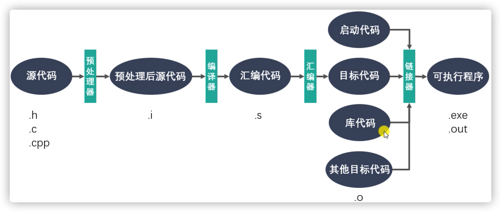

## GCC命令行参数


# 库

- 静态库在程序链接阶段被复制到程序中
- 动态库在程序运行时被加载到内存中

## 静态库

- 命名规则：libxxx.a
  - lib: 前缀
  - xxx：库的名字
  - .a: 后缀
- GCC进行链接时，会把静态库中代码大报道可执行程序中
- 一般用于库比较**小**的时候

### 静态库优点

1. 被打包到应用程序中，加载速度快
2. 发布程序无需提供静态库，移植方便

### 静态库缺点

1. 消耗系统资源，浪费内存

2. 更新、部署、发布麻烦

### 静态库制作

1. gcc获得 .o文件
2. 将.o文件打包，使用ar工具（archive）
   - `ar rcs libxxx.a xxx.o xxx.o`
   - r - 将文件插入备存文件中
   - c - 建立备存文件
   - s - 索引

### 静态库使用

在main.c中对静态库进行使用，然后gcc编译

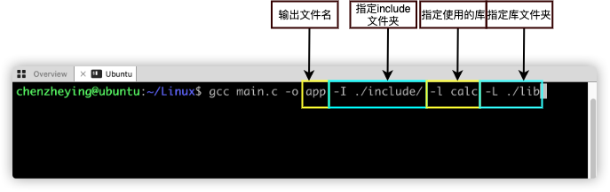

### 制作及使用图解

1. gcc生成.o文件

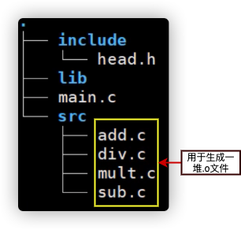

2. 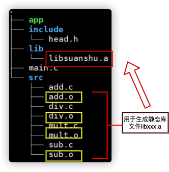

3. 

## 动态库

- 命名规则：libxxx.so
  - lib：前缀（固定）
  - xxx：库名
  - .so：后缀（固定，静态库是.a）
- 使用时用库的名字，即xxx
- GCC进行链接时，动态库的代码不会被打包到可执行程序中
- 程序启动时，动态库会被动态加载到内存中，通过`ldd`命令检查动态库依赖关系
- 一般用于库比较**大**的时候

### 动态库优点

1. 实现进程间资源共享（共享库）
2. 更新、部署、发布简单
3. 可以控制何时加载动态库

### 动态库缺点

1. 加载速度比静态库慢
2. 发布程序时需要提供依赖的动态库

### 动态库制作

- gcc得到和位置无关的.o文件
  - `gcc -c -fpic/-fPIC a.c b.c`从a.c b.c源文件得到a.o和b.o
- gcc得到动态库
  - `gcc -shared a.o b.o -o libcalc.so`

### 动态库使用

#### 指定动态库位置的方法

1. 命令行中指定，一次性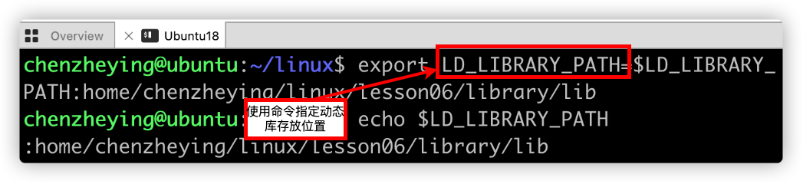

2. bashrc配置文件中添加与1中相同的内容
3. 在etc/profile中添加与1中相同的内容
4. 在etc/ld.so.conf中添加库所在目录，并执行指令ldconf
5. 将动态库文件放到/lib或/usr/lib目录下（不建议，容易命名冲突）

 

# Makefile

- Makefile文件定义了那些文件需要先编译，哪些后编译，哪些重新编译，及其他操作。
- “自动化部编译”，使用make命令对源码进行**编译**。

- 命名：makefile或Makefile
- 预定义变量
  1. AR： ar
  2. CC：gcc
  3. CXX：g++
  4. $@: 目标的完整名称
  5. $<: 第一个依赖文件的名称
  6. $^: 所有的依赖文件 

- ```
  app:main.c a.c b.c
  	gcc -c main.c a.c b.c
  ```

- 使用预定义变量的简化版

  ```
  app:main.c a.c b.c
  	$(CC) -c $^ -o $@
  ```

  

- 模式匹配：`%`作为通配符，同一命令中的`%`代表相同字符串

  ```
  %.o:%.c
  	$(CC) -c $< -o $@
  ```

  

- 函数：$(wildcard PATTERN)，获得目录下的文件

  ```
  src=$(wildcard ./*.c)
  ```

  

- 函数：$(patsubst <pattern>, <replacement>,<text>)，根据规则用replacement中的单词替换text中符合pattern的单词

  ```
  objs=$(patsubst %.c, %.o, $(src))
  ```

  

- 命令：clean

  ```
  clean:
  	rm $(objs) -f
  ```

  然后使用make clean执行

  - 可以在clean上面一行加上.PHONY，以保证make clean的执行不会被用户自己创建的clean文件阻挡

# GDB

- GDB是调试工具，和GCC配套组成完整开发环境


# 文件IO

## 标准C库IO

    


# 虚拟地址空间

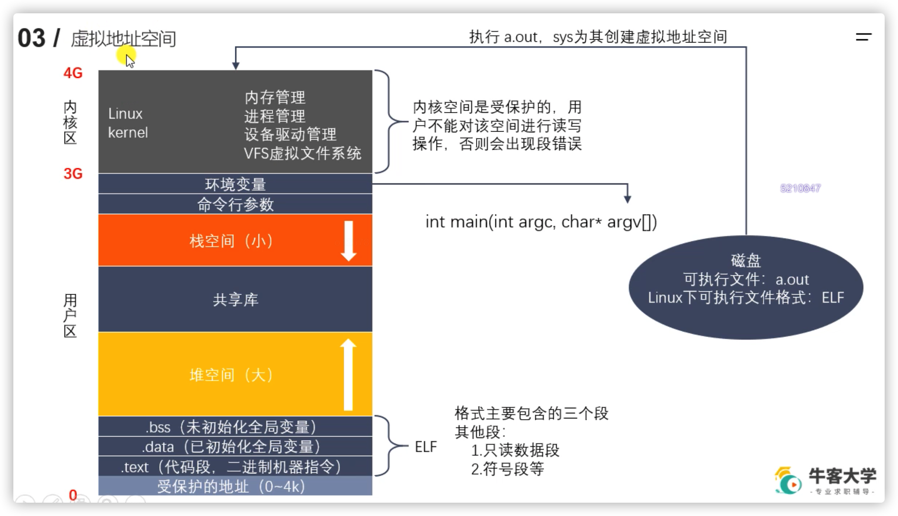

# 文件描述符

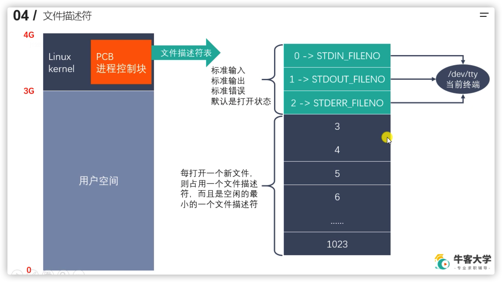

每个进程中的内核区都有一个PCB进程控制块，其中包含一个文件描述符表，默认1024个字节，存储1024个文件描述符（可以重复）。

# Linux系统IO函数

- 标准c的io函数，是通过调用linux系统io函数实现的

## OPEN函数

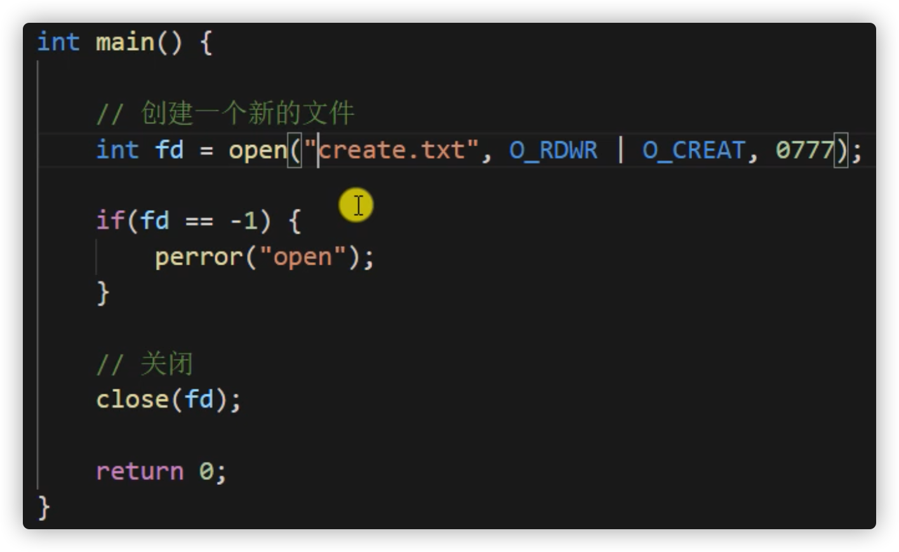


## 读、写操作


## 移动文件指针——lseek函数

- 标准c库的fseek函数调用的是linux系统的lseek函数
- 文件指针：读/写文件时，会从文件指针的位置进行
- 标准c库的fseek函数

```c++
#include <stdio.h>

int fseek(FILE *stream, long offset, int whence);
```

- linux系统的lseek函数

```c++
#include <sys/types.h>
#include <unistd.h>

off_t lseek(int fd, off_t offset, int whence);
```

- fd：文件描述符
- offset：偏移量
- whence：开始偏移的位置
  - SEEK_SET：从文件开头开始偏移
  - SEEK_CUR：从当前位置开始偏移
  - SEEK_END：从文件末尾开始偏移
- 返回值：返回文件指针位置

- 作用：
  1. 移动文件到文件头 `lseek(fd, 0, SEEK_SET)`
  2. 获取当前文件指针位置 `lseek(fd, 0, SEEK_CUR)`
  3. 获取文件长度 `lseek(fd, 0, SEEK_END)`
  4. 拓展文件长度，10b -> 110b `lseek(fd, 100, SEEK_END)`

## stat和lstat

```c++
#include <sys/types.h>
#include <sys/stat.h>
#include <unistd.h>

int stat(const char *pathname, struct stat *statbuf);
int fstat(int fd, struct stat *statbuf);
int lstat(const char *pathname, struct stat *statbuf);
```

- stat作用：显示一个文件的信息
- lstat作用：若b.txt是一个软链接到a.txt的文件，stat()函数只能显示a.txt的信息，使用lstat()函数显示a.txt的信息


## 文件属性操作函数

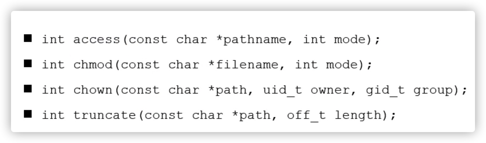

## 目录操作函数

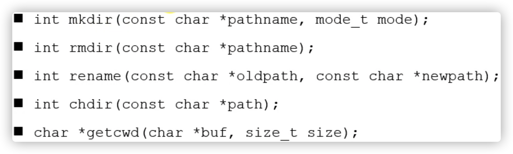

- chdir：修改进程的工作目录
- getcwd： 获取当前工作目录并存放到buf中
  - 返回值：返回buf的地址

## 目录遍历函数

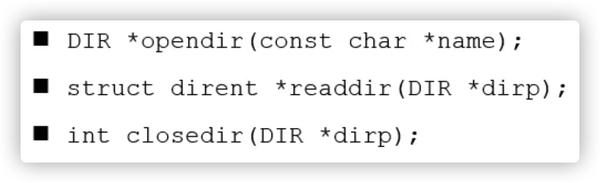

## 文件描述符相关函数

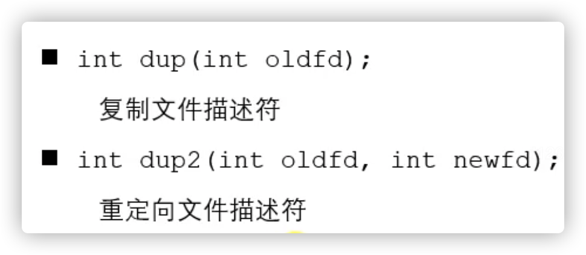

- dup：新建一个文件描述符，也指向oldfd所指向的文件。
- dup2：让newfd指向oldfd指向的文件。

## fcntl函数

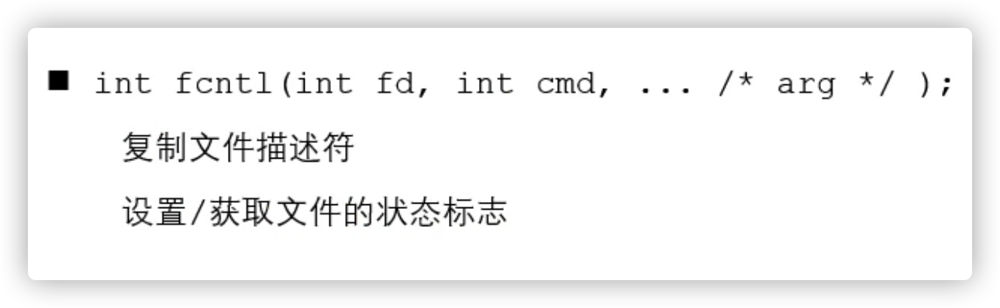

