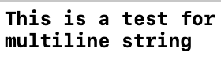
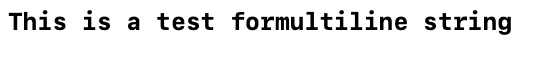
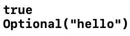
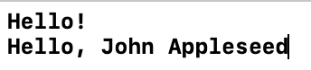
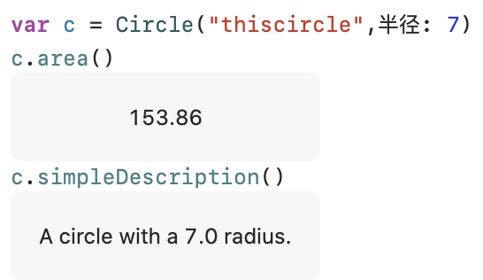
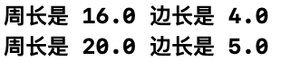
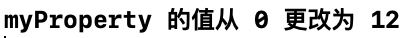

初学Swift，记录一些以前没见到过的功能用法
<!--more-->
## 简单值
- 多行字符串
  - 使用三个双引号``"""``帮助生成多行字符串
    ```swift
    let quotation = """
    This is a test for
    multiline string
    """

    print(quotation)
    ```
    
  - 可利用``\``避免换行符成为字符串值的一部分
    ```swift
    let quotation = """
    This is a test for\
    multiline string
    """

    print(quotation)
    ```
    

## 控制流
- 可选值（缺失值）
  - 在类型后面加上``?``表示可选值
    ```swift
    var optionalString: String?
    print(optionalString == nil)
    optionalString = "hello"
    print(optionalString)
    ```
    

  - 使用``if``和``let``，根据是否值是否缺失进行不同的操作
    ```swift
    var optionalName: String?
    var greeting = "Hello!"
    if let name = optionalName {
        greeting = "Hello, \(name)"
    }
    print(greeting)

    optionalName = "John Appleseed"
    if let name = optionalName {
        greeting = "Hello, \(name)"
    }
    print(greeting)
    ```
    

## 函数和闭包
- 使用`func`来声明函数，使用`-> 返回值类型`来指定返回值类型
- 函数的**标签**：
  - 通常函数的参数格式为``标签+空格+形参名+冒号+参数类型``，例：
    ```swift
    func greet(_ person: String, on day: String) -> String 
    ```
  - 标签设为``_``表示不使用标签
  - 调用函数时必须带上标签（除非标签是``_``），例：
    ```swift
    greet("John", on: "Wednesday")
    ```
  - 特殊的是，标签可以是中文
- 返回值可以是**元组**，以返回多个值
- 返回值可以是一个**函数**
- 参数也可以是一个**函数**
- 函数可以嵌套，即在函数内部声明另一个函数
- **闭包**这里没看懂，之后重点学习
## 对象和类
- 类``class``中的所有变量``var``和常量``let``都是这个类的**属性**，每个属性都需要赋值（无论是通过声明``name = "Not named"``还是通过构造器``init (name: String) {self.name = name}``）
  ```swift
  class Shape{
      //通过声明对常量add_on和变量numberofSides进行初始化
      let add_on: String = "This is a custom shape."
      var numberofSides:Int = 0
      var name: String = "Not Named"
      //要求使用构造器对name进行赋值
      init (name:String){
          self.name = name
      }
      func simpleDescription() -> String{
          return add_on + " This shape \(name) has \(numberofSides) sides."
      }
  }
  //构造器方法对name进行赋值
  var thisShape = Shape(name: "first shape")
  //声明方法对numberofSides进行赋值
  thisShape.numberofSides = 5
  ```
  - 使用声明方法进行属性赋值时，必须在类``class``内对属性给定初值
  - 使用构造器方法进行属性赋值时，必须在创建该类型的对象时，对``init``函数参数表中的所有对象进行传参
  - 对不需子类继承的属性使用声明方法赋值
  - 对需要子类继承的属性使用构造器方法进行赋值
- 使用``init``来创建构造器（构造函数），不创建也不会报错
- 使用``deinit``来创建析构函数，不创建也不会报错
- 类型继承
  - 使用``class ClassName: SuperClassName``以声明一个继承SuperClassName的ClassName
    ```swift
    class Circle: NamedShape{
        var radiusLength: Double
        init(_ name: String,半径 radiusLength: Double){
            //这两行不可互换
            self.radiusLength = radiusLength
            super.init(name: name)
            //
            numberOfSides = 1
        }
        func area()->Double{
            return 3.14*radiusLength*radiusLength
        }
        override func simpleDescription() -> String {
            return "A circle with a \(radiusLength) radius."
        }
    }
    var c = Circle("thiscircle",半径: 7)
    c.area()
    c.simpleDescription()
    ```
    

  - 子类的构造函数
    - 子类的构造函数中，需调用父类的构造函数
    - 子类的构造函数中，自己独有的属性的赋值语句应位于父类构造函数之前
    - 子类的构造函数中，可以进行除了属性赋值之外的其他操作
  - 在``func``前加上``override``表明这个函数是重载函数

<div id="computedProperty"> </div>

- 类的计算属性
  - 除了简单的存储属性，还有使用getter(``get``)和setter(``set``)的计算属性。
  - 使用``set``设置为一个计算属性进行赋值时需要进行的操作；使用``get``设置调用一个计算属性的值时进行的操作
    ```swift
    class Square {
        var name: String
        var sideLength: Double
        init(_ name: String,边长 sideLength: Double){
            self.name = name
            self.sideLength = sideLength
        }
        var perimeter: Double{
            get{
                return 4*sideLength
            }
            set{
                sideLength = newValue / 4.0
            }
        }
    }

    var testSquare = Square("KUAKUA", 边长: 4)
    print("周长是",testSquare.perimeter,"边长是",testSquare.sideLength)
    testSquare.perimeter = 20
    print("周长是",testSquare.perimeter,"边长是",testSquare.sideLength)
    ```
    

    - 在setter中，默认使用newValue指代赋给对象属性的值，也可以在set之后加小括号``()``自定义名称
- 其他
  - 为一个属性设置``willset``或``didset``，以设置属性值改变时执行的操作
    ```swift
    class Foo {
        var myProperty: Int = 0 {
            didSet {
                print("myProperty 的值从 \(oldValue) 更改为 \(myProperty)")
            }
        }
    }
    var test = Foo()
    test.myProperty = 12
    ```
    
    
    - Swift 中为什么要有 willSet 和 didSet，它们的使用情境是什么？ https://www.jianshu.com/p/5b72d5af7635
- 枚举和结构体
  - 枚举
    - 在定义枚举时要声明类型（整型、浮点数、字符串等）
    - 使用``case``来声明枚举元素
    - 元素默认的``rawValue``按照声明顺序从0开始每次加1，但是也可以在声明时为元素赋上一个值，在被赋值的元素之后声明的元素的``rawValue``在所赋值的基础上递增
    - 枚举内部可以定义函数

 