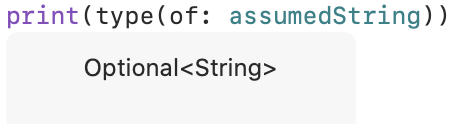

Swift基础部分学习笔记，包括常量和变量、分号、整数和浮点数、类型别名、布尔值、元组、可选类型、断言和先决条件、基本运算符
<!--more-->
## 常量和变量
- Swift中推荐将不需改变的值都声明为常量
- 一般情况下声明常量和变量时不需要声明常\变量类型，系统可自动推断它的类型；当有指定常\变量类型的需要时，可使用类型注解
    ```swift
    let helloWorld,goodGoodStudy,dayDayUp: String
    ```
- 常\变量名可包含任何字符，包括Unicode字符（中文、emoji表情等）（当然也有一些例外，非要用的话需要添加反引号`` ` ``）

### 输出常量和变量
`print(_:separator:terminator:)`函数除了默认的使用方法`print()`外，还可以通过改变`separator`和`terminator`来改变输出方式

## 分号
- 语句结尾一般不需使用分号，在同一行内写多条独立语句时必须有分号
    ```swift
    let 🐱 = "cat"; let 🐶 = "dog"; print("\(🐱) dislikes \(🐶)")
    //控制台输出“cat dislikes dog”
    ```

## 整数和浮点数
### 表示
- 整数类型有8、16、32、64的``Int``或``UInt``
  - 可以使用``类型.min``和``类型.max``获取类型的最大最小值
  - 尽量统一使用``Int``
- 32位浮点数``float``，64位浮点数``double``
- 数值类字面量
  - 整数字面量

    |进制 |前缀|举例|
    |:---|:---|:---|
    |十进制|无|17|
    |二进制|0b|0b10001|
    |八进制|0o|0o21|
    |十六进制|0x|0x11|
  - 浮点字面量

    |进制|前缀|指数符号|真值|举例|
    |:--|:--|:--|:--|:-|
    |十进制|无|e/E|基数✖️10^exp|1.25e-2 = 0.0125|
    |十六进制|0x|p/P|基数✖️2^exp|0xFp2 = 60.0|
  - 数值类字面量可以包括额外的格式（额外的0或者下划线）来增强可读性
    ```swift
    let paddedDouble = 000123.456
    let oneMillion = 1_000_000
    let justOverOneMillion = 1_000_000.000_000_1
    ```

### 类型转换
- 整数转换  
可以使用构造器进行类型转换(类似强制类型转换)
  ```swift
  let twoThousand: UInt16 = 2_000
  let one: UInt8 = 1
  let twoThousandAndOne = twoThousand + UInt16(one)
  ```
  这里可以这么用是因为``UInt16``的构造器可以接受一个``UInt8``的值，相当于是往函数``UInt16()``传了一个``UInt8``的参数。  
  也就是说也可以向``UInt16``构造器中传入其他特定的已在构造器“函数”中定义好的类型值，也可以通过扩展来使它接受其他类型的值。
- 整数和浮点数转换
  - 整数转浮点数可以利用构造器进行（类似强制类型转换）
  - 浮点数转整数可以利用构造器进行（类似强制类型转换）（会使得浮点值被截断）

## 类型别名
使用typealias关键字定义类型别名
```swift
typealias AudioSample = UInt16
//之后AudioSample就等同于UInt16
var maxAmplitudeFound = AudioSample.min
//此变量为0
```

## 布尔值
* 在swift中Int类型的值不能进行布尔判断，以下语句是非法的:
```swift
let i = 1; if i {}
```
以下语句是合法的:
```swift
let i = 1; if i == 1 {}
```

## 元组
- 可以利用任意个任意类型的值组合成元组
```
let http404Error = (404, "Not Found")
```
此元组类型为``(Int, String)``
- 元组内容分解
  - 方法1: 声明另一个为元素命名了的元组常量，并将原元组常量赋值过去
  ```swift
  let http404Error = (404, "Not Found")
  let (statusCode, statusMessage) = http404Error
  print("Message: (statusCode),(statusMessage)")
  /*可以使用``_``代替一个元素名以实现不分解此元素
  let (statusCode, _) = http404Error
  */
  ```
  * 方法2: 使用下标访问元组中的单个元素
  ```swift
  print("status code: \(http404Error.0) status message: \(http404Error.1)")
  ```
  - 方法3: 在定义元组时使用冒号``:``为元素命名，以便之后获取
  ```swift
  let http404Error = (statusCode: 404, statusMessage: "Not Found")
  print("status code: (http404Error.statusCode) status message: (http404Error.statusMessage)")

  ```
- 可以将元组作为函数返回值，以返回多个信息

## 可选类型
可选类型的变/常量可能有值（此时可以解析可选类型以访问这个值），可能根本没有值（此时值为``nil``）
### 可选类型常/变量定义
1. 使用构造器定义  
在构造器可能会失败时(如进行类型转换时)，系统会自动返回一个可选类型的值
    ```swift
    let possibleNumber = "123"
    let convertedNumber = Int(possibleNumber)

    ```
    由于该构造器可能会失败，所以convertedNumber被定义为一个``optional Int``，写作``Int?``

2. 使用声明方式定义  
```swift
let a: String? = "optionalString"
var b: Int?
b = 10
```
- 若想使用这种方法定义，而不想赋初值，只能定义变量``var``而非常量``let``

### 强制类型解析
若确定一个可选类型的变/常量有值，可在其名后加上``!``进行强制解析
```swift
if convertedNumber != nil {
print("convertedNumber is (convertedNumber!).")
}
```

### 可选绑定
- 可以利用``if``对一个包含**可选类型赋值**的~~语句进行布尔判断~~，来同时实现判断可选类型常/变量是否含值，并将可选类型中的值赋给一个个常/变量
- *上面理解有错误*  这里``if``判断的其实是``actualNumber``包含的值是否**不**等于``nil``，因为Swift中的赋值运算符没有返回值
```swift
if let actualNumber = Int(possibleNumber) {
print("Convertion succeeded.")
}
else{
print("Convertion failed.")
}
```
- 多个可选绑定或多个布尔条件在一个``if``语句中，用逗号隔开，逗号在这里等同于``&&``
```swift
if let firstNumber = Int("4"), let secondNumber = Int("42"), firstNumber < secondNumber && secondNumber < 100 {
...
}
```

### 隐式解析可选类型
系统遇到可选类型时，每次都要判断和解析可选值，非常低效；若可以确定一个
可选类型**在第一次被赋值之后总会有值**，可以在声明时在它的类型后加上感叹号将它定义为隐式解析可选类型
```swift
let assumedString: String! = "An implicitly unwrapped string."
```
此时``assumedString``是一个隐式解析可选类型常量，虽然它的类型仍是Optional<String>
```swift
print(type(of: assumedString))  
```

但特殊的是，当它不能被当成可选类型使用时，Swift会自动强制解析其可选值。
- 与普通的可选类型相比，隐式解析可选类型可以在获取值时少写一个感叹号``!``
  ```swift
  //普通可选类型
  let possibleString: String? = "An optional string."
  //没有最后的这个**!**会报错
  let forcedString: String = possibleString!

  //隐式解析可选类型
  let assumedString: String! = "An implicitly unwrapped string."
  //这里把类型为Optional<String>的assumedString当成普通的String用就行
  let implicitString: String = assumedString
  ```
- 也可以将隐式解析可选类型当成普通可选类型，使用``变量名+!``来取值
  ```swift
  if assumedString != nil {
    print(assumedString!)
  }
  ```
- 注意：
  1. 不要在隐式解析可选类型没有值的时候尝试取值，会触发运行时错误。
  2. 如果一个变量之后可能变成``nil``的话请不要使用隐式解析可选类型。 

## 错误处理
使用``throws do try catch``进行错误处理  
- [ ] 这里这章只是简单提了一下，等到专门的**错误处理**章节再学习

## 断言和先决条件
- 断言和先决条件都可以用来检查在执行后续代码之前是否一个必要的条件已经被满足了，也都是代码中的有用的文档形式。
- 与错误处理不不同：断言和先决条件并不是用来处理可以恢复的或者可预期的错误。
- 断言仅在调试环境运行，而先决条件则在调试环境和生产环境中运行。

### 断言
- assert断言
  检查表达式的真假，若假，返回定义好的断言信息
  ```swift
  let age = -3
  assert(age >= 0, "A person's age cannot be less than zero.")
  ```

  也可以不返回任何断言信息``assert(age >= 0)``
- if - assertionFailure断言
  ```swift
  if age < 0 {
    assertionFailure("A person's age cannot be less than zero.")
  }
  ```

### 强制执行先决条件
```swift
precondition(index > 0, "Index must be greater than zero.")
```

### 致命错误
使用unchecked模式（-Ounchecked）编译代码，编译器会假设所有的先决条件总是为true（真）以优化你的代码，而fatalError(_:file:line:)函数总是中断执行

## 基本运算符

### 算数运算符
|运算符|中文名|举 例|
|:---:|:---:|:---:|
|``=``|赋值|``a = 10``|
|``+``|加法|``a+b``|
|``-``|减法|``a-b``|
|``*``|乘法|``a*b``|
|``/``|除法|``a/b``|
|``%``|取余|``a%b``|
|``-``|负号|``-a``|
|``+``|正号|``+a``|
|``+=``|组合赋值|``var a = 1; a += 2``|

### 比较运算符
|运算符|中文名|举 例|
|:---:|:---:|:---:|
|``==``|等于|``a == b``|
|``!=``|不等于|``a != b``|
|``>``|大于|``a > b``|
|``<``|小于|``a < b``|
|``>=``|大于等于|``a >= b``|
|``<=``|小于等于|``a <= b``|

- 都返回布尔值
- 如果两个元组的元素相同，且长度相同的话，元组就可以被比较。比较元组大小会按照从左到右、逐值比较的方式，直到发现有两个值不等时停止。
  - Swift 标准库只能比较七个以内元素的元组比较函数。如果你的元组元素超过七个时，你需要自己实现比较运算符。

### 三元运算法
唯一一个三元运算符：``问题 ? 答案1 : 答案2 ``  
若``问题``成立，返回``答案1``的结果；反之返回``答案2``的结果。  
  
以下两段代码效果相同：
1. 三元运算符
```swift
let biggerOne = a > b ? a : b
//将较大数赋值给新常量
```
2. if-else
```swift
if a > b {
  let biggerOne = a
}
else {
  biggerOne = b
}
```


### 空合运算符
空合运算符是``??``，左操作数是一个可选类型值，右操作数是一个和左操作数存储值类型一致的值
```swift
a ?? b
```
相当于
```swift
(a != nil) ? a! :b 
```
若a为空，表达式返回b，否则就解析a的值并将它返回（可以理解为b是a的替补值）


### 区间运算符
|运算符|中文名|举 例|例子表示范围|应用场景|
|:---:|:---:|:---:|:-------:|:-----:|
|``...``|闭区间|``a...b``|[a,b]|``for index in 1...5``
|``..<``|半开区间|``a..<b``|[a,b)|``for i in 0..<count``|
|``...``|单侧区间|``...2``|从开头到2|``for name in names[...2]``|
|``..<``|半开单侧区间|``..< 2``|从开头到2但不包括2|``for name in names[..<2]``|
### 逻辑运算符
|运算符|中文名|举 例|
|:---:|:---:|:---:|
|``!``|逻辑非|``!a``|
|``&&``|逻辑与|``a && b``|
|``||``|逻辑或|``a || b``|