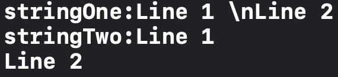
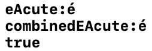
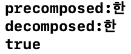
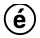
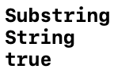
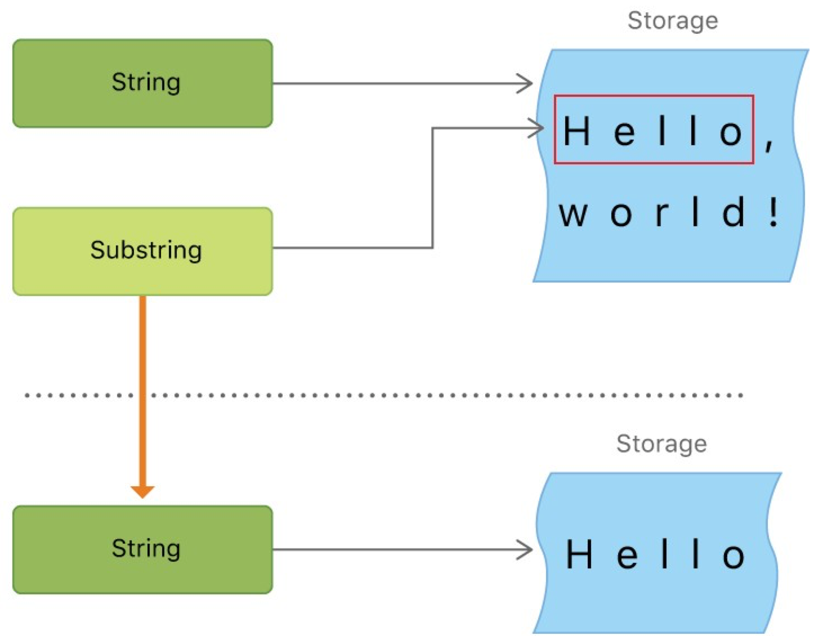

Swift字符串和字符部分学习笔记，包括[字符串字面量](#字符串字面量)、[初始化空字符串](#初始化空字符串)、[连接字符串和字符](#连接字符串和字符)、[Unicode](#unicode)、[访问和修改字符串](#访问和修改字符串)、[子字符串](#子字符串)、[比较字符串](#比较字符串)。
<!--more-->
- 字符串类型：``String``，字符类型：``Character``  
- 一个字符串可以看成是一堆字符的集合  
    - 可以使用`for-in`循环遍历字符串，获取字符串中的每一个字符
        ```swift
        for character in "Dog!🐶" {
            print(character)
        }
        ```
    - 可以使用一个`Character`数组初始化一个`String`
        ```swift
        let catCharacters: [Character] = ["C", "a", "t", "!", "🐱"]
        let catString = String(catCharacters)
        ```
- 可以使用字符串的`count`属性获得字符串中`Character`的数量

## 字符串字面量
即用一对双引号包裹着的具有固定顺序的字符集，可用于给字符串类型的常/变量提供初始值
```swift
let aString = "String literal value"
```
字符和字符串的字面量都需要使用**双引号**

### 多行字符串字面量
使用一对三引号包裹多行字符串字面量
```swift
let thisString = """
多行字符串
字面量
"""
print(thisString)
```
  
若想在书写多行字符串字面量时换行，但并不让字符串字面量包含换行符（为了加强代码的可读性），可食用续行符``\``
```swift
let thisString = """
多行字符串\
字面量
"""
print(thisString)
```

- 多行字符串字面量的缩进应和结尾的三引号的缩进对齐

### 字符串字面量的特殊字符
|字符|字符名|
|:-:|:---:|
|`\0`|空字符|
|`\\`|反斜线|
|`\t`|水平制表符|
|`\n`|换行符|   
|`\r`|回车符|
|`\"`|双引号|
|`\'`|单引号|
|`\u{n}`|Unicode标量|
- 在多行字符串字面量中使用双引号不用加转义符，使用三引号需要至少一个转义符

<div id="separator"> </div>

### 扩展字符串分隔符
在扩展分隔符中包含的特殊字符将会被直接包含，无需转义；或者在转义符后面加上与扩展分隔符数量相等的`#`
```swift
let stringOne = #"Line 1 \nLine 2"#
print("stringOne:" + stringOne)
let stringTwo = ##"Line 1 \##nLine 2"##
print("stringTwo:" + stringTwo)
```


### 字符串插值
可以使用转义符进行字符串插值，字符串插值不一定要使用字符串类型的常/变量
```swift
let multiplier = 3
let message = "\(multiplier) times 2.5 is \(Double(multiplier) * 2.5)"
```
- 在字符串插值中，上面的[扩展字符串分隔符](#separator)可以正常使用
- 插值字符串中不能包含回车、换行符、非转义反斜杠

## 初始化空字符串
1. 赋值空的字符串字面量给变量
    ```swift
    var emptyString = ""
    ```
2. 使用构造器初始化空的String实例
    ```swift
    var anotherEmptyString = String()
    ```
这两种方法定义出来的两个字符串变量完全相同
- `String`类型的变量有`Bool`类型的属性`isEmpty`，可用于判断字符串是否为空

## 连接字符串和字符
- 使用加法`+`连接两个字符串
    ```swift
    let string1 = "hello"
    let string2 = " there"
    var welcome = string1 + string2
    ```
- 使用加法赋值运算符`+=`连接两个字符串
    ```swift
    var instruction = "look over"
    instruction += " there"
    ```
- 使用字符串的append()方法将一个**字符**附加到一个字符串变量的尾部
    ```swift
    let exclamationMark: Character = "!"
    welcome.append(exclamationMark)
    ```

## Unicode
Swift的`String`和`Character`类型完全兼容Unicode标准。使用方式`\u{n}`， `n`为任意一到八位十六进制数且可用的 Unicode 位码。

<div id="extendable"> </div>

### 可扩展的字形群集
Swift中的`Character`类型是可扩展的  
1. 例1:  
   可以使用`e`加急促重音的Unicode位码组合成单一的`é`
    ```swift
    let eAcute: Character = "\u{E9}"
    let combinedEAcute: Character = "\u{65}\u{301}"
    print("eAcute:\(eAcute)")
    print("combinedEAcute:\(combinedEAcute)")
    print(eAcute == combinedEAcute)
    ```
      

2. 例2:  
    韩语音节有序排列组合可以构成韩语字
    ```swift
    let precomposed: Character = "\u{D55C}"
    let decomposed: Character = "\u{1112}\u{1161}\u{11AB}"
    print("precomposed:\(precomposed)")
    print("decomposed:\(decomposed)")
    print(precomposed == decomposed)
    ```
    
   
3. 例3:  
    使用包围记号的标量包围其他Unicode标量，作为一个单一的`Character`值：
    ```swift
    let encosedEAcute: Character = "\u{E9}\u{20DD}"
    print(encosedEAcute)
    ```
    
4. 例4:  
   使用地域性指示符号的Unicode标量组合成一个单一的国旗`Character`
   ```swift
    let regionalIndicatorC: Character = "\u{1F1E8}"
    let regionalIndicatorN: Character = "\u{1F1F3}"
    let regionalIndicatorForCN: Character = "\u{1F1E8}\u{1F1F3}"
    print(regionalIndicatorC)
    print(regionalIndicatorN)
    print(regionalIndicatorForCN)

   ```
   

- 使用可拓展的字符群集作为`Character`值来连接或改变字符串时，并不一定会更改字符串的字符数量
  ```swift
  var word = "cafe"
  print(word.count == (word+"\u{301}").count)
  ```
    
  `cafe`后面添加一个急促重音，形成`café`，两个`String`的`count`属性值相同，都为`4`

### 字符串的Unicode表示形式
- [ ] 字符串的UTF-8, UTF-16, Unicode标量表示，之后用到了再来学习

## 访问和修改字符串
访问和修改字符串有两种方法：使用字符串的属性和方法 / 用下标语法

### 字符串索引
- 不同的字符可能会占用不同数量的内存空间（如使用了[可扩展字形群集](#extendable)的字符串），所以要知道Character的确定位置，就必须从String开头遍历每一个Unicode 标量直到结尾。因此，Swift的字符串**不能用整数**（integer）做索引。Swift中的索引是专门的`index`类型。
- `String`类型有属性：`startIndex`表示字符串第一个字符的索引，`endIndex`表示字符串最后一个字符的**后一个位置**的索引
- 在`startIndex`和`endIndex`的基础上使用：
  ```swift
  let greeting = "Guten Tag!"
  ```

  |方法/属性|解释|举例/解释|
  |:------:|:-:|:------:|
  |`startIndex`|表示字符串第一个字符的索引|`greeting[greeting.startIndex]`表示`G`|
  |`endIndex`|表示字符串最后一个字符的**后一个位置**的索引|`endIndex`属性不能作为一个字符串的有效下标|
  |`index(before: )`|表示传入的`index`的前一个位置的索引|`greeting[greeting.index(befor: greeting.endIndex)]`表示`!`|
  |`index(after: )`|表示传入的`index`的后一个位置的索引|`greeting[greeting.index(after: greeting.startIndex)]`表示`u`|
  |`index(_: offsetBy: )`|`参数一`向后偏移`参数二`个位置的索引（`参数二`可以是负数）|`greeting[greeting.index(greeting.startIndex, offsetBy: 7)]`表示`a`|
- 以上所列的`index`方法或属性可在任意一个确认的并遵循Collection协议的类型中使用，如Array、Dictionary和Set。

### 插入和删除

#### 插入
1. ``insert(_:at:)``
   `_`后写要插入的字符，`at`后写要插入的位置，将`_`后的字符插入到`at`后所写位置之前
   ```swift
    var welcome = "hello"
    welcome.insert("!", at: welcome.endIndex)
    // welcome 变量现在等于 "hello!"
   ```
2. ``insert(contentsOf:at:)``
   `contentsOf`后写要插入的字符串，`at`后写要插入的位置，将`contentsOf`后的字符串插入到`at`后所写位置之前
   ```swift
    welcome.insert(contentsOf:" there", at: welcome.index(before: welcome.endIndex))
    // welcome 变量现在等于 "hello there!"
   ```

#### 删除
1. ``remove(at:)``
   删除字符串中指定索引位置的字符
   ```swift
     welcome.remove(at: welcome.index(before: welcome.endIndex))
    // welcome 现在等于 "hello there"
   ```
2. ``removeSubrange(_:)``
   删除字符串中指定索引位置的子字符串
   ```swift
    let range = welcome.index(welcome.endIndex, offsetBy: -6)..<welcome.endIndex
    //常量range的类型是Range<Index>
    welcome.removeSubrange(range)
    // welcome 现在等于 "hello"
   ```
- 以上所列的`insert`和`remove`方法可在任意一个确认的并遵循RangeReplaceableCollection协议的类型中使用，如Array、Dictionary和Set。

## 子字符串
Swift中从字符串中获取的子字符串（使用下标或者`prefix(_:)`等方法）的类型是`Substring`，而不是`String`  
``Substring``在大多数情况下和`String`相同，在短时间内需要操作字符串时才应使用`Substring`，需长时间使用的话应先将其转化为`String`
```swift
let greeting = "Hello, world!"
let index = greeting.firstIndex(of: ",") ?? greeting.endIndex
let beginning = greeting[..<index]
//beginning是一个Substring类型的常量
print(type(of: beginning))
let newString = String(beginning)
//newString是一个String类型的常量
print(type(of: newString))
print(beginning == newString)
```


`String`和`Substring`在占用内存空间上有区别  
如在上例中，`Substring`类型的`beginning`复用原字符串`greeting`的内存空间，新的字符串`newString`拥有自己的内存空间，如下图所示：


## 比较字符串

|方法|解释|
|:-:|:-:|
|`==` / `!=`|等于或不等于|
|`hasPrefix(_:)`|有前缀|
|`hasSuffix(_:)`|有后缀|
