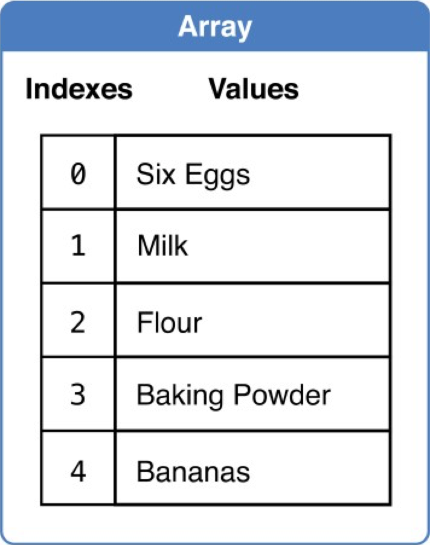
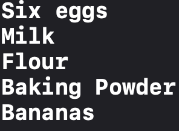
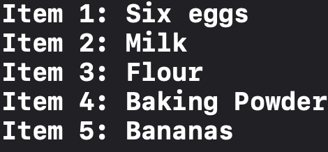
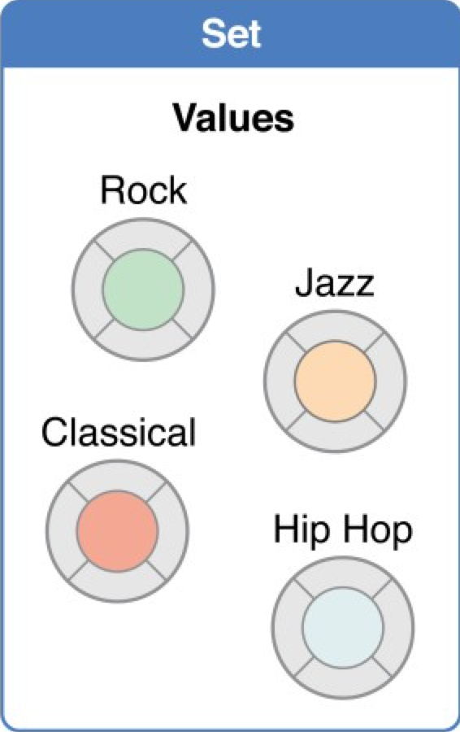
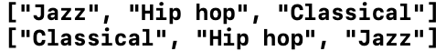
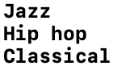
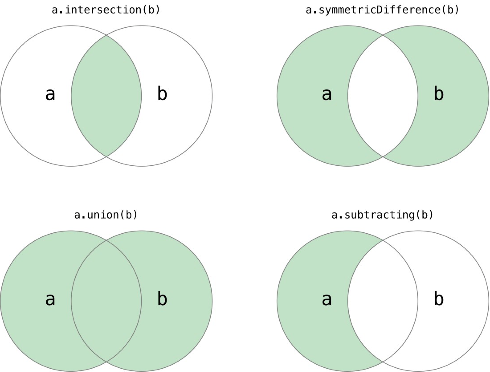
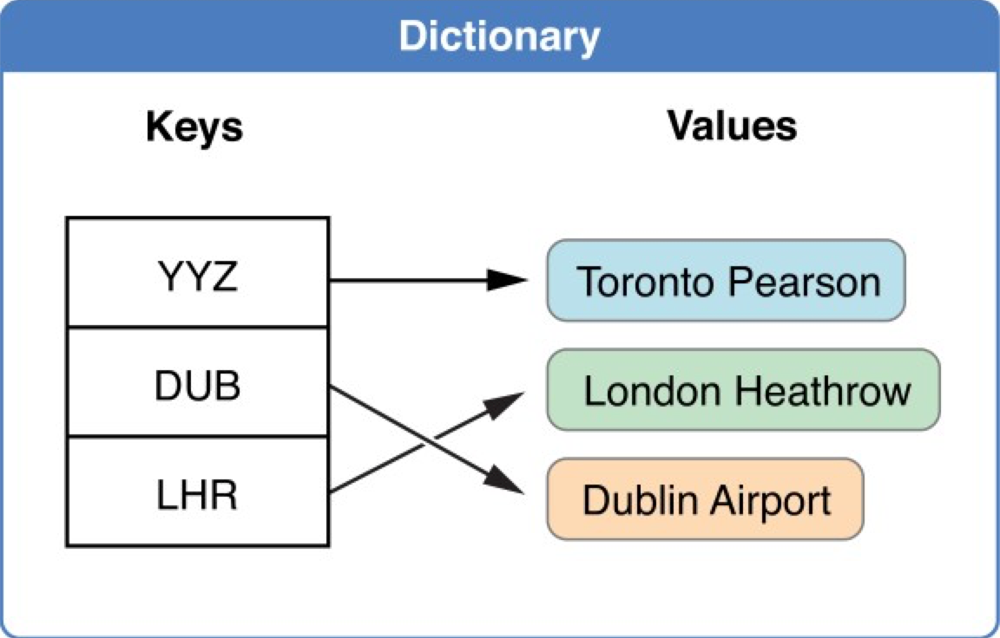
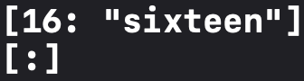

Swift集合类型学习笔记，包括数组（Array）、集合（Set）、字典（Dictionary）。
<!--more-->
- Swift中的数组、集合和字典必须明确其中保存的键和值类型
- 集合的可变性：
  - 数组、集合或字典都可以被分配成一个变量或者常量，变量可变（添加、修改、删除），常量不可变（大小、内容）

## 数组（Arrays）
数组是有序数据的集，使用有序列表存储同一类型的多个值。



### 创建和构造数组

- 创建特定类型空数组
  - 使用`变/常量名 = [类型名]()`的方法定义空数组
      ```swift
      var someInts = [Int]()
      ```

  - 可以通过给一个非空数组赋空值得到有类型的空数组
      ```swift
      someInts.append(3)
      someInts = []
      ```

- 创建带默认值的数组  
  使用`Araay(repeating: 类型初始值, count: 数据项数量)` 
  ```swift
    var threeDoubles = Array(repeating: 0.0, count: 3)
    print(threeDoubles)
  ```
  


- 数组相加创建数组  
  使用加法操作符组合两个已存在的**相同类型**数组
  ```swift
    var threeDoubles = Array(repeating: 0.0, count: 3)
    var anotherThreeDoubles = Array(repeating: 2.5, count: 3)
    var sixDoubles = threeDoubles + anotherThreeDoubles
    print(sixDoubles)
  ```

    

- 数组字面量构造数组
  ```swift
    var shoppingList: [String] = ["Eggs", "Milk"]
    //这个: [String]可以省略不写
  ```

<div id="arrayMethods">  </div>

### 访问和修改数组
|属性/方法|作用|举例|例子解释|
|:------:|:-:|:-:|:-----:|
|`Count`|获取数组数据项的数量|`shoppingList.count`|返回`shoppingList`的数据项数量`2`|
|`isEmpty`|检查数组的`count`属性是否为0|`shoppingList.isEmpty`|返回`true`，因为`shoppingList`不是空数组|
|`append(_: )`|在数组后面添加新的数据项|`shoppingList.append("Flour")`|在`shoppingList`最后面添加一项`"Flour"`|
|`+=`|加法赋值运算符，将另一个**相同类型**数组中的数据项添加到该数组后面|`shoppingList += ["Baking Powder", "Chocolate Spread", "Cheese", "Butter"]`|将四个`String`添加到`shoppingList`最后面|
|`insert(_: at: )`|某个指定索引值**之前**添加数据项|`shoppingList.insert("Maple Syrup", at: 0)`|在索引值0之前（也就是数组最前面）添加`"Maple Syrup"`|
|`remove(at: )`|把数组中指定位置数据项移除，并返回这个被移除的数据项|`let mapleSyrup = shoppingList.remove(at: 0)`|数组`shoppingList`的首个数据项被移除，且被赋值给常量`mapleSyrup`|
|`removeLast()`|移除数组的最后一个数据项，并返回这个被移除的数据项|`let apples = shoppingList.removeLast()`|移除`shoppingList`的最后一项`apple`,并将其赋值给常量`apples`|
|`removeAll()`|移除数组中的所有数据项|`shoppingList.removeAll()`|`shoppingList`现在变成空数组|

- 可以利用下标一次性改变一系列数据值，即使新数据和原有数据的数量不一样
  ```swift
    shoppingList[4...6] = ["Bananas", "Apples"]
  ```
  将`shoppingList`里下标为4、5、6的三个数据项改成`"Bananas","Apples"`两个数据项

### 数组的遍历
1. 使用`for-in`循环遍历数组的数据项
    ```swift
    for item in shoppingList {
      print(item)
    }
    ```
    

2. 使用`enumerated()`方法进行数组遍历
    ```swift
    for (index, value) in shoppingList.enumerated() {
      print("Item \(String(index + 1)): \(value)")
    }
    ```
    

    `enumerated()`方法返回一个由索引值和数据值组成的元组数组

## 集合（Sets）

集合是**无序无重复**数据的集，用来存储相同类型并且没有确定顺序的值。
  


- 集合中存储的类型必须可哈希化，该类型必须有计算其哈希值的方法，提供一个类型为`Int`的可读属性`hashValue`

### 创建和构造集合


- 创建特定类型空集合
  - 使用`变/常量名 = Set<类型名>()`的方法定义空集合
      ```swift
      var letters = Set<Character>()
      ```

  - 可以通过给一个非空集合赋空值得到有类型的空集合
      ```swift
      someInts.append(3)
      someInts = []
      ```

- 用数组字面量创建集合
`["Rock", "Classical", "Hip hop"]`类似这种的值是**数组**字面量，但是也可以用于创建集合

  ```swift
  var favoriteGenres: Set<String> = ["Rock", "Classical", "Hip hop"]
  ```

  `Set`必须显式声明，`String`可以省略
  ```swift
  var favoriteGenres: Set = ["Rock", "Classical", "Hip hop"]
  ```

### 访问和修改集合
[用于访问和修改数组的属性和方法](#arrayMethods)都可以用于访问和修改集合，但有几点稍有不同
- 集合的插入元素方法为`insert(_: )`，因为集合中的元素是无顺序的，所以无需像在数组中的一样使用一个`at: `参数指定插入元素的位置
- 使用`contains(_:)`方法检查集合中是否包含一个特定的值
    ```swift
    print(facoriteGenres.contains("Funk"))
    ```
    

- 使用`sorted()`方法得到使用操作符`<`对元素进行比较排序之后得到的有序数组
    ```swift
    var favoriteGenres: Set = ["Classical", "Jazz", "Hip hop"]
    var genresArray = favoriteGenres.sorted()
    print(favoriteGenres)
    print(genresArray)
    ```
    
  
### 集合的遍历
1. 使用`for-in`循环遍历集合的数据项
    ```swift
    var favoriteGenres: Set = ["Classical", "Jazz", "Hip hop"]
    for genre in favoriteGenres {
        print("\(genre)")
    }
    ```

    

2. 利用`sorted()`方法得到对应的有序数组，以此进行有序遍历
    ```swift
    for genre in favoriteGenres.sorted() {
        print("\(genre)")
    }
    ```

### 集合操作

- 根据两个集合的关系构造新集合
    |方法|解释|
    |:-:|:--:|
    |`intersection(_: )`|两个集合的**交集**|
    |`symmetricDifference(_: )`|两个集合不相交的值的集合|
    |`union(_: )`|两个集合的**并集**|
    |`subtracting(_: )`|不被`参数集合`包含的值的集合|

    
  
- 检查集合的关系
    |方法|解释|
    |:-:|:--:|
    |`==`|判断两个集合包含的值是否全部相同|
    |`isSubset(of:)`|判断是否是`参数集合`的子集合|
    |`isSuperset(of:)`|判断是否是`参数集合`的父集合|
    |`isStrictSubset(of:)`|判断是否是`参数集合`的严格子集合|
    |`isStrictSuperset(of:)`|判断是否是`参数集合`的严格父集合|
    |`isDisjoint(with:)`|判断是否和`参数集合`完全不相交|

## 字典（Dictionary）
字典是**无序的键值对**的集，存储的是键值对之间的关系，每个值（value）都关联唯一的键（key）。其所有键的值需要是相同的类型，所有值的类型也需要相同。  



### 创建和构造字典

- 创建特定类型的空字典
  - 使用构造器方法`[Key: Value]`创造特定类型的空字典
    ```swift
    //复杂写法
    var namesOfIntegers = Dictionary<Int, String>()
    //简化写法
    var namesOfIntegers = [Int: String]()
    ```
  - 可以通过给一个非空字典赋空值得到有类型的空字典
    ```swift
    var namesOfIntegers = [Int: String]()
    namesOfIntegers[16] = "sixteen"
    print(namesOfIntegers)
    namesOfIntegers = [:]
    print(namesOfIntegers)
    ```
    

- 用字典字面量创建字典  
  字典字面量形如`[key 1: value 1, key 2: value 2, key 3: value 3]`  
  例：
  ```swift
  var airports: [String: String] = ["YYZ": "Toronto Pearson", "DUB": "Dublin"]
  ```
  类型`[String: String]`可省略
  ```swift
  var airports = ["YYZ": "Toronto Pearson", "DUB": "Dublin"]
  ```

### 访问和修改字典

|属性/方法|解释|举例|例子解释|
|:------:|:-:|:--:|:----:|
|`count`|只读属性，返回字典的数据项数量|`airports.count`|返回`airports`的数据项数量`2`|
|`isEmpty`|检查字典的`count`属性是否为0|`airports.isEmpty`|返回`true`，因为`airports`不是空字典|
|`updateValue(_:forKey:)`|将键值`参数2`对应的值更新为`参数1`，并返回更新之前的原值；如果字典中没有`参数2`这个键，则在字典中添加新的键值对`参数2: 参数1`，并返回`nil`|`let oldValue = airports.updateValue("Dublin Airport", forKey: "DUB")`|常量`oldValue`的类型为`String?`，包含值为`"DUB"`对应的原值`"Dublin"`|
|`removeValue(forKey:)`|在字典中移除键值对并且返回被移除的值；若没有找到对应的值，则返回`nil`|`let removedValue = airports.removeValue(forKey: "DUB")`|常量`removedValue`的类型为`String?`，包含值为`"DUB"`对应的原值`"Dublin airports"`|

- 可以使用下标语法在字典中对特定键对应的值进行检索、修改、移除（即修改为`nil`）
  - 因为有可能请求的键没有对应的值存在，字典的下标访问会返回对应值类型的**可选类型**

### 字典遍历
- 使用`for-in`循环遍历字典的键值对，每个键值对以`(key, value)`元组形式返回
```swift
for (airportCode, airportName) in airports {
    print("\(airportCode): \(airportName)")
}
```
  
- 使用`for-in`循环配合`keys`或`values`属性，遍历字典的键或者值
```swift
for airportCode in airports.keys {
  print("Airport code: \(airportCode)")
}
for airportName in airports.values {
  print("Airport name: \(airportName)")
}
  ```
  - 可以对`keys`和`values`属性使用`sorted()`方法