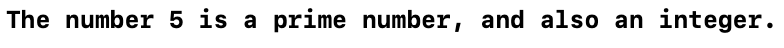
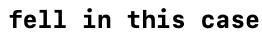
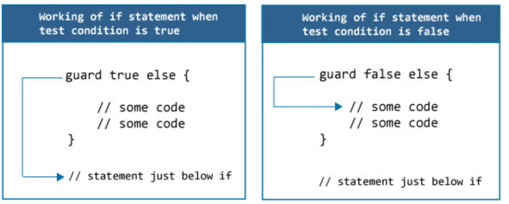

Swift控制流学习笔记，包括[循环语句](#cycle)、[条件语句](#condition)、[控制转移语句](#control)、[提前退出（guard）](#guard)、[检测API可用性](#API)。
<!--more-->

<div id="cycle"> </div>

## 循环语句

### For-In 循环
使用`for-in`循环遍历一个集合中的所有元素

#### ``for-in``遍历数组元素

```swift
let names = ["Anna", "Alex", "Brian", "Jack"]
for name in names {
    print("Hello, \(name)!")
}
```

#### `for-in`遍历字典键值对

使用`(key,value)`元组接收键值对
```swift
let numberOfLegs = ["spider": 8, "ant": 6, "cat": 4]
for (animalName, legCount) in numberOfLegs {
    print("\(animalName)s have \(legCount) legs")
}
```

字典的内容理论上是无序的,将元素插入字典的顺序并不会决定它们被遍历的顺序

#### `for-in`循环数字范围

```swift
for index in 1...5 {
    print("\(index) times 5 is \(index * 5)")
}
```

如果想使用`for-in`循环但并不想使用`index`，可以使用`_`代替`index`

```swift
let base = 3
let power = 10
var answer = 1
for _ in 1...power {
    answer *= base
}
print("\(base) to the power of \(power) is \(answer)")
```

可以使用`stride(from:to:by:)`函数进行有间隔的循环（循环范围不包括`to`后参数）。也可以使用`stride(from:through:by:) `进行有间隔的循环（循环范围包括`through`后参数）
```swift
for index in stride(from: 1, to: 10, by: 2){
    print(index,terminator:" ")
}
```


### While循环

```swift
while condition {
    statements
}
```

### Repeat-While循环

```swift
repeat {
    statements
} while condition
```

<div id="condition"> </div>

## 条件语句

### If

```swift
if condition1 {
    statement1
} else if condition2 {
    statement2
} else {
    statement3
}
```

### Switch

```swift
switch some value to consider {
case value 1:
    respond to value 1
case value 2,
    value 3:
    respond to value 2 or 3
default:
    otherwise, do something else
}
```

- `case`的值也可以是一个区间
- `case`后可以放多种情况，用逗号隔开，`,`相当于`or`，可以分行书写

#### 使用元组在同一个`switch`语句中测试多个值。
- 元组中的元素可以是值，也可以是区间。
- 使用下划线（`_`）来匹配所有可能的值。
- 允许多个`case`匹配同一个值。但是，如果存在多个匹配，那么只会执行第一个被匹配到的`case`分支。

#### 值绑定（Value Bindings）

在`case`语句中声明临时常/变量，并且在`case`分支体内使用（能绑定上就算匹配成功，得到`true`）  

```swift
let anotherPoint = (2, 0)
switch anotherPoint {
case (let x, 0):
    print("on the x-axis with an x value of \(x)")
case (0, let y):
    print("on the y-axis with a y value of \(y)")
case let (x, y):
    print("somewhere else at (\(x), \(y))")
}
```  
`anotherPoint`匹配到第一个`case`；例如`(0, 1)`会匹配到第二个`case`；第三个`case`可以和任意的`(Int, Int)`元组匹配。

#### Where补充条件
在`case`语句中使用`where`语句添加额外的判断条件

```swift
switch yetAnotherPoint {
case let (x, y) where x == y:
    print("(\(x), \(y)) is on the line x == y")
    ......  
}
```

<div id="control"> </div>

## 控制转移语句
有五种：
- [continue](#continue)
- [break](#break)
- [fallthrough](#fallthrough)
- return *(📒 TODO:与函数章节的知识链接)*
- throw *(📒 TODO:与错误处理章节的知识链接)*

<div id="continue">  </div>

### Continue
告诉一个循环体立刻停止本次循环，**重新开始下次**循环。
```swift
let puzzleInput = "great minds think alike"
var puzzleOutput = ""
for character in puzzleInput {
    switch character {
    case "a", "e", "i", "o", "u", " ":
        continue
    default:
        puzzleOutput.append(character)
    }
}
print(puzzleOutput)
```

最后输出的是"grtmndsthnklk"  
在循环中嵌套判断语句,字符串中的字符与第一个`case`中的字符匹配后会直接进行下次循环。

<div id="break"></div>  

### Break
立刻结束整个控制流（`switch`或者循环）代码块的执行  

特别的是，在`Switch`中，不允许一个`case`后面没有任何语句，所以当想要执行“在某种情况下需结束循环”的操作时，需使用`Break`语句

```swift
let numberSymbol: Character = "三"  // 简体中文里的数字 3
var possibleIntegerValue: Int?
switch numberSymbol {
case "1", "١", "一", "๑":
    possibleIntegerValue = 1
case "2", "٢", "二", "๒":
    possibleIntegerValue = 2
case "3", "٣", "三", "๓":
    possibleIntegerValue = 3
case "4", "٤", "四", "๔":
    possibleIntegerValue = 4
default:
    break
}
```

在本例中，由于无法列举所有的情况，在除了`case`123之外的情况下都不需要进行任何操作，因而使用`default`，使用`break`语句。

<div id="fallthrough"></div>

### Fallthrough（贯穿）

在`Swift`的`switch-case`语句中，匹配到某种`case`，并执行完`case`后的操作后会跳出代码块，不会继续判断后面的`case`，可以为需要继续进入下一个`case`分支中的`case`使用`fallthrough`关键字。  

```swift
let integerToDescribe = 5
var description = "The number \(integerToDescribe) is"
switch integerToDescribe {
case 2, 3, 5, 7, 11, 13, 17, 19:
    description += " a prime number, and also"
    fallthrough
default:
    description += " an integer."
}
print(description)
```

匹配到第一个`case`并执行完相应语句后会继续后面的匹配，会进入到接下来的一个case`default`并执行相应的操作。  



需要注意的是添加了`fallthrough`后，会直接落入到下一个`case`中，不会去判断是否和后面的`case`匹配。

```swift
let integerToDescribe = 5
var description = "The number \(integerToDescribe) is"
switch integerToDescribe {
case 2, 3, 5, 7, 11, 13, 17, 19:
    description += " a prime number, and also"
    fallthrough
case 1:
    description = "fell in this case"
default:
    description += " an integer."
}
print(description)
```



### 语句标签

可以利用标签，显式指明`break`语句想要终止的是哪个循环体或者条件语句，显式指明`continue`语句想要影响哪一个循环体  
语法为：
```swift
标签名：while condition {
    statements
}
```

举例：  
```swift
mainLoop: while condition {
    var temp = 1
    switch temp {
        case 1:
            statement1
        case 2:
            continue mainLoop
        case 3:
            break mainLoop
    }
    some statements
}
```

`continue mainLoop`会使得程序直接执行下一次`mainLoop`循环  
`break mainLoop`这里指明了要`break`的是哪一个代码块，若这里不指明，则`break`的会是`switch-case`代码块

<div id="guard"> </div>

## 提前退出（guard）

在基本的作用上，`guard`语句有点类似`if-else`。  
区别在于：  
- 在`if`条件语句中使用常量和变量来创建一个可选绑定，仅在`if`语句的**句中**才能获取到值。相反，在`guard`语句中使用常量和变量来创建一个可选绑定，仅在`guard`**语句外且在语句后**才能获取到值。
- `guard`和`if-else`的用法不同
  - `guard`语句必须配套一个`else`
  - `guard`语句的`else`后必须有一个控制语句（`return`, `break`, `continue`, `throw`）


```swift
func someFunction() {
    guard false else {
        print("Condition not met")
        return
    }
    print("Condition met")
}
```

<div id="API"> </div>

## 检测API可用性
Swift内置支持检查API可用性，这可以确保我们不会在当前部署机器上，不小心地使用了不可用的API。
```swift
if #available(iOS 11.2.6, macOS 10, *) {
    APIs 可用，语句将执行
} else {
    APIs 不可用，语句将不执行
}
```

语句中小括号内的`*`是必须的，以支持比指定版本号高的版本