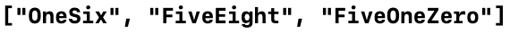

Swift函数学习笔记，包括[闭包表达式](#expression)、[尾随闭包](#4)、[值捕获](#valueCapture)、[逃逸闭包](#escapingClosure)。
<!--more-->
闭包是自包含的函数代码块，采用如下三种形式之一：
1. **全局函数**是一个有名字但不会捕获任何值的闭包。
2. **嵌套函数**是一个有名字并可以捕获其封闭函数域内值的闭包。
3. **闭包表达式**是一个利用轻量级语法所写的可以捕获其上下文中变量或常量值的匿名闭包。 
 
闭包尤其用在编码中涉及到**函数作为参数**的那些方法时。  

闭包的语法优化：
1. [利用上下文推断参数和返回值类型](#1)
2. [隐式返回单表达式闭包](#2)，即单表达式闭包可以省略`return`关键字
3. [参数名称缩写](#3)
4. [尾随闭包语法](#4) 

<div id="expression"> </div>

## 闭包表达式
闭包表达式是一种构建内联闭包的方式。下面以`siwft`中的`sorted(by:)`函数为例进行说明。  
`sorted(by:)`函数要求传入的参数是一个闭包（类型为`(元素类型, 元素类型) -> Bool`），返回值是一个排序了的新数组。以对`String`类型数组排序为例：  
传入参数为
```swift
func backward(_ s1: String, _ s2: String) -> Bool {
    return s1 > s2
}
var reversedNames = names.sorted(by: backward)
```

将数组中的元素按字母表逆序排列。  

闭包表达式的语法为
```swift
{ (parameters) -> return type in
    statements
}
```

参数表和返回值类型和函数体都在大括号内部，参数表和返回值类型后加上` in `表示下面是函数体。  
使用闭包表达式后上面代码变为
```swift
reversedNames = names.sorted(by: { (s1: String, s2: String) -> Bool in
    return s1 > s2
})
```

### 闭包表达式优化

<div id="1"></div>

#### 根据上下文推断类型
以上面的例子为例，sorted接收的闭包一定是(String, String) -> Bool类型的，因此可以省略一些内容。优化后的代码如下：
```swift
reversedNames = names.sorted(by: {s1, s2 in return s1 > s2})
```

<div id="2"></div>

#### 单表达式闭包的隐式返回
单行表达式闭包可以省略`return`关键字。
```swift
reversedNames = names.sorted(by: {s1, s2 in s1 > s2})
```

<div id="3"></div>

#### 参数名称缩写
内联闭包有参数名称缩写功能，可通过`$0`，`$1`，`$2`来顺序调用闭包的参数。  
在闭包表达式中使用参数名称缩写时，可以在闭包定义中省略参数列表。

```swift
reversedNames = names.sorted(by: { $0 > $1 } )
```

#### 运算符方法
在本例中，由于String类型有` > `方法，其类型为`(String, String) -> Bool`，故可使用运算符方法简化闭包。
```swift
reversedNames = names.sorted(by: >)
```

<div id="4"></div>

## 尾随闭包
如果你需要将一个很长的闭包表达式作为**最后一个参数**传递给函数，那么可以使用尾随闭包简化代码。  
如果有函数：
```swift
func someFunctionThatTakesAClosure(closure: () -> Void) {
    // 函数体部分
}
```

不使用尾随闭包
```swift
someFunctionThatTakesAClosure(closure: {
    // 闭包主体部分
})
```

使用尾随闭包
```swift
someFunctionThatTakesAClosure() {
    // 闭包主体部分
}
```

例如上一部分的``reversedNames = names.sorted(by: { $0 > $1 } )``可以改写为``reversedNames = names.sorted() { $0 > $1 }``，如果闭包表达式是函数或方法的唯一参数，甚至可以省略掉括号：``reversedNames = names.sorted { $0 > $1 }``  

示例：使用数组的`map(_:)`函数将一个`Int`数组`numbers`的各位数字映射成相应的英文单词。  

```swift
let digitNames = [
    0: "Zero", 1: "One", 2: "Two",   3: "Three", 4: "Four",
    5: "Five", 6: "Six", 7: "Seven", 8: "Eight", 9: "Nine"
]

let numbers = [16, 58, 510]

let strings = numbers.map {
    (number) -> String in
    var number = number
    var output = ""
    repeat{
        output = digitNames[number%10]! + output
        number = number/10
    }while number > 0
    return output
}
print(strings)
```  
  

map方法接收一个闭包，在这里使用尾随闭包，并省略了：`()`和`参数类型`。  

<div id="valueCapture"> </div>

## 值捕获
值捕获的意思就是一个闭包可以调用它外部的常/变量。即使定义这些常量和变量的**原作用域已经不存在**，闭包仍然可以在闭包函数体内引用和修改这些值。  
Swift 中，可以捕获值的闭包的最简单形式是嵌套函数，嵌套函数可以捕获其外部函数所有的参数以及定义的常量和变量。
```swift
func makeIncrementer(forIncrement amount: Int) -> () -> Int {
    var runningTotal = 0
    func incrementer() -> Int {
        runningTotal += amount
        return runningTotal
    }
    return incrementer
}
```

在嵌套函数`incrementer()`中，无任何参数传入，但是它可以调用外部函数的参数`amount`和定义在外部函数中的变量`runningTotal`。  
函数` makeIncrementer(forIncrement amount: Int)`以一个`()->Int`类型的函数作为返回值。  
捕获引用保证了`runningTotal`和`amount`变量在调用完`makeIncrementer`后不会消失，并且保证了在下一次执行`incrementer`函数时，`runningTotal` 依旧存在。  
且多次调用`makeIncrementer`函数所得到的返回函数所操作的变量`runningTotal`都是独立的，可以理解为每个返回函数都有一个专用的变量`runningTotal`。  
```swift
let incrementByTen = makeIncrementer(forIncrement: 10)
let incrementBySeven = makeIncrementer(forIncrement: 7)

incrementByTen()
//返回10
incrementByTen()
//返回20
incrementBySeven()
//这个函数中的runningTotal重新从0开始，返回7
incrementByTen()
//返回30
```

🗒️ Note：闭包是引用类型  
函数和闭包都是引用类型，所以:
- 虽然`incrementBySeven`和`incrementByTen` 都是常量，但可以增加其捕获的变量的值。
- 如果将闭包赋值给了两个不同的常量或变量，两个值都会指向同一个闭包，共享闭包捕获的值：
    ```swift
    let alsoIncrementByTen = incrementByTen
    alsoIncrementByTen()
    //返回40
    ```

<div id="escapingClosure"> </div>

## 逃逸闭包
这边没看懂  
**📒 TODO：之后反过来再看**
