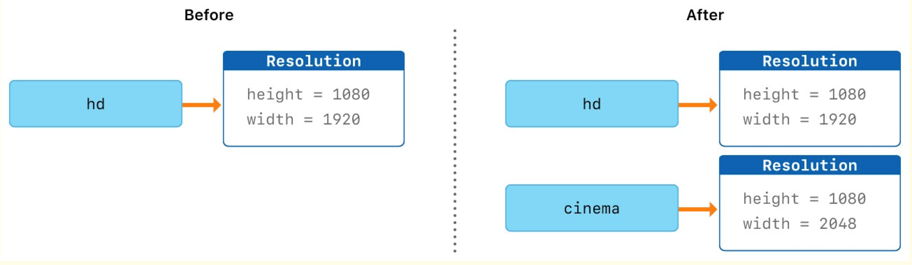
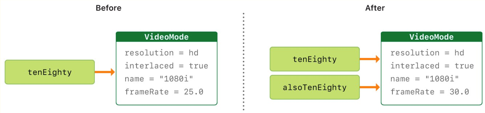

Swift类和结构体部分学习笔记，包括[类和结构体可实现功能的比较](#comparision)、[类和结构体定义](#define)、[类和结构体的实例化](#instantiation)、[值类型——引用类型](#valueTypeReferenceType)。
<!--more-->

<div id="comparision"> </div>

## 类和结构体可实现功能的比较
|功能|功能作用|结构体|类|
|:--:|:--:|:--:|:---:|
|属性|存储值|&check;|&check;|
|方法|提供功能|&check;|&check;|
|下标操作|通过下标语法访问它们的值|&check;|&check;|
|构造器|设置初始值|&check;|&check;|
|析构器|释放所被分配的资源||&check;|
|扩展|增加默认实现之外的功能|&check;|&check;|
|协议|提供某种标准功能|&check;|&check;|
|继承|一个类继承另一个类的特征||&check;|
|类型转换|在运行时检查和解释一个类实例的类型||&check;|
|引用计数|对一个类的多次引用||&check;|

准则：优先使用结构体，仅在适当或必要时才使用类。

<div id="define"> </div>

## 类和结构体定义
通过 `struct`关键字引入结构体:
```swift
struct Resolution {

    var width = 0

    var height = 0

}
```
通过  `class`  关键字引入类:
```swift
class VideoMode {

    var resolution = Resolution()

    var interlaced = false

    var frameRate = 0.0

    var name: String?

}
```
属性：
- 可以存储为常量或变量
- 可以为它指定类型，也可以通过赋初值进行类型推断。  

🗒️ Note：  
建议类型命名格式为`UpperCamelCase`，属性和方法的命名格式为`lowerCamelCase`。

<div id="instantiation"> </div>

## 类和结构体的实例化

```swift
let someResolution = Resolution()

let someVideoMode = VideoMode()
```

- 使用点语法：`.`使用类和结构体实例的属性
    ```swift
    someVideoMode.resolution.width = 1280
    print("Width: \(someVideoMode.resolution.width)")
    ```
- 成员逐一构造器  
    只有结构体有默认的成员逐一构造器，类并没有。  
    用于初始化新结构体实例中成员的属性。
    ```swift
    let vga = Resolution(width: 640, height: 480)
    ```

<div id="valueTypeReferenceType"> </div>

## 值类型 —— 引用类型

### 结构体和枚举是值类型
结构体、枚举以及Swift中所有的基本类型【整数（integer）、浮点数（floating-point number）、布尔值（boolean）、字符串（string)、数组（array）和字典（dictionary）】都是**值类型**的。*（因为这些基本类型底层都是使用结构体实现的）*  
值类型的实例以及实例中所包含的任何值类型的属性，在代码中传递的时候都会被复制。


表现为：当实例a被赋值为b时，实例a的改变**不会**引起实例b的改变
```swift
let hd = Resolution(width: 1920, height: 1080)
var cinema = hd
cinema.width = 2048
print("cinema is now  \(cinema.width) pixels wide")
// 打印 "cinema is now 2048 pixels wide"
print("hd is still \(hd.width) pixels wide")
// 打印 "hd is still 1920 pixels wide"
```
🗒️ Note：
特别的是集合  
为了降低性能成本，新集合不会立即复制，而是跟原集合共享同一份内存，共享同样的元素。在集合的某个副本要被修改前，才会复制它的元素。

### 类是引用类型
引用类型在被赋予到一个变量、常量或者被传递到一个函数时，其值不会被拷贝。因此，使用的是已存在实例的引用，而不是其拷贝。


表现为：当实例a被赋值为b时，实例a的改变**会**引起实例b的改变
```swift
let tenEighty = VideoMode()
tenEighty.resolution = hd
tenEighty.interlaced = true
tenEighty.name = "1080i"
tenEighty.frameRate = 25.0
let alsoTenEighty = tenEighty
alsoTenEighty.frameRate = 30.0
print("The frameRate property of tenEighty is now \(tenEighty.frameRate)")
// 打印 "The frameRate property of theEighty is now 30.0"
```

- 恒等运算符
用于两个引用类型是否相同的判断，判定两个常量或者变量是否引用同一个类实例。
  - 运算符：
    - 相同（===）
    - 不相同（!==）
  - 相同/恒等 —— 等于/相等/等价
    - 相同表示两个类类型的常量或者变量引用同一个类实例
    - 等于”表示两个实例的值“相等”或“等价”，判定时要遵照设计者定义的评判标准。  
        在定义自定义结构体和类的时候，需要决定判定两个实例“相等”的标准。