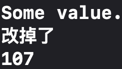

Swift属性学习笔记，包括[存储属性](#存储属性)、[计算属性](#计算属性)、[属性观察器](#属性观察器)、[全局变量和局部变量](#全局变量和局部变量)、[类型属性](#类型属性)。
<!--more-->
## 存储属性
存储属性就是存储在特定**类或结构体**实例里的一个常量(`var`)或变量(`let`)。在初始化之后变量属性还可以被改变，常量属性不能再改变。
```swift
struct FixedLength{
    var firstValue: Int
    let length: Int
}

var rangeOfThreeItems = FixedLength(firstValue: 0, length: 3)
```

在初始化之后变量属性还可以被改变
```swift
rangeOfThreeItems.firstValue = 5
print("第一个值：",rangeOfThreeItems.firstValue)
```


常量属性不能再改变
```swift
rangeOfThreeItems.length = 5
print("范围长度：",rangeOfThreeItems.length)
```


### 常量的存储属性
#### 常量结构体实例的存储属性
由于结构体是值类型的，当值类型的实例被声明为常量的时候，它的所有属性也就成了常量，所以如果创建了一个结构体实例并将其赋值给一个常量，则无法修改该实例的任何属性（不论是变量存储属性还是常量存储属性）。
```swift
struct FixedLengthRange {
    var firstValue: Int
    let length: Int
}
let rangeOfThreeItems = FixedLengthRange(firstValue: 0, length: 3)
rangeOfThreeItems.firstValue = 6
```


#### 常量类实例的存储属性
类是引用类型的，把一个引用类型的实例赋给一个常量后，依然可以修改该实例的可变属性。  
也就是说无论一个类实例是常量还是变量，它的可变属性是种可供修改。
```swift
class FixedLengthRange {
    var firstValue = 0
    let length = 3
}
let rangeOfThreeItems = FixedLengthRange()
rangeOfThreeItems.firstValue = 6
print("初值：", rangeOfThreeItems.firstValue)
```


### 延迟加载存储属性
当并不需要在初始化实例时就计算其所有的存储属性的值时，可以使用`lazy`关键字表示此存储属性可在第一次被调用时再计算。  

🗒️ Note：想使用延迟加载必须将属性声明成**变量存储属性**(`var`)。  

延迟加载存储属性的两种应用场景：
- 属性的值依赖于一些外部因素，且这些外部因素只有在构造过程结束之后才会知道。
- 获得属性的值需要复杂或者大量的计算。（如下例）
```swift
class DataImporter {
    /*
    DataImporter 是一个负责将外部文件中的数据导入的类。
    这个类的初始化会消耗不少时间。
    */
    var fileName = "data.txt"
    // 这里会提供数据导入功能
}

class DataManager
{
    lazy var importer = DataImporter()
    var data = [String]()
    // 这里会提供数据管理功能
}
let manager = DataManager()
manager.data.append("Some data")
manager.data.append("Some more data")
// DataImporter 实例的 importer 属性还没有被创建
```

在上例中创建类`DataManager`实例`manager`时，属性`data`被立即初始化，而前面加上了关键字`lazy`的延迟加载存储属性`importer`并没有被初始化。  
`importer`是一个`DataImporter`类型的变量，实现的功能较多，加载所需较长时间，而`DataManager`的实例并非都需要使用到`importer`，因此将`importer`设置为延迟加载属性比较合适。  
当`importer`属性被第一次访问时，它会被创建并初始化。

```swift
print(manager.importer.fileName)
// DataImporter 实例的 importer 属性现在被创建了
// 输出“data.txt”
```

&#9888;&#65039; Warnig: 如果一个被标记为`lazy`的属性在没有初始化时就同时被多个线程访问，则**无法**保证该属性只会被初始化一次。


## 计算属性
除存储属性外，类、结构体和枚举可以定义计算属性。计算属性不直接存储值，而是提供一个` getter `和一个可选的` setter`，来间接获取和设置其他属性或变量的值。  
`getter`的作用：在要求获取计算属性的值时，`getter`中的语句被运行。  
`setter`的作用：在改变计算属性的值时，`setter`中的语句被运行。  

计算属性可以方便地用来保持变量的正确对应关系（比如：[保持边长和周长的正确对应关系](https://chenzheying.github.io/2020/11/10/swift-初见#computedProperty)。  

🗒️ Note：
- 计算属性必须被声明为可变属性(`var`)，因为它们的值不是固定的。
- 计算属性必须指明返回值的类型。

------
下面是一个保持矩形中心点、矩形起始点、矩形尺寸正确对应关系的例子：
```swift
struct Point {
    var x = 0.0, y = 0.0
}
struct Size {
    var width = 0.0, height = 0.0
}
struct Rect {
    var origin = Point()
    var size = Size()
    var center: Point {
        get {
            let centerX = origin.x + (size.width / 2)
            let centerY = origin.y + (size.height / 2)
            return Point(x: centerX, y: centerY)
        }
        set(newCenter) {
            origin.x = newCenter.x - (size.width / 2)
            origin.y = newCenter.y - (size.height / 2)
        }
    }
}
```

`Point`封装`(x,y)`坐标  
`Size`封装矩形的宽度`width`和高度`height`  
`Rect`表示一个有原点和尺寸的矩形

```swift
var square = Rect(origin: Point(x: 0.0, y: 0.0), size: Size(width: 10.0, height: 10.0))
let initialSquareCenter = square.center
print("中心点是：(\(initialSquareCenter.x),\(initialSquareCenter.y))")
square.center = Point(x: 15.0, y: 15.0)
print("修改完中心点后原点变为：(\(square.origin.x), \(square.origin.y))")
```
  


### 计算属性语法简化

#### 简化Setter声明
`setter`可以不定义表示新值的参数名，使用`newValue`表示新值，如上例可简化为：
```swift
set {
    origin.x = newValue.x - (size.width / 2)
    origin.y = newValue.y - (size.height / 2)
}
```

#### 简化Getter声明
与在[函数中忽略`return`的规则](https://chenzheying.gitee.io/2020/12/03/Swift%E5%AD%A6%E4%B9%A0%E7%AC%94%E8%AE%B006-%E5%87%BD%E6%95%B0/#隐式返回的函数)相同，如果整个` getter `是单一表达式，`getter `会隐式地返回这个表达式结果，如上例可简化为：
```swift
 get {
            Point(x: origin.x + (size.width / 2),
                  y: origin.y + (size.height / 2))
        }
```

#### 只读计算属性
有时计算属性不需要`Setter`，（如三维立方体的计算属性体积），可使用只读计算属性，只设置`getter`。  
只读计算属性返回一个值，可使用点运算符访问，但不能为它设置值。  
由于只读计算属性只有`getter`，所以可以把`get`关键字和花括号也省略
```swift
struct Cuboid {
    var width = 0.0, height = 0.0, depth = 0.0
    var volume: Double {
        return width * height * depth
    }
}
let fourByFiveByTwo = Cuboid(width: 4.0, height: 5.0, depth: 2.0)
print("the volume of fourByFiveByTwo is \(fourByFiveByTwo.volume)")
// 打印“the volume of fourByFiveByTwo is 40.0”
```

## 属性观察器
属性观察器有两种：
- 一种是`willset`，在新的值被设置之前调用
- 一种是`didset`，在新的值被设置之后调用  
可以为*自定义的存储属性*、*继承的存储属性*或*继承的计算属性*添加其中一个或两个。

属性观察器的作用是监控和响应属性值的变化，每次属性被设置值的时候都会调用属性观察器。

### `willSet`观察器
`willSet`在新的值被设置之前调用

```swift
willSet(newTotalSteps) {
            print("将 totalSteps 的值设置为 \(newTotalSteps)")
}
```

和在[计算属性中介绍的](#计算属性语法简化)一样，这里为新的属性值所设定的名字（参数）可以省略，默认名称为`newValue`。
```swift
willSet {
            print("将 totalSteps 的值设置为 \(newValue)")
}
```

### `didSet`观察器
`didSet`在新的值被设置之后调用
```swift
didSet(originalValue) {
    if totalSteps > originalValue  {
        print("增加了 \(totalSteps - originalValue) 步")
    }
}
```

这里为旧属性值设定的名字（参数）可以省略，默认名称为`oldValue`。

```swift
didSet {
    if totalSteps > oldValue  {
        print("增加了 \(totalSteps - oldValue) 步")
    }
}
```

### 示例

```swift
class StepCounter {
    var totalSteps: Int = 0 {
        willSet(newTotalSteps) {
            print("将 totalSteps 的值设置为 \(newTotalSteps)")
        }
        didSet {
            if totalSteps > oldValue  {
                print("增加了 \(totalSteps - oldValue) 步")
            }
        }
    }
}
let stepCounter = StepCounter()
stepCounter.totalSteps = 200
// 将 totalSteps 的值设置为 200
// 增加了 200 步
stepCounter.totalSteps = 360
// 将 totalSteps 的值设置为 360
// 增加了 160 步
stepCounter.totalSteps = 896
// 将 totalSteps 的值设置为 896
// 增加了 536 步
```

在对设置了属性观察器的存储属性`totalSteps`进行赋值操作前，会调用设置好的`willSet`操作，赋值完成后会调用`didSet`操作。

----
🗒️ Note：
<div id="todo1"> </div>
- 对于继承的属性，你可以在子类中通过[重写属性]的方式为它添加属性观察器。
- 对于自定义的计算属性来说，使用它的[`setter`](#计算属性)监控和响应值的变化，而不是尝试创建观察器。
- 如果将带有观察器的属性作为[输入输出参数（通过`in-out`方式）](https://chenzheying.gitee.io/2020/12/03/Swift%E5%AD%A6%E4%B9%A0%E7%AC%94%E8%AE%B006-%E5%87%BD%E6%95%B0/#输入输出参数)传入函数，`willSet`和`didSet`会被调用。

## 属性包装器
整个小节都没有看

## 全局变量和局部变量
全局变量是在函数、方法、闭包或任何类型之外定义的变量。  
局部变量是在函数、方法或闭包内部定义的变量。
- 全局或局部范围都可以定义计算型变量，返回一个计算结果而不是存储值，声明格式和[计算属性](#计算属性)完全一样。
- 全局的常量或变量都是[延迟计算](#延迟加载存储属性)的，且不需要标记`lazy`修饰符。

## 类型属性

类型属性是该类型的所有实例所共享的属性，可以是存储型类型属性，也可以是计算型类型属性，无论创建了多少个该类型的实例，这些属性都只有唯一一份。  

🗒️ Note：
- 必须给存储型（相对于计算型）类型属性指定默认值。
- 存储型类型属性是延迟初始化的，它们只有在第一次被访问的时候才会被初始化。
- 可以定义在枚举、结构体、类中。

### 类型属性语法
一般情况下使用`static`关键字定义类型属性；在定义计算类型属性时，需要改用关键字`class`，此时它被定义为可重载的。
```swift
class SomeClass {
    //存储型类型属性
    static var storedTypeProperty = "Some value."
    //不可重载的计算型类型属性
    static var computedTypeProperty: Int {
        return 27
    }
    //可重载的计算型类型属性
    class var overrideableComputedTypeProperty: Int {
        return 107
    }
}
```

使用类型本身的点语法访问类型属性。
```swift
print(SomeClass.storedTypeProperty)
SomeClass.storedTypeProperty = "改掉了"
print(SomeClass.storedTypeProperty)
print(SomeClass.overrideableComputedTypeProperty)
```



----
下面的例子定义了一个表示音频的结构体，使用两个存储型类型属性来表示两个声道的音量，每个声道具有`0`到`10`之间的整数音量。  
```swift
struct AudioChannel {
    static let thresholdLevel = 10
    static var maxInputLevelForAllChannels = 0
    var currentLevel: Int = 0 {
        didSet {
            if currentLevel > AudioChannel.thresholdLevel {
                // 将当前音量限制在阈值之内
                currentLevel = AudioChannel.thresholdLevel
            }
            if currentLevel > AudioChannel.maxInputLevelForAllChannels {
                // 存储当前音量作为新的最大输入音量
                AudioChannel.maxInputLevelForAllChannels = currentLevel
            }
        }
    }
}
```

在`AudioChannel`结构体中有两个类型属性：
- 常量`thresholdLevel`表示最大支持音量为10。
- 变量`maxInputLevelForAllChannels`表示当前所有实例的最大音量值，默认为0。

`currentLevel`是一个包含`didSet`[属性观察器](#属性观察器)的存储属性，表示当前实例的当前音量等级，保证当前音量不超过类型属性`thresholdLevel`，并将`maxInputLevelForAllChannels`更新为正确的值。
```swift
var leftChannel = AudioChannel()
var rightChannel = AudioChannel()

leftChannel.currentLevel = 7
print(leftChannel.currentLevel)
// 输出“7”
print(AudioChannel.maxInputLevelForAllChannels)
// 输出“7”


rightChannel.currentLevel = 11
print(rightChannel.currentLevel)
// 输出“10”
print(AudioChannel.maxInputLevelForAllChannels)
// 输出“10”
```

## 📒 TODO
1. [继承重写的超链接](#todo1)
2. [属性包装器](#属性包装器)