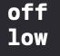

*方法*是与某些特定类型相关联的[**函数**](https://chenzheying.gitee.io/2020/12/03/Swift学习笔记06-函数/)。  
- 类、结构体、枚举都可定义方法。  
- 方法分为[实例方法](#实例方法)和[类型方法](#类型方法)。
<!--more-->


## 实例方法
实例方法的语法与[函数](https://chenzheying.gitee.io/2020/12/03/Swift学习笔记06-函数/)完全一致。实例方法：  
1. 属于某个特定类、结构体或者枚举类型
2. 写在它所属的类型的前后大括号之间
3. 能够隐式访问它所属类型的所有的其他实例方法和属性
4. 不能脱离于现存的实例而被调用
5. 用点语法调用实例方法

### self属性
当实例方法的某个**参数名称**与实例的某个**属性名称**相同时，使用此名称默认指向方法的参数，可使用`self`属性来指向同名的属性名称。

```swift
struct Point{
    var x = 0.0, y = 0.0
    func isAtRight(_ x: Double) -> Bool {
        return self.x > x
    }
}

let aPoint = Point(x: 1.0, y: 1.0)
print(aPoint.isAtRight(2.0))
//输出打印false
```

### 可变方法（mutating）
结构体和枚举是值类型。默认情况下，值类型的属性不能在它的实例方法中被修改。

#### 使用mutating实现对实例属性的修改
可使用`mutating`关键字，将实例方法定义为**可变方法**，实现对属性的修改。

```swift
struct Point{
    var x = 0.0, y = 0.0
//    func move(x deltaX: Double, y deltaY:Double) {
//        x += deltaX 报错：Left side of mutating operator isn't mutable: 'self' is immutable
//        y += deltaY 报错：Left side of mutating operator isn't mutable: 'self' is immutable
//    }

    mutating func moveMutating(x deltaX: Double, y deltaY:Double) {
        x += deltaX
        y += deltaY
    }
}
```

#### 使用mutating实现对实例self的赋值

可以在可变方法中给`self`赋值一个全新的实例

```swift
struct Point {
    var x = 0.0, y = 0.0
    mutating func moveBy(x deltaX: Double, y deltaY: Double) {
        self = Point(x: x+deltaX, y: y+deltaY)
    }
}
```

枚举的可变方法可以把`self`设置为同一枚举类型中不同的成员

```swift
enum TriStates{
    case off, low, high
    mutating func next(){
        switch self {
        case .off:
            self = .low
        case .low:
            self = .high
        case .high:
            self = .off
        }
    }
}
var lightStates = TriStates.off
print(lightStates)
lightStates.next()
print(lightStates)
```


## 类型方法

类型方法与[实例方法](#实例方法)的区别类似于[普通属性](https://chenzheying.gitee.io/2020/12/13/Swift学习笔记10-属性/#存储属性)和[类型属性](https://chenzheying.gitee.io/2020/12/13/Swift学习笔记10-属性/类型属性)的区别，类型方法是属于某个类型（包括类、结构体、枚举）而不是某个实例的。


### 声明
1. 在`func`之前加上`static`，指定类型方法
    ```swift
    class SomeClass{
        
        static func someTypeMethod(){

        }
    }
    ```
2. 在`func`之前加上`class`，指定可重载的类型方法
    ```swift
    class SomeClass{
    
        class func someTypeMethod(){
        
        }
    }
    ```
### 调用
使用点语法，在类型上而不是实例上调用。
```swift
class SomeClass{
    
    class func someTypeMethod(){
        
    }
}

SomeClass.someTypeMethod()
```

### 其他
1. `self`属性指向类型本身，而不是类型的某个实例，因此可以用`self`来消除类型属性和类型方法参数之间的歧义。即有`self`的代表类型属性，没有`self`的代表类型方法参数。
   ```swift
   class SomeClass{
        static var someValue = "Some value."
        class func typeMethod1(someValue: String){
            print(self.someValue)
        }
        static func typeMethod2(someValue: String){
            print(someValue)
        }
    }

    SomeClass.typeMethod1(someValue: "Value some.")
    SomeClass.typeMethod2(someValue: "Value some.")
   ```

    

2. 可在一个类型方法中直接通过另一个类型方法（或另一个类型属性）的名称进行调用，无需在前面加上类型名称。
    ```swift
    struct LevelTracker {
        
        static var highestUnlockedLevel = 1
        
        var currentLevel = 1
        
        
        
        static func unlock(_ level: Int) {
            
            if level > highestUnlockedLevel { highestUnlockedLevel = level }
            
        }
    }

    ```