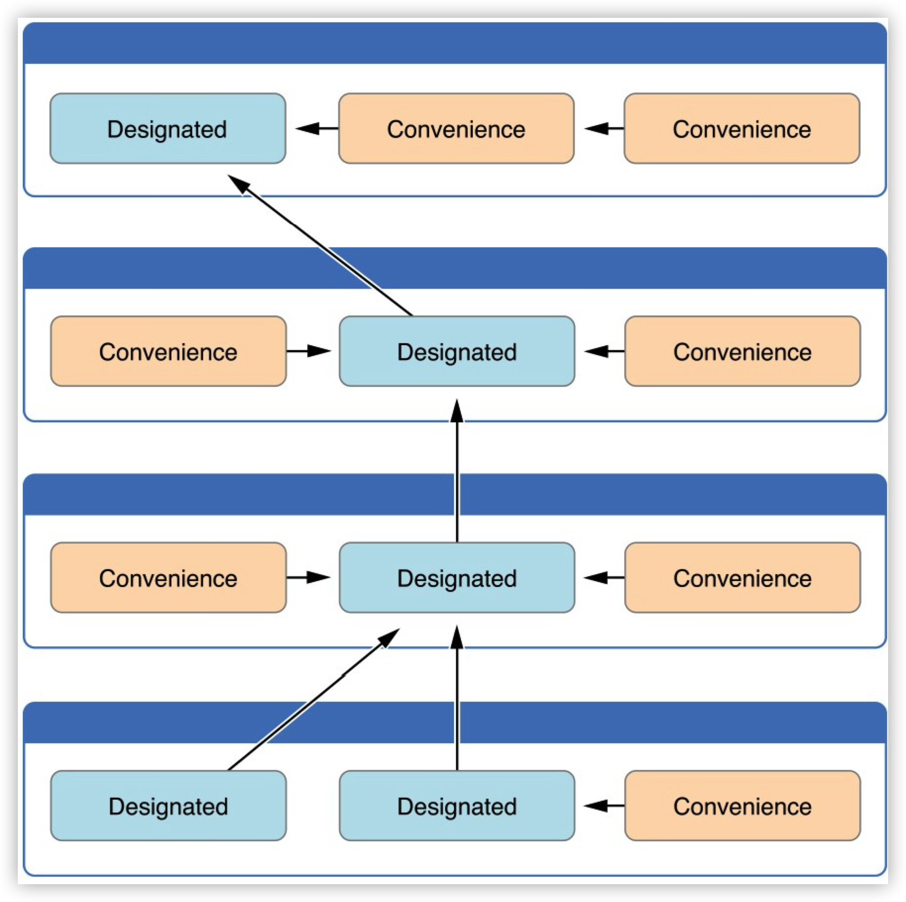

Swift[构造](#构造)和[析构](#析构)学习笔记。

<!--more-->
## 构造
- 构造过程指的是定义一个类型的实例时，为实例的每个存储属性设置初值（和执行其他必须的设置）的这个初始化过程。
- 需要通过定义构造器来实现构造过程。

### 最简形式构造器
即一个不带任何形参的`init`方法。
```swift
struct Fahrenheit {
    var temperature: Double
    init() {
        temperature = 32.0
    }
}
var f = Fahrenheit()
print("The default temperature is \(f.temperature)° Fahrenheit")
// 打印“The default temperature is 32.0° Fahrenheit”
```
在创建一个实例时，`init`方法会被调用，存储属性`temperature`被赋值为`32.0`。

### 带形参的构造器

```swift
struct Celsius {
    var temperatureInCelsius: Double
    init(fromFahrenheit fahrenheit: Double) {
        temperatureInCelsius = (fahrenheit - 32.0) / 1.8
    }
    init(fromKelvin kelvin: Double) {
        temperatureInCelsius = kelvin - 273.15
    }
}
let boilingPointOfWater = Celsius(fromFahrenheit: 212.0)
// boilingPointOfWater.temperatureInCelsius 是 100.0
let freezingPointOfWater = Celsius(fromKelvin: 273.15)
// freezingPointOfWater.temperatureInCelsius 是 0.0
```
与函数和方法的类似:
- 参数由“实参标签+形参名+类型”构成。
- 没有指定实参标签时，实参标签默认为形参名。
- 如果定义了某个实参标签，调用构造器时必须使用它。
- 可以用`_`代替实参标签，实现调用构造器时不使用标签。

### 可选属性类型
若有的存储属性在初始化时无法确定其值，因此无法为其赋值，或它在之后某个时机可能被赋值为空，应将它声明为**可选类型**。

无需在构造器中对可选类型的属性进行初始化，它会被自动初始化为`nil`。
```swift
class SurveyQuestion {
    var text: String
    var response: String?
    init(text: String) {
        self.text = text
    }
}
let appleQuestion = SurveyQuestion(text: "Do u like apple?")
print(appleQuestion.response)
//输出nil
appleQuestion.response = "Yes"
print(appleQuestion.response!)
//输出Yes
```

### 默认构造器
如果结构体或类为所有属性提供了默认值，又没有提供任何自定义的构造器，那么Swift会给这些结构体或类提供一个默认构造器。
```swift
class ShoppingListItem {
    var name: String?
    var quantity = 1
    var purchased = false
}
var item = ShoppingListItem()
```
实例`item`的属性都被初始化为默认值，分别是`nil`、`1`和`false`。

🗒️ Note：  
结构体或类如果有自定义的构造器，则无法使用默认构造器。

### 逐一成员构造器
结构体如果没有定义任何自定义构造器（无论属性是否有默认值），它们将自动获得一个逐一成员构造器。
```swift
struct Size
{
    var width = 0.0, height = 0.0
}
let twoByTwo = Size(width: 2.0, height: 2.0)
```

调用逐一成员构造器时，可以省略任何一个或多个有默认值的属性。
```swift
let zeroByTwo = Size(height: 2.0)
print(zeroByTwo.width, zeroByTwo.height)
// 打印 "0.0 2.0"

let zeroByZero = Size()
print(zeroByZero.width, zeroByZero.height)
// 打印 "0.0 0.0"
```
🗒️ Note：  
- 结构体如果有自定义的构造器，则无法使用逐一成员构造器。
- 类没有逐一成员构造器。

### 构造器代理
在构造器中调用其他构造器完成构造过程，被称为构造器代理。

#### 值类型构造器代理
值类型包括结构体和枚举，不支持继承，构造器代理较简单。  
使用语法：`self.init`
```swift
//两个辅助结构体
struct Size {
    var width = 0.0, height = 0.0
}
struct Point {
    var x = 0.0, y = 0.0
}


struct Rect {
    var origin = Point()
    var size = Size()
    init() {}
    init(origin: Point, size: Size) {
        self.origin = origin
        self.size = size
    }

    init(center: Point, size: Size) {
        let originX = center.x - (size.width / 2)
        let originY = center.y - (size.height / 2)
        self.init(origin: Point(x: originX, y: originY), size: size)
    }
}
```

第三个构造器构造过程中，调用了第二个构造器以简化构造过程。

#### 类类型构造器代理
由于类支持继承，所以类有责任保证其所有继承的存储型属性在构造时也能正确的初始化，这导致类的构造器代理较为复杂。  
由于类类型有[指定构造器](#指定构造器)和[便利构造器](#便利构造器)两种构造器，在进行构造器代理调用时应遵循以下规则：
1. 指定构造器必须调用其直接父类的的指定构造器（如果它有父类）。
2. 便利构造器必须调用同类中定义的其它构造器。（即便利构造器必须）
3. 便利构造器最后必须调用指定构造器。

即：
- 指定构造器必须总是向上代理
- 便利构造器必须总是横向代理

如图示：


### 类的继承和构造过程
类类型有两种构造器：指定构造器和[便利构造器](#便利构造器)。
#### 指定构造器
- 指定构造器是类中最主要的构造器。
- 指定构造器初始化类中提供的所有属性。
- 普遍的是一个类只拥有一个指定构造器。
- 每一个类都必须至少拥有（自己的或者继承来的）一个指定构造器。

指定构造器的语法与值类型简单构造器一样：
```swift
init(parameters) {
    statements
}
```

#### 便利构造器
- 便利构造器是类中比较次要的、辅助型的构造器。
- 应当只在必要的时候为类提供便利构造器

使用`convenience`关键字声明便利构造器
```swift
convenience init(parameters) {
    statements
}
```