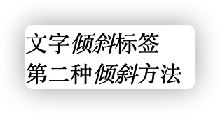
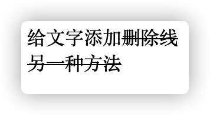

# 前言

工作需要，难免囫囵吞枣。 

# 必备标签

## `<!DOCTYPE>`标签：文档类型声明 

如：<!DOCTYPE html>：文档使用HTML

## `<html lang = "en \ zh-CN">`标签：页面语言

语言种类为英文或中文

## `<meta charset="UTF-8" />`编码格式标签

| 编码   | 含义          |
| :----- | ------------- |
| GB2312 | 简体中文      |
| BIG5   | 繁体中文      |
| GBK    | 简体+繁体中文 |
| UTF-8  | 万国码        |

  

# 常用标签

## 标题标签`<h1>` - `<h6>`

共`<h1>`-`<h6>`六个等级，作为标题使用，依据重要性递减。  

特点：

1. 文字加大加粗
2. 一个标题独占一行

## 段落和换行标签  

### 段落标签`<p> </p>`

用于分段

```html
<p>
  第一段内容
</p>
<p>
  第二段内容
</p>
```


### 换行标签`<br />`

编辑器中敲下的换行符不会被反映在浏览器页面中，如需换行可使用**换行标签**

```html
<p>
  第一段内容：在这里<br />我想换个行。
</p>
```


### 📒Note注意事项

Q : 段落标签和换行标签都会产生换行效果，区别在哪里？

A : 段落标签产生的换行间距更大，换行标签产生的换行间距更小。 

## 文本格式化标签

为文字设置粗体、斜体、下划线等，突出重要性。

### 加粗标签`<strong>`和`<b>`

```html
实现文字<strong>加粗</strong> <br />
另一种实现文字<b>加粗</b>的方式
```


### 倾斜标签`<em>`和`<i>`

```html
文字<em>倾斜</em>标签<br />
第二种<i>倾斜</i>方法
```



### 删除线标签`<del>`和`<s>`

```html
给文字添加<del>删除线</del><br />
<s>另一种方法</s>
```



### 下划线标签`<ins>`和`<u>`

```html
<ins>下划线下划线</ins><br />
<u>另一种另一种</u>
```


## 当作容器的`<div>`和`<span>`标签

### `<div>`标签

division，分割、分区，**一个div标签独占一行**。

### `<span>`标签

span，跨度、跨距，**一行可以多个span**。

## 图像标签

### 图像标签``

单标签，定义HTML页面中的图像，包含多个属性

- `src`：图像源，img标签必须要包含`src`

```html

```


- `alt`：图片替换文本

  图片显示不出来时显示替换文本。

```html

```


- `title`: 图片提示文本

  鼠标经过图片时显示替换文本。

  

- `width`: 设定图片的宽度
- `height`: 设定图片的高度
- `width`和`height`一般只设定其中的一个，自动缩放。
- `border`: 设定边框

## 超链接标签`<a>`

使用方式：`<a href="跳转目标" target="目标窗口的弹出方式">文本或图像</a>`

- `target`属性：
  - `_self`: 当前页面打开（默认）
  - `_blank`: 新建窗口打开

## 特殊字符

| 特殊字符 | 描述          | 对应代码   |
| -------- | ------------- | ---------- |
|          | **空格符**    | `&nbsp;`   |
| **<**    | **小于号**    | `&lt;`     |
| **>**    | **大于号**    | `&gt;`     |
| &        | 和号          | `&amp;`    |
| ¥        | 人民币        | `&yen;`    |
| &copy;   | 版权          | `&copy;`   |
| &reg;    | 注册商标      | `&reg;`    |
| &deg;    | 度            | `&deg;`    |
| &plusmn; | 正负号        | `&plusmn;` |
| &times;  | 乘号          | `&time;`   |
| &divide; | 除号          | `&divide;` |
| &sup2;   | 平方（上标2） | `&sup2;`   |
| &sup3;   | 立方（上标3） | `&sup3;`   |


## 表格标签

用于展示数据

```html
<table>
  <tr>
    <th>表头单元格</th>
    <th>表头单元格</th>
    <th>表头单元格</th>
  </tr>
  <tr>
    <td>单元格内文字</td>
    <td>单元格内文字</td>
    <td>单元格内文字</td>
  </tr>
  <tr>
    <td>单元格内文字2</td>
    <td>单元格内文字2</td>
    <td>单元格内文字2</td>
  </tr>
</table>

```


### 表格`<table>`标签的属性

| 属性名      | 属性值              | 描述                                          |
| ----------- | ------------------- | --------------------------------------------- |
| align       | left、center、right | 规定表格相对周围元素的对齐方式                |
| border      | 1或""               | 规定表格单元是否有边框，默认为"",表示没有边框 |
| cellpadding | 像素值              | 规定单元边沿与其内容之间的空白，默认1像素。   |
| cellspacing | 像素值              | 规定单元格之间的空白，默认2像素               |
| width       | 像素或百分比        | 规定表格的宽度                                |

### 表格的结构标签

使表格代码具有更好的语义，不会改变表格的样子

| 标签名 | 意义     |
| ------ | -------- |
| thead  | 表头区域 |
| tbody  | 表身区域 |

### 合并单元格

- 跨行合并（在同一列上）：`rowspan = “合并单元格的个数”`

- 跨列合并（在同一行上）：`colspan = “合并单元格的个数”`

- 📒Note注意事项：
  1. 写在开始合并的单元格`<tr>`标签的属性部分
  2. 合并后需将多余单元格删掉

## 列表标签

表格用于显示数据，列表用于**布局**。

### 无序列表

各列表项无顺序等级之分。

```html
<ul>
  <li>1</li>
  <li>2</li>
  <li>3</li>
</ul>
```


- `<ul>`中只能嵌套`<li>`标签
- `<li>`标签中可以放任何元素（任何标签）

### 有序列表

```html
<ol>
  <li>1</li>
  <li>2</li>
  <li>3</li>
</ol>
```


- `<ol>`中只能嵌套`<li>`标签
- `<li>`标签中可以放任何元素（任何标签）

### 自定义列表

```html
<dl>
  <dt>名词1</dt>
  <dd>名词1解释1</dd>
  <dd>名词1解释2</dd>
</dl>
```


- `<dl>`中只能嵌套`<dt>`和`<dd>`

- `<dt>`和`<dd>`没有数量限制，但是一般一个`<dt>`搭配多个`<dd>`

## 表单标签

- 表单的用处：收集用户信息。
- 表单构成部分：`表单域`+`表单控件`+`提示信息` 

### 表单域

包含表单元素的区域，使用`<form>`标签定义，`<form>`会把它范围内的表单元素信息提交给服务器。

```html
<form action="所对应的后台页面" method="POST/GET" name="表单域的名称">
  
</form>
```

### 表单控件（表单元素）

#### `input`输入表单元素

- type属性是input元素的必备属性

```html
<input type="类型">
```

input的type可以设定的属性值：

| 属性值   | 描述                                                     |
| -------- | -------------------------------------------------------- |
| button   | 定义可点击按钮（通过JS启动脚本）                         |
| checkbox | 定义复选框，实现多选多（多个标签要有相同的`name`属性）   |
| file     | 定义输入字段和“浏览”按钮，供文件上传                     |
| hidden   | 定义隐藏的输入字段                                       |
| image    | 定义图像形式的提交按钮                                   |
| password | 定义密码字段，盖子段的字符被掩码                         |
| radio    | 定义单选按钮，实现多选一（多个标签要有相同的`name`属性） |
| reset    | 定义重置按钮，用于清除表单中的所有元素                   |
| submit   | 定义提交按钮，将表单数据发送到服务器                     |
| text     | 定义单行输入字段                                         |

- input的常用其他类型属性：

| 属性      | 属性值  | 描述                                                         |
| --------- | ------- | ------------------------------------------------------------ |
| name      | 自定义  | 定义input元素的名称                                          |
| value     | 自定义  | 规定input元素的值                                            |
| checked   | checked | 为checkbox和radio属性设置，规定此input元素首次加载时应当被选中 |
| maxlength | 正整数  | 规定输入字段中的字符最大长度                                 |

#### select下拉表单元素

```html
籍贯：
<form>  
<select>
  籍贯：
  <option>1</option>
    <option selected="selected">2</option>
    <option>3</option>
    <option>4</option>
</select>  
</form>
```


#### textarea表单元素

“大号文本框”。

```html
<form>
  留言板：
  <textarea rows = "2" cols="2">默认信息</textarea>
</form>
```


## label标签

- `<label>`标签为input元素定义标注
- `<label>`标签用于绑定一个表单元素，当点击其内部的文本时，浏览器自动将焦点赚到其对应表单元素上。

```html
<label for="绑定的表单元素id">label显示文字</label><input type="checkbox" id="绑定的表单元素id">
```


