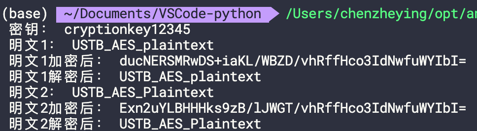

## AES加密算法
AES算法的全称是Advanced Encryption Standard高级加密标准，AES算法是一种对称的分组加密技术，使用128位分组加密数据，是美国联邦政府采用的一种区块加密标准。这个标准用来替代原先的DES，已经被多方分析且广为全世界所使用。经过五年的甄选流程，高级加密标准由美国国家标准与技术研究院（NIST）于2001年11月26日发布于FIPS PUB 197，并在2002年5月26日成为有效的标准。现在，高级加密标准已然成为对称密钥加密中最流行的算法之一。
AES的区块长度固定为128比特，密钥长度则可以是128，192或256比特。
<!--more-->

AES加密过程是在一个4×4的字节矩阵上运作，其初值就是一个明文区块（矩阵中一个元素大小就是明文区块中的一个Byte）。加密时，各轮AES加密循环（除最后一轮外）均包含4个步骤：
1. AddRoundKey—矩阵中的每一个字节都与该次回合密钥（round key）做XOR运算；每个子密钥由密钥生成方案产生。
2. SubBytes—透过一个非线性的替换函数，用查找表的方式把每个字节替换成对应的字节。
3. ShiftRows—将矩阵中的每个横列进行循环式移位。
4. MixColumns—为了充分混合矩阵中各个直行的操作。这个步骤使用线性转换来混合每内联的四个字节。最后一个加密循环中省略MixColumns步骤，而以另一个AddRoundKey取代。

## AES加密解密实现
使用python的一个强大的加密算法库pycryptodome实现AES加密和解密算法的编码。

### 代码
```python
#coding:utf-8
import base64
from Crypto.Cipher import AES    

#aes加密算法
def aes_encode(data, key):
    while len(data) % 16 != 0:     # 补足字符串长度为16的倍数
        data += (16 - len(data) % 16) * chr(16 - len(data) % 16)
    data = str.encode(data)
    aes = AES.new(str.encode(key), AES.MODE_ECB)  # 初始化加密器
    return str(base64.encodebytes(aes.encrypt(data)), encoding='utf8').replace('\n', '')  # 加密

#aes解密函数
def aes_decode(data, key):
    try:
        aes = AES.new(str.encode(key), AES.MODE_ECB)  # 初始化加密器
        decrypted_text = aes.decrypt(base64.decodebytes(bytes(data, encoding='utf8'))).decode("utf8")  # 解密
        decrypted_text = decrypted_text[:-ord(decrypted_text[-1])]  # 去除多余补位
    except Exception as e:
        pass
    return decrypted_text

if __name__ == '__main__':
    key = 'cryptionkey12345'  # 指定16位密钥
    print(" 密钥：",key)
    text = "USTB_AES_plaintext"    # 待加密文本
    
    encrypted_text = aes_encode(text,key)
    decrypted_text = aes_decode(encrypted_text,key)
    print(" 明文1：", text, "\n", "明文1加密后：", encrypted_text, "\n", "明文1解密后：", decrypted_text)

    text_2 = "USTB_AES_Plaintext"
    encrypted_text_2 = aes_encode(text_2,key)
    decrypted_text_2 = aes_decode(encrypted_text_2,key)
    print(" 明文2：", text_2, "\n", "明文2加密后：", encrypted_text_2, "\n", "明文2解密后：", decrypted_text_2)

```

### 运行结果


在实验中将密钥设置为16位的字符串`cryptionkey12345`，对两段明文`USTB_AES_plaintext`和`USTB_AES_Plaintext`分别进行AES加密和AES解密，第二段明文相对于第一段明文只有1位发生了改变，小写`p`变成了大写`P`，但两段明文加密之后得到的密文却有超过20位的改变。