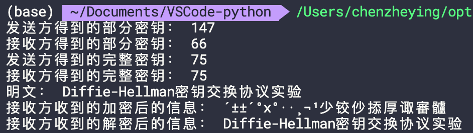

## Diffie–Hellman密钥交换协议
Diffie-Hellman（DH）密钥交换协议是一种在公共信道上安全交换加密密钥的方法，是最早的公钥协议之一，最初由Ralph Merkle提出概念，并以Whitfield Diffie和Martin Hellman命名。DH是密码学领域内最早实现的公钥交换的实际例子之一。今天，DH被用于各种应用，如Proton Mail和SSH。  
<!--more-->


## Diffie-Hellman流程
在Diffie-Hellman协议中，每一方都由一个任何人都能访问的公钥和一个只有终端用户自己看到的私钥组成。消息发送方无法得到消息接收方的私钥，消息接收方也无权使用消息发送方的私钥。发送方和接收方的公钥是两个并不要求相同的质数。  
Diffie-Hellman生成密钥的过程分为部分密钥交换和完整密钥生成两部分。

### 部分密钥交换

消息的发送方和接收方都用自己的私钥、自己的公钥和对方的公钥生成一个部分密钥。  
在发送方使用自己的公钥作为底数，私钥作为指数，接收方的公钥作为模数得到部分密钥；在接收方以相同的方法得到部分密钥。然后两方交换部分密钥

### 生成完整密钥
两方都使用接收到的部分密钥作为底数，自己的私钥作为指数，对方的公钥作为模数便可得到相同的完整加密密钥。  
由以下式子可以证明两方生成的完整密钥是相同的。


## DiffieDiffie–Hellman密钥交换实现
使用python进行编码实现了DiffieDiffie–Hellman密钥交换过程，并实现了一个简单的加解密函数（将消息的每个字符都转换为整数之后再加上密钥值）。
### 代码

```python
class DH_Endpoint(object):
    def __init__(self, public_key1, public_key2, private_key):
        self.public_key1 = public_key1
        self.public_key2 = public_key2
        self.private_key = private_key
        self.full_key = None
    
    # 生成部分密钥
    def generate_partial_key(self):
        partial_key = self.public_key1**self.private_key
        partial_key = partial_key%self.public_key2
        return partial_key
    
    # 生成完整密钥
    def generate_full_key(self, partial_key_r):
        full_key = partial_key_r**self.private_key
        full_key = full_key%self.public_key2
        self.full_key = full_key
        return full_key
    
    # 简单的信息加密
    def encrypt_message(self, message):
        encrypted_message = ""
        key = self.full_key
        for c in message:
            encrypted_message += chr(ord(c)+key)
        return encrypted_message
    
    # 解密
    def decrypt_message(self, encrypted_message):
        decrypted_message = ""
        key = self.full_key
        for c in encrypted_message:
            decrypted_message += chr(ord(c)-key)
        return decrypted_message

if __name__ == "__main__":
    message="Diffie-Hellman密钥交换协议实验"
    sender_public=197 # 发送方公钥
    sender_private=199 # 发送方私钥
    reciever_public=151 # 接收方公钥
    reciever_private=157 # 接收方私钥
    sender = DH_Endpoint(sender_public, reciever_public, sender_private)
    reciever = DH_Endpoint(sender_public, reciever_public, reciever_private)

    sender_partial=sender.generate_partial_key()
    print("发送方得到的部分密钥：",sender_partial) 

    reciever_partial=reciever.generate_partial_key()
    print("接收方得到的部分密钥：",reciever_partial)

    sender_full=sender.generate_full_key(reciever_partial)
    print("发送方得到的完整密钥：",sender_full) 

    reciever_full=reciever.generate_full_key(sender_partial)
    print("接收方得到的完整密钥：",reciever_full) 

    print("明文：",message)

    reciever_encrypted=reciever.encrypt_message(message) 
    print("接收方收到的加密后的信息：",reciever_encrypted)

    message = sender.decrypt_message(reciever_encrypted)
    print("接收方收到的解密后的信息：",message)
        
```

### 运行结果
