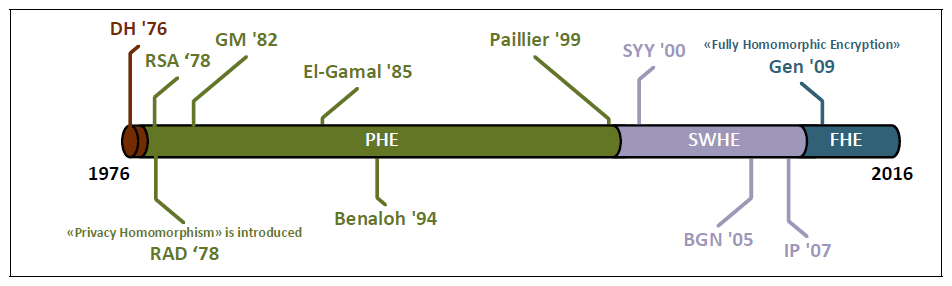

# 同态加密
选取同态加密作为研究主题，查阅资料对其进行了了解，在这篇文章中对学习到的知识进行总结。
<!--more-->

## 定义
一般的加密方案关注的都是数据存储安全。这个过程中用户是不能对加密结果做任何操作的，只能进行存储、传输。对加密结果做任何操作，都将会导致错误的解密，甚至解密失败。  
同态加密方案关注的是数据处理安全。它保证处理者不能访问数据。也就是说，处理者直接对密文进行操作，而解密后的明文能正确反映进行的操作。实现了数据的“可算不可见”。  

维基百科中提供的同态加密概念是：同态加密（英语：Homomorphic encryption）是一种加密形式，它允许人们对密文进行特定形式的代数运算得到仍然是加密的结果，将其解密所得到的结果与对明文进行同样的运算结果一样。换言之，这项技术令人们可以在加密的数据中进行诸如检索、比较等操作，得出正确的结果，而在整个处理过程中无需对数据进行解密。其意义在于，真正从根本上解决将数据及其操作委托给第三方时的保密问题，例如对于各种云计算的应用。  
  
我的理解是，应用其他的加密算法作为安全措施时，普通用户无法对加密后的数据进行任何除了存储和传输之外的操作，只能对未加密或解密了的数据进行其他操作，这逼迫用户必须在“为了不泄漏隐私而要求不进行数据操作”和“要求进行数据操作但是有隐私泄漏的风险”两者中进行选择。而同态加密的策略则能让用户要求对加密了的数据进行某种操作，对操作后的结果进行解密之后就能得到与对未加密数据进行同样操作完全一致的结果，这样用户就可以同时选择要求进行数据操作和不泄漏隐私了。

## 分类
同态加密思想从提出到现在，在具体实现方案方面，经历了3个重要时期：
1978—1999年是部分同态加密的繁荣发展时期；1996—2009年是部分同态加密与浅同态加密的交织发展时期，也是浅同态加密方案的繁荣发展时期；2009年以后是全同态加密的繁荣发展时期。

### 部分同态加密方案
部分同态（partially homomorphic）有的地方也叫单同态（single homomorphic），指的是该同态加密方案只能做无限次同态加法（additive-only）或者只能做无限次同态乘法（multiplicative-only）操作。  
也就是说部分同态加密算法能实现对加密数据进行无限次加法或无限次乘法后，对操作后的结果进行解密之后就能得到与对未加密数据进行同样操作完全一致的结果。  
RSA加密是最早应用的公钥加密算法框架，同时RSA算法也是一种部分同态加密算法，其对乘法有同态的性质。部分同态加密的研究成果出现比较早，并且加法同态加密算法比乘法同态加密算法要多一些。  
部分同态加密的优点是原理简单、易实现，缺点是仅支持一种运算（加法或乘法）。

### 浅同态加密方案
浅同态（somewhat homomorphic）加密方案也叫做层次同态加密算法（leveled homomorphic），可以对密文进行有限次数的任意同态操作，换句话说，它既能做乘法又能做加法，但是不能同态计算任意的函数。  
浅同态加密的研究主要分为两个阶段，第一个阶段是在2009年Gentry提出第一个全同态加密框架以前，比较著名的例子有：BGN算法、姚氏混淆电路等；第二个阶段在Gentry全同态加密框架之后，主要针对全同态加密效率低的问题。浅同态加密的优点是同时支持加法和乘法，并且因为出现时间比部分同态加密晚，所以技术更加成熟、一般效率比部分同态加密要高很多、和部分同态加密效率接近或高于部分同态加密，缺点是支持的计算次数有限。

### 全同态加密
最早的同态加密概念从78年Rivest等人提出来，而一直到09年Gentry等人给出了利用ideal lattice给出了全同态加密的协议。
全同态（fully homomorphic）加密方案，可以对密文进行无限次数的任意同态操作，也就是说它可以同态计算任意的函数。  
从使用的技术上分，全同态加密有以下类别：基于理想格的全同态加密方案、基于LWE/RLWE的全同态加密方案等等。全同态加密的优点是支持的算子多并且运算次数没有限制，缺点是效率很低，目前还无法支撑大规模的计算。

## 同态加密在云计算中的应用
同态加密技术数据“可算不可见”的特性让它在云计算领域的到广泛的应用，随着区块链、联邦学习等新兴领域的发展及其对隐私保护的更高要求，同态加密也被应用在了更多的领域。

云计算环境本身的结构特点给安全性带来较大隐患，出于降低成本提升资源利用率上的考虑，参与计算的节点大都异构并且类型多样，物理分布稀疏，服务商难以对所有节点进行有效控制。用户往往依靠可靠性较低的网络通信和半可信的云存储服务器来传输和存储数据资源，必然存在暴露敏感信息的风险，难以确保数据的机密性、完整性和可用性，一旦敏感数据资源被窃取或者篡改，所造成的严重后果难以估计。
隐私信息检索、可搜索加密、多方安全计算技术大量地应用在云计算的应用过程中，然而当需要云服务商对这些密文数据进行计算处理时，通常无法实现网络中的计算资源对加密的数据进行处理，因为已有的大多数传统加密方法都不支持对密文的运算，而云环境中许多应用场景都需要对密文数据进行操作。  
按照传统的做法，这些数据经过加密后发送到云端需要解密再进行处理，用户本身在对数据进行处理时，也需要向服务商申请密文数据，下载到本地解密后再使用，这样不仅同样会暴露隐私，同时，当用户频繁使用数据时，需要消耗大量网络带宽和时间与服务商进行通信实现数据加密和解密以及加密数据的上传和下载等，所带来的计算和通信消耗大大降低了云计算的可用性和用户体验。  
同态加密的问世为云计算中用户隐私安全提供了可靠、有效的保护手段。

#### 云计算中保护隐私的检索  

云端数据的存储和使用呈几何爆炸式增长，对加密数据的检索成为一个亟待解决的难点问题，
   基于全同态加密的数据检索技术能够直接在加密的数据上直接检索，避免检索数据被统计分析，不仅能做到保序检索，还能对检索的数据进行比较、异或等简单运算。
#### 多方安全计算中的应用
在现实中，某个应用场景中需要多方参与计算，但是各方互相可能为可信也可能为不可信，当需要对私有数据进行检索、分析、处理时，大家都不希望数据内容被其他参与方掌握，所有参与方将自有数据以密文形式进行联合计算，使用全同态加密算法，可以使除用户和授权者外的第三方利用其同态特性在密文上直接操作，将结果返回后得到明文计算相同的结果，从而完成用户的需求。

#### 密文数据库
CryptDB是麻省理工计算机科学和人工智能实验室(CSAIL)以部分同态加密方案为基础实现商用化的应用实例，它能够实现用户对存储在SQL数据库的数据进行多种查询操作，通过SQL能够“识别”的4种操作(order comparison、equality checks、join、aggregate)来分解所有原始查询语句以对数据按列进行加密，从内到外层层采用不同加密方案来加密不同查询功能，其安全性由内层的低强度到最外层满足语义安全。另外，CryptDB系统对用户身份密码和加密算法密钥进行捆绑，这样用户如果不使用正确的身份密码将无法登录对数据项进行解密，连数据库管理员也无法对密文数据解密，即使服务器被攻破，只要用户没有登录，攻击者也无法解密用户的密文数据，并且CryptDB主要采用对称型同态加密方案，因此所有操作对系统效率影响较小。

## 学习感受
同态加密的数据“可算不可见”特性非常适合于当下云计算浪潮的特点，在我研究的联邦学习课题中也有应用，应成为云计算、分布式计算、联邦学习相关学习和从业者的关注点。

python