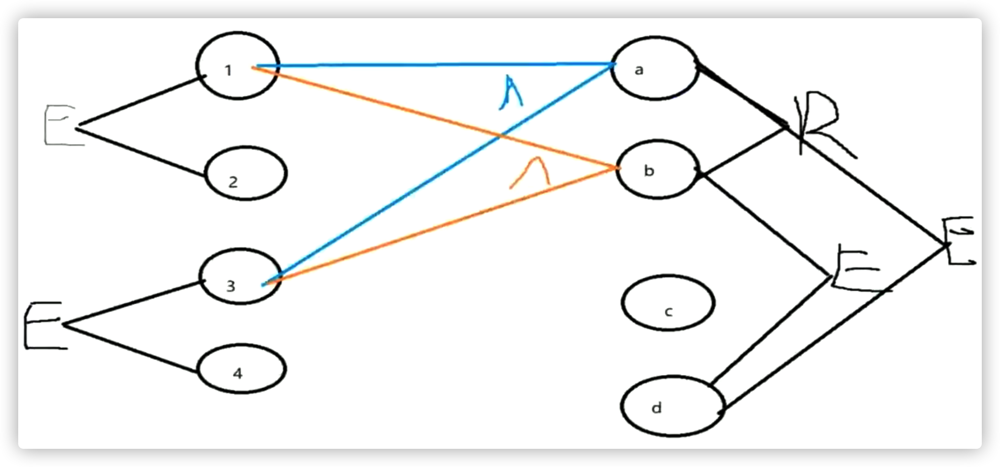
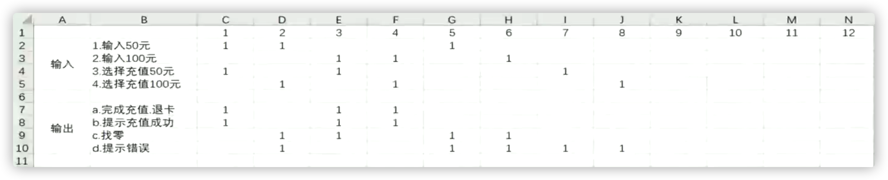
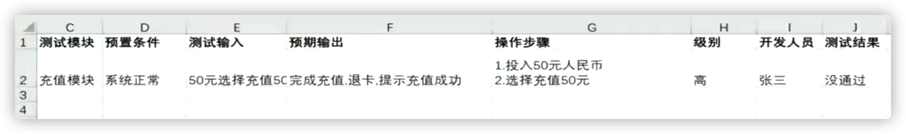
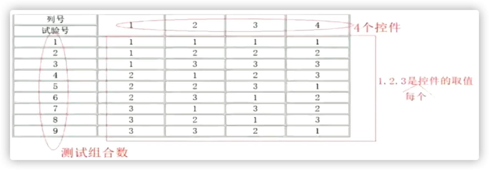
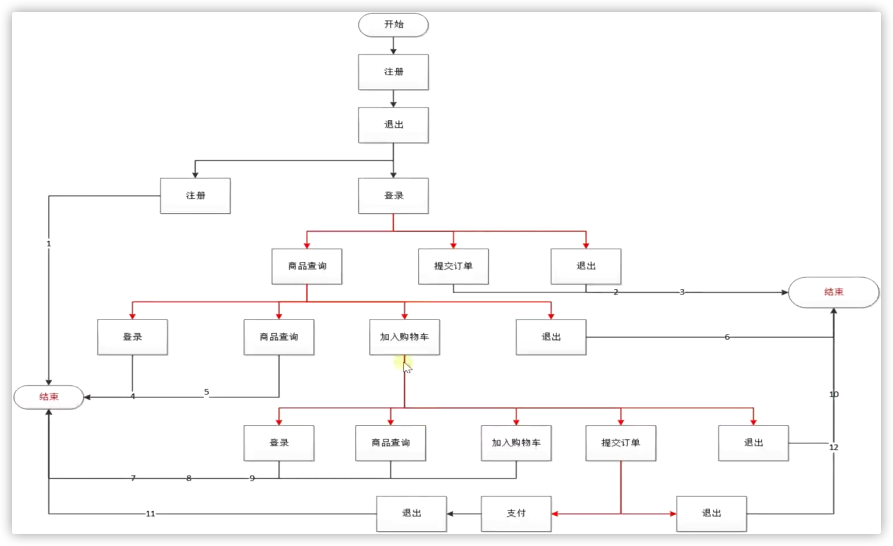

# 测试用例设计步骤

1. 确定需求
2. 确定有效等价类和无效等价类
3. 对每条等价类设计测试用例

- 用例设计工具：Excel

# 边界值法

- 使用场景：输入框
- 等价类划分的补充
  - 边界点（上点）
  - 离点
  - 内点

# 因果图法

- 因=输入条件，果=输出条件
- 使用场景：适合检查程序输入条件的各种组合情况
- 特点：
  1. 考虑输入条件的**相互制约**和**组合**
  2. 考虑输出条件对输入条件的依赖关系

- 约束条件
  1. 互斥
  2. 包含
  3. 屏蔽
  4. 唯一
  5. 要求

## 基本步骤

1. 找出所有因（等价类）

2. 找出所有果（输出条件）

3. 明确因的制约和组合关系

4. 明确果的制约和组合关系

5. 什么因对应什么果，生成因果图

   

6. 因果图转换成判定表/决策表

   

7. 表的每一列设计测试用例

   

# 判定表法

即决策表，因果图法的一个产物（上面6下的那张图）

# 正交表法

- 正交法：**正交实验**法或正交排列法，用最小的测试过程集合获得最大的测试覆盖率。（选出代表性的测试用例）

- 使用场景：条件组合非常多

- 正交表的构成

  		

- 工具：allpairs

  ​	Mac端使用[python库](https://pypi.org/project/allpairspy/#basic-usage)

# 场景法

- 从起点，经过一系列事件，达到某一结果，达到终点的过程测试。

- 使用场景：冒烟测试
- 基本流+多个备选流

# 流程分析法

- 使用场景：针对测试场景类型属于*流程测试场景*的测试项下*的测试子项*

- 深度遍历流程，或广度遍历流程

  

# 错误推断法

- 基于经验和直觉推断出错误，有针对性的设计测试用例。
- 使用场景：项目时间比较短。
