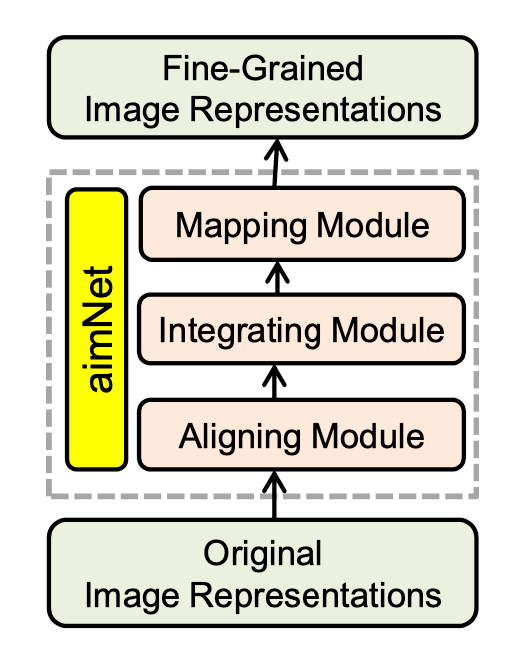
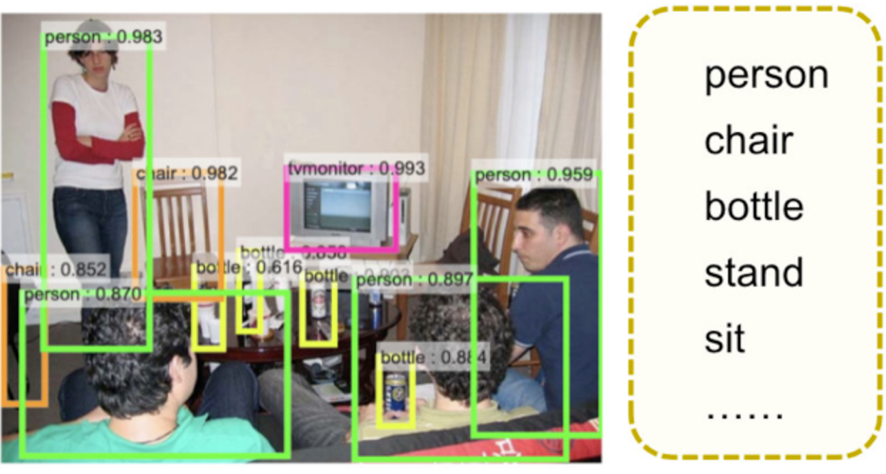
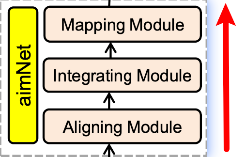
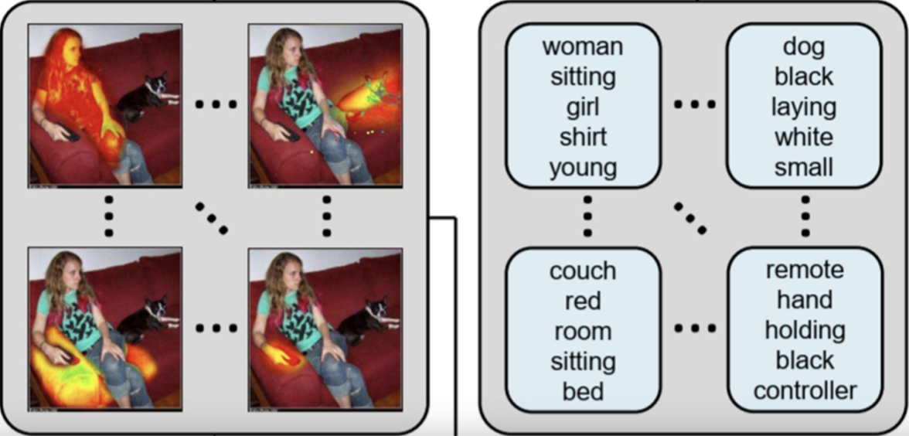
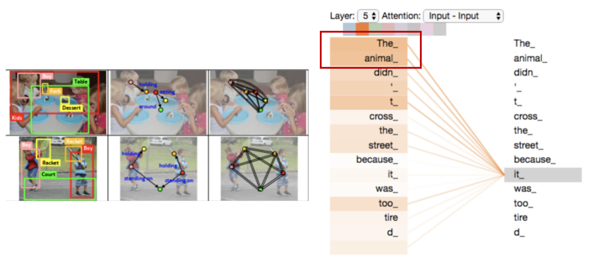
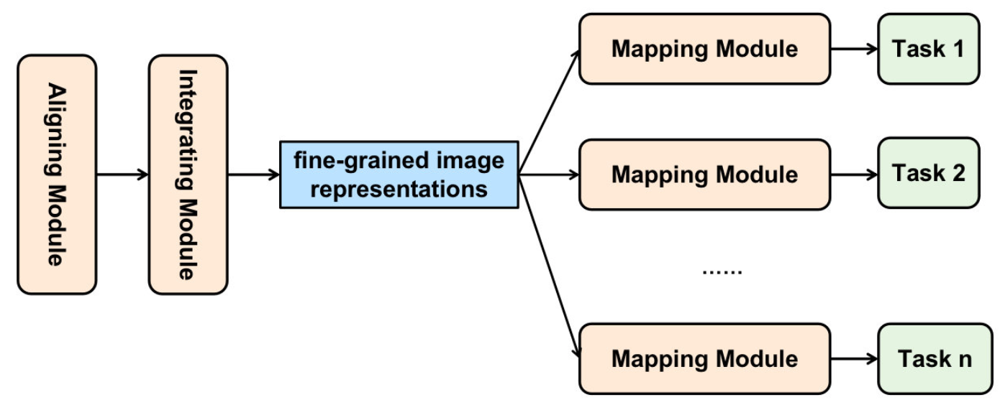
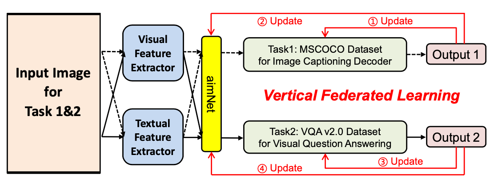

一篇利用联邦学习解决传统计算机视觉问题、且根据问题对联邦学习框架进行调整的论文，作者Fenglin Liu。
<!--more-->
## 要点笔记
### 应用领域：Vision-and-Language Grounding 问题
- image caption
  - 解释：图像描述，建立从图像到语言的对应关系
- visual question answering (VQA)
  - 解释：视觉问题回答，要求机器回答关于图片内容的问题，这就要求机器不仅需要能够理解图像以及语言信息，还要能够具有一定的常识。

### 主要贡献
- 利用联邦学习解决（为提升性能而）共享下流数据所造成的**隐私问题**
- 提出aimNet，将提取的图像视觉和文本特征有效地、自动地转换为细粒度的图像表示

### 算法框架

#### step1: Visual and Texture Features

- 使用Faster R-CNN在图片上生成bounding box，并为之匹配d维（隐藏神经元的个数）单词向量
- 发生在：客户端
- 输入：图像
- 输出：
  - 矩阵I：图像区域
  - 矩阵T：单词

#### step2: aimNet

- 发生在：服务器端
- 输入：矩阵I和矩阵T
- 输出：细粒度的图像表征映射到不同的任务上的矩阵
- Aligning module

  - 对齐模块：结合语义使矩阵I中的向量有更好的图像区域表示；利用图像区域避免矩阵T中的单词的歧义
  - 具体作用：图像和文本信息的结合
- Integrating module

  - 合并模块：学习空间上或语义上相关的对象
  - 具体作用：在视觉领域，整合模块学习突出的区域分组，并整合自然相关的图像区域，以获得更高层次的图像表示。在文本领域，它学习属性组合，并有能力在句子措辞时考虑关联和搭配。
- Mapping module

  - 映射模块：将前面生成的细粒度的图像表征映射到不同的任务上，使得这个框架可以适用于不同的任务
  - 具体作用：将丰富的信息注入到任务空间中，得到的映射至不同人物的细粒度图像表示可用于下游任务

#### step3: Downstream Tasks

- 发生在：客户端
- 输入：前两步学习得到的矩阵（图像表征映射到不同任务），要处理的任务
- 输出：任务结果
- 作用：评判得到的矩阵，迭代更新

### 实验
- 实验任务：图像描述+视觉问题回答
- 实验设置：横向联邦学习+纵向联邦学习+联邦迁移学习
  - 横向联邦学习：客户端的特征空间相同、样本不同
    - 实验中将两个不同的图像字幕数据集视为两个不同客户端，“业务”（特征空间）相同--生成图片描述，样本（输入图像）不同
  - 纵向联邦学习：客户端数据来源相同/高度相似，但特征空间不同
    - 实验将不同下流任务视为不同客户端，他们的数据来源（输入图像）相同
  - 迁移联邦学习：两个数据集不仅样本不同，而且特征空间不同
    - 实验用不同数据集模拟不同客户端，不同客户端的数据和任务都不同

## 论文中文解析博客
https://blog.csdn.net/joker_1024/article/details/109298238

python