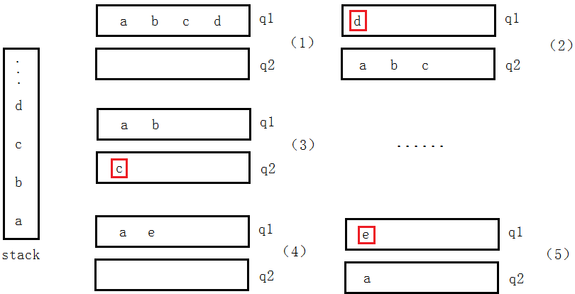

# 算法题：两个队列模拟栈

队列的特点是先进先出，操作者所能获得的永远是队列最里面的元素。  
而栈的特点是后进显出，操作者所能获得的永远是栈最顶端的元素。  

## 出栈
用队列模拟栈的出栈，就是让队列最里面的元素，成为队列最顶端的元素，而这种情况仅在队列中只有一个元素时发生。  

如下图所示，当想要获得最顶端的`d`时，应先将队列中`d`之前的所有元素按照原顺序（队列的先进先出特点就保证了出队是按照原顺序）出队并存储在另一个空队列中。

## 入栈
元素直接入队非空的队列。

# 算法题：两个栈模拟队列

使用两个先进后出的栈（S1和S2）模拟一个先进先出的队列。

## 出队

初始时：S1中有元素，S2为空  

此时执行出队，应让S1中最底部的元素出队

先让d、c、b、a按顺序从S1出栈并入栈S2，直至S1为空

此时S1为空，对S2进行出栈即为所要的出队顺序。  
之后的出队操作，全部等同于S2的出栈操作，直至S2为空。  
S2为空时，再次将S1中的元素（如果S1里还有元素的话）转移到S2中，出队即在S2中出栈。

## 入队
由于从每次S1出栈都要求将S1出空为止，所以S1有两种状态，空或还未出栈。

若S1为空，入队即为S1的入栈，此时不会影响出队（S2中的出栈）顺序。

若S1还未出栈，将入队视为S1的入栈也不会影响出队顺序。

所以入队即为S1的入栈。

## 总结

使用S1作为入队的栈，S2作为出队的栈，如果S2为空还要求出队的话，就先将S1中的所有元素按顺序转移至S2中，再执行后续的操作。

# 常见的排序算法及其效率和稳定性

## 总结排序算法的思想（将乱序排位增序）

|排序方法|排序思想|
|--|--|
|冒泡排序|从前往后相邻两个元素进行比较，逆序则交换|
|选择排序|从未排序列中选择出最小的元素，放在末尾|
|插入排序|挨个为未排序的元素找到它在已排序列中应在的位置|
|希尔排序|缩小增量排序，选择一个逐渐缩小为1的增量值，将序列中相隔“增量值”个位置的元素分为一组，每组组内进行插入排序|
|归并排序|分而治之，先分：将序列分为单个元素；再治：将元素两两进行组合，组合时要求组合为一个有序序列；直至所有元素组加入组合|
|快速排序|找一个基准数，比这个数小的数全部放在它的左边，大于或等于它的数全部放在它的右边，对左右两个小数列重复第二步，直至各区间只有1个数|

